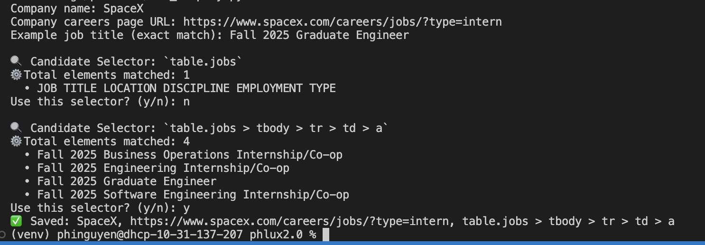

# 🌀 Phlux: Phi's Job Tracker

Easily track jobs across top tech companies.

## 🧩 Add Your Own Companies
- Run `add_company.py`
- Follow the CLI instructions (see below)
- Add selector and example job title to `companies.csv`
- Make a PR to contribute!

---

## 📌 Job Listings found by Phlux (126 companies, 987 roles)

| Company | Role | Date Found |
|---|---|---|
| [ Samsung](https://sec.wd3.myworkdayjobs.com/Samsung_Careers?workerSubType=189767dd6c920145d5c3e59c2c297819&Location_Country=bc33aa3152ec42d4995f4791a106ed09) | Senior Director, HR Strategy | 7/12 |
| [ Autodesk](https://autodesk.wd1.myworkdayjobs.com/uni?jobFamilyGroup=f909d7cccc2d480b8f6af996c7bf8352) | Intern Software Developer, Stagiaire en Développement Logiciel | 7/11 |
| [ TikTok](https://lifeattiktok.com/search?keyword=&recruitment_id_list=202%2C301&job_category_id_list=&subject_id_list=7322364514224687370%2C7322364513776093449%2C7459987887569733896%2C7459986622530078983&location_code_list=CT_247%2CCT_94%2CCT_243%2CCT_104%2CCT_114%2CCT_75%2CCT_1103355%2CCT_157%2CCT_233&limit=12&offset=0) | Software Engineer Intern (Recommendation Infrastructure) - 2025 Summer/Fall (BS/ MS) | 7/11 |
| [ Nokia](https://fa-evmr-saasfaprod1.fa.ocs.oraclecloud.com/hcmUI/CandidateExperience/en/sites/CX_1/jobs?lastSelectedFacet=TITLES&location=United+States&locationId=300000000480126&locationLevel=country&mode=location&selectedTitlesFacet=TRA) | Data fabric and network automation Co-op | 7/11 |
| [ Nokia](https://fa-evmr-saasfaprod1.fa.ocs.oraclecloud.com/hcmUI/CandidateExperience/en/sites/CX_1/jobs?lastSelectedFacet=TITLES&location=United+States&locationId=300000000480126&locationLevel=country&mode=location&selectedTitlesFacet=TRA) | Operations & Transformation Co-op | 7/11 |
| [ Susquehanna](https://careers.sig.com/global-susquehanna-jobs) | Machine Learning Quantitative Researcher – DDT – Experienced Hire | 7/11 |
| [ Susquehanna](https://careers.sig.com/global-susquehanna-jobs) | Software Engineering Internship: Summer 2026 | 7/11 |
| [ Susquehanna](https://careers.sig.com/global-susquehanna-jobs) | Helpdesk Analyst - New Grad | 7/11 |
| [ Susquehanna](https://careers.sig.com/global-susquehanna-jobs) | Software Developer \| Sports Trading Software \| Experienced Hire | 7/11 |
| [ Susquehanna](https://careers.sig.com/global-susquehanna-jobs) | Team Lead – Collaboration/Productivity Tech (Leadership Role) | 7/11 |
| [ Scheider Electric](https://careers.se.com/global/jobs?keywords=internship&sortBy=relevance&page=1&country=United%20States&tags1=Intern) | Mechanical Engineering Intern | 7/11 |
| [ Github](https://www.github.careers/careers-home/jobs?view=search&limit=100&page=1) | Staff Engineering Manager, Web Systems | 7/11 |
| [ Visa](https://careers.smartrecruiters.com/Visa/university-recruiting) | Business Associate - Visa Leadership Accelerator Program (For Fresh Graduates) - Administrative | 7/11 |
| [ Verizon](https://mycareer.verizon.com/jobs/?search=&team=Campus+%26+Apprenticeships&pagesize=100#results) | Military Fellowship - Operations Support Senior Manager | 7/11 |
| [ Relativity](https://job-boards.greenhouse.io/embed/job_board?for=rsinternboard) | Propulsion Integration Engineer Intern | 7/11 |
| [ HP](https://apply.hp.com/careers?query=internship&Seniority=graduate&Seniority=internship&Seniority=Apprenticeship&domain=hp.com) | College Intern - Data Science | 7/11 |
| [ HP](https://apply.hp.com/careers?query=internship&Seniority=graduate&Seniority=internship&Seniority=Apprenticeship&domain=hp.com) | College Intern - Machine Learning and Artificial Intelligence | 7/11 |
| [ Sony](https://sonyglobal.wd1.myworkdayjobs.com/SonyGlobalCareers?workerSubType=7306bd11847f108d51604b3183153b95) | Marketing Analyst Intern | 7/11 |
| [ Boeing](https://jobs.boeing.com/category/internship-jobs/185/9287/1) | 2025/26 Summer Internship - Business | 7/11 |
| [ Boeing](https://jobs.boeing.com/category/internship-jobs/185/9287/1) | 2025/26 Summer Internship - Engineering | 7/11 |
| [ Boeing](https://jobs.boeing.com/category/internship-jobs/185/9287/1) | 2025/26 Summer Internship - Engineering | 7/11 |
| [ Boeing](https://jobs.boeing.com/category/internship-jobs/185/9287/1) | 2025/26 Summer Internship - Engineering | 7/11 |
| [ Boeing](https://jobs.boeing.com/category/internship-jobs/185/9287/1) | 2025/26 Summer Internship - Engineering | 7/11 |
| [ Boeing](https://jobs.boeing.com/category/internship-jobs/185/9287/1) | 2025/26 Summer Internship - Engineering | 7/11 |
| [ Boeing](https://jobs.boeing.com/category/internship-jobs/185/9287/1) | 2025/26 Summer Internship - Information Technology | 7/11 |
| [ Boeing](https://jobs.boeing.com/category/internship-jobs/185/9287/1) | 2025/26 Summer Internship - Information Technology | 7/11 |
| [ Boeing](https://jobs.boeing.com/category/internship-jobs/185/9287/1) | 2025/26 Summer Internship - Information Technology | 7/11 |
| [ Boeing](https://jobs.boeing.com/category/internship-jobs/185/9287/1) | 2025/26 Summer Internship - Information Technology | 7/11 |
| [ Boeing](https://jobs.boeing.com/category/internship-jobs/185/9287/1) | 2025/26 Summer Internship - Information Technology | 7/11 |
| [ Mercedes Benz](https://jobs.lever.co/MBRDNA?commitment=Intern) | Software Developer - AIX Intern | 7/11 |
| [ Mosaic](https://mosaic.wd5.myworkdayjobs.com/mosaic?workerSubType=ed8099291cc44a449715a96f49b3b316&locations=650055bade3a47079294e41cfa83d322&locations=8e6a747b95174ec58844a56e3a58fea7&locations=679a79860e514d81a6cb1f68c9c88e09&locations=5eb4fe3563194525801ecea18921c4c6) | Informational Technology Cybersecurity Co-Op/Intern - Fall 2025 | 7/11 |
| [ Mosaic](https://mosaic.wd5.myworkdayjobs.com/mosaic?workerSubType=ed8099291cc44a449715a96f49b3b316&locations=650055bade3a47079294e41cfa83d322&locations=8e6a747b95174ec58844a56e3a58fea7&locations=679a79860e514d81a6cb1f68c9c88e09&locations=5eb4fe3563194525801ecea18921c4c6) | Data Analyst Co-op/Intern - Spring 2026 | 7/11 |
| [ Mosaic](https://mosaic.wd5.myworkdayjobs.com/mosaic?workerSubType=ed8099291cc44a449715a96f49b3b316&locations=650055bade3a47079294e41cfa83d322&locations=8e6a747b95174ec58844a56e3a58fea7&locations=679a79860e514d81a6cb1f68c9c88e09&locations=5eb4fe3563194525801ecea18921c4c6) | Process Engineer Co-Op/Intern - Spring 2026 | 7/11 |
| [ Mosaic](https://mosaic.wd5.myworkdayjobs.com/mosaic?workerSubType=ed8099291cc44a449715a96f49b3b316&locations=650055bade3a47079294e41cfa83d322&locations=8e6a747b95174ec58844a56e3a58fea7&locations=679a79860e514d81a6cb1f68c9c88e09&locations=5eb4fe3563194525801ecea18921c4c6) | Reliability Engineer Co-Op/Intern - Spring 2026 | 7/11 |
| [ Mosaic](https://mosaic.wd5.myworkdayjobs.com/mosaic?workerSubType=ed8099291cc44a449715a96f49b3b316&locations=650055bade3a47079294e41cfa83d322&locations=8e6a747b95174ec58844a56e3a58fea7&locations=679a79860e514d81a6cb1f68c9c88e09&locations=5eb4fe3563194525801ecea18921c4c6) | Health and Safety Engineer Co-Op/Intern - Spring 2026 | 7/11 |
| [ Mosaic](https://mosaic.wd5.myworkdayjobs.com/mosaic?workerSubType=ed8099291cc44a449715a96f49b3b316&locations=650055bade3a47079294e41cfa83d322&locations=8e6a747b95174ec58844a56e3a58fea7&locations=679a79860e514d81a6cb1f68c9c88e09&locations=5eb4fe3563194525801ecea18921c4c6) | Permitting Engineer Co-Op/Intern - Spring 2026 | 7/11 |
| [ Mosaic](https://mosaic.wd5.myworkdayjobs.com/mosaic?workerSubType=ed8099291cc44a449715a96f49b3b316&locations=650055bade3a47079294e41cfa83d322&locations=8e6a747b95174ec58844a56e3a58fea7&locations=679a79860e514d81a6cb1f68c9c88e09&locations=5eb4fe3563194525801ecea18921c4c6) | Inventory & Supply Chain Co-Op/Intern - Spring 2026 | 7/11 |
| [ Mosaic](https://mosaic.wd5.myworkdayjobs.com/mosaic?workerSubType=ed8099291cc44a449715a96f49b3b316&locations=650055bade3a47079294e41cfa83d322&locations=8e6a747b95174ec58844a56e3a58fea7&locations=679a79860e514d81a6cb1f68c9c88e09&locations=5eb4fe3563194525801ecea18921c4c6) | Project Engineering Co-op/Intern - Spring 2026 | 7/11 |
| [ Mosaic](https://mosaic.wd5.myworkdayjobs.com/mosaic?workerSubType=ed8099291cc44a449715a96f49b3b316&locations=650055bade3a47079294e41cfa83d322&locations=8e6a747b95174ec58844a56e3a58fea7&locations=679a79860e514d81a6cb1f68c9c88e09&locations=5eb4fe3563194525801ecea18921c4c6) | Mining Engineer Co-Op/Intern - Spring 2026 | 7/11 |
| [ Microsoft](https://jobs.careers.microsoft.com/global/en/search?lc=United%20States&et=Internship&l=en_us&pg=1&pgSz=20&o=Relevance&flt=true) | Researcher Intern | 7/10 |
| [ Datadog](https://careers.datadoghq.com/early-careers/) | Sales Development Representative - Singapore (Thai Speaking) | 7/10 |
| [ TikTok](https://lifeattiktok.com/search?keyword=&recruitment_id_list=202%2C301&job_category_id_list=&subject_id_list=7322364514224687370%2C7322364513776093449%2C7459987887569733896%2C7459986622530078983&location_code_list=CT_247%2CCT_94%2CCT_243%2CCT_104%2CCT_114%2CCT_75%2CCT_1103355%2CCT_157%2CCT_233&limit=12&offset=0) | Software Engineer Intern (Recommendation Infrastructure) - 2025 Summer/Fall (BS/MS) | 7/10 |
| [ TikTok](https://lifeattiktok.com/search?keyword=&recruitment_id_list=202%2C301&job_category_id_list=&subject_id_list=7322364514224687370%2C7322364513776093449%2C7459987887569733896%2C7459986622530078983&location_code_list=CT_247%2CCT_94%2CCT_243%2CCT_104%2CCT_114%2CCT_75%2CCT_1103355%2CCT_157%2CCT_233&limit=12&offset=0) | Machine Learning Engineer Intern (TikTok-Recommendation) - 2025 Fall (Master) | 7/10 |
| [ TikTok](https://lifeattiktok.com/search?keyword=&recruitment_id_list=202%2C301&job_category_id_list=&subject_id_list=7322364514224687370%2C7322364513776093449%2C7459987887569733896%2C7459986622530078983&location_code_list=CT_247%2CCT_94%2CCT_243%2CCT_104%2CCT_114%2CCT_75%2CCT_1103355%2CCT_157%2CCT_233&limit=12&offset=0) | Machine Learning Engineer Intern (Training Pre-processing) - 2025 Summer (BS/MS) | 7/10 |
| [ Susquehanna](https://careers.sig.com/global-susquehanna-jobs) | Machine Learning Internship - PhD: 2026 | 7/10 |
| [ Susquehanna](https://careers.sig.com/global-susquehanna-jobs) | Software Development - Automated Testing | 7/10 |
| [ Jane Street](https://www.janestreet.com/join-jane-street/open-roles/?type=internship&location=new-york) | Quantitative Trader | 7/10 |
| [ Jane Street](https://www.janestreet.com/join-jane-street/open-roles/?type=internship&location=new-york) | Quantitative Researcher | 7/10 |
| [ Jane Street](https://www.janestreet.com/join-jane-street/open-roles/?type=internship&location=new-york) | Machine Learning Researcher | 7/10 |
| [ Jane Street](https://www.janestreet.com/join-jane-street/open-roles/?type=internship&location=new-york) | Software Engineer | 7/10 |
| [ Jane Street](https://www.janestreet.com/join-jane-street/open-roles/?type=internship&location=new-york) | Strategy and Product | 7/10 |
| [ Jane Street](https://www.janestreet.com/join-jane-street/open-roles/?type=internship&location=new-york) | Machine Learning Engineer | 7/10 |
| [ Jane Street](https://www.janestreet.com/join-jane-street/open-roles/?type=internship&location=new-york) | FPGA Engineer | 7/10 |
| [ Jane Street](https://www.janestreet.com/join-jane-street/open-roles/?type=internship&location=new-york) | Linux Engineer | 7/10 |
| [ Jane Street](https://www.janestreet.com/join-jane-street/open-roles/?type=internship&location=new-york) | Network Engineer | 7/10 |
| [ Jane Street](https://www.janestreet.com/join-jane-street/open-roles/?type=internship&location=new-york) | Tools and Compilers Research and Development | 7/10 |
| [ Jane Street](https://www.janestreet.com/join-jane-street/open-roles/?type=internship&location=new-york) | Trading Desk Operations Engineer | 7/10 |
| [ ByteDance](https://jobs.bytedance.com/en/position?keywords=&category=&location=CT_1103355%2CCT_157%2CCT_94%2CCT_114%2CCT_100764%2CCT_75%2CCT_233%2CCT_203&project=7322364514224687370%2C7503447747358361864&type=3&job_hot_flag=&current=1&limit=10&functionCategory=&tag=) | Backend Software Engineer Intern (Product RD and Infrastructure-Global E-Commerce Content)- 2025 Fall(BS/MS) | 7/10 |
| [ ByteDance](https://jobs.bytedance.com/en/position?keywords=&category=&location=CT_1103355%2CCT_157%2CCT_94%2CCT_114%2CCT_100764%2CCT_75%2CCT_233%2CCT_203&project=7322364514224687370%2C7503447747358361864&type=3&job_hot_flag=&current=1&limit=10&functionCategory=&tag=) | Software Engineer Intern (Doubao (Seed) - Machine Learning System) - 2025 Summer (MS) | 7/10 |
| [ ByteDance](https://jobs.bytedance.com/en/position?keywords=&category=&location=CT_1103355%2CCT_157%2CCT_94%2CCT_114%2CCT_100764%2CCT_75%2CCT_233%2CCT_203&project=7322364514224687370%2C7503447747358361864&type=3&job_hot_flag=&current=1&limit=10&functionCategory=&tag=) | Frontend Software Engineer Intern (Product RD and Infrastructure-Global E-Commerce Seller Business) - 2025 Start Fall (BS/MS) | 7/10 |
| [ ByteDance](https://jobs.bytedance.com/en/position?keywords=&category=&location=CT_1103355%2CCT_157%2CCT_94%2CCT_114%2CCT_100764%2CCT_75%2CCT_233%2CCT_203&project=7322364514224687370%2C7503447747358361864&type=3&job_hot_flag=&current=1&limit=10&functionCategory=&tag=) | Frontend Software Engineer Intern (Product RD and Infrastructure-Global E-Commerce Content) - 2025 Start Fall (BS/MS) | 7/10 |
| [ Zipline](https://www.zipline.com/careers/open-roles?search=intern#) | Engineering Technician - Materials Test - Engineering - South San Francisco, California, USA | 7/10 |
| [ Replit](https://jobs.ashbyhq.com/replit) | AI Chief of Staff - Engineering • Foster City, CA (Hybrid) In office M,W,F • Full time | 7/10 |
| [ HP](https://apply.hp.com/careers?query=internship&Seniority=graduate&Seniority=internship&Seniority=Apprenticeship&domain=hp.com) | Content Management Intern | 7/10 |
| [ Sony](https://sonyglobal.wd1.myworkdayjobs.com/SonyGlobalCareers?workerSubType=7306bd11847f108d51604b3183153b95) | Intern, North American Royalty Administration | 7/10 |
| [ DRW](https://job-boards.greenhouse.io/drweng?departments%5B%5D=87404) | AI Research InternNew | 7/10 |
| [ DRW](https://job-boards.greenhouse.io/drweng?departments%5B%5D=87404) | Leadership Rotation Network InternNew | 7/10 |
| [ DRW](https://job-boards.greenhouse.io/drweng?departments%5B%5D=87404) | Quantitative Research InternNew | 7/10 |
| [ DRW](https://job-boards.greenhouse.io/drweng?departments%5B%5D=87404) | Software Developer InternNew | 7/10 |
| [ DRW](https://job-boards.greenhouse.io/drweng?departments%5B%5D=87404) | Strategy InternNew | 7/10 |
| [ DRW](https://job-boards.greenhouse.io/drweng?departments%5B%5D=87404) | Venture Capital Analyst InternNew | 7/10 |
| [ DRW](https://job-boards.greenhouse.io/drweng?departments%5B%5D=87404) | Quantitative Researcher | 7/10 |
| [ DRW](https://job-boards.greenhouse.io/drweng?departments%5B%5D=87404) | C++ Software DeveloperNew | 7/10 |
| [ DRW](https://job-boards.greenhouse.io/drweng?departments%5B%5D=87404) | Software DeveloperNew | 7/10 |
| [ DRW](https://job-boards.greenhouse.io/drweng?departments%5B%5D=87404) | Quantitative ResearcherNew | 7/10 |
| [ DRW](https://job-boards.greenhouse.io/drweng?departments%5B%5D=87404) | Quantitative Research Intern New | 7/10 |
| [ DRW](https://job-boards.greenhouse.io/drweng?departments%5B%5D=87404) | Quantitative Trading Analyst | 7/10 |
| [ DRW](https://job-boards.greenhouse.io/drweng?departments%5B%5D=87404) | Quantitative Trading AnalystNew | 7/10 |
| [ DRW](https://job-boards.greenhouse.io/drweng?departments%5B%5D=87404) | Quantitative Trading Analyst InternNew | 7/10 |
| [ DRW](https://job-boards.greenhouse.io/drweng?departments%5B%5D=87404) | Quantitative Trading Analyst Intern New | 7/10 |
| [Kodiak Robotics](https://job-boards.greenhouse.io/kodiak?departments%5B%5D=4004934009) | Fall 2025 Intern, Artificial Intelligence/Machine LearningNew | 7/10 |
| [Kodiak Robotics](https://job-boards.greenhouse.io/kodiak?departments%5B%5D=4004934009) | Fall 2025 Intern, ControlsNew | 7/10 |
| [Kodiak Robotics](https://job-boards.greenhouse.io/kodiak?departments%5B%5D=4004934009) | Fall 2025 Intern, Motion PlanningNew | 7/10 |
| [Kodiak Robotics](https://job-boards.greenhouse.io/kodiak?departments%5B%5D=4004934009) | Fall 2025 Intern, PerceptionNew | 7/10 |
| [Kodiak Robotics](https://job-boards.greenhouse.io/kodiak?departments%5B%5D=4004934009) | Fall 2025 Onboard Infrastructure EngineerNew | 7/10 |
| [Kodiak Robotics](https://job-boards.greenhouse.io/kodiak?departments%5B%5D=4004934009) | Winter 2026 Intern, Artificial Intelligence/Machine LearningNew | 7/10 |
| [Kodiak Robotics](https://job-boards.greenhouse.io/kodiak?departments%5B%5D=4004934009) | Winter 2026 Intern, PerceptionNew | 7/10 |
| [ XPENG](https://job-boards.greenhouse.io/xpengmotors?keyword=intern) | Research Intern | 7/10 |
| [ Amazon](https://www.amazon.jobs/en/search?offset=0&result_limit=10&sort=recent&country%5B%5D=USA&distanceType=Mi&radius=24km&latitude=&longitude=&loc_group_id=&loc_query=&base_query=intern&city=&country=&region=&county=&query_options=&) | Jr. Software Development Engineer - San Diego, CA, Jr. Developer Program | 7/9 |
| [ Optiver](https://optiver.com/working-at-optiver/career-opportunities/page/2/?search=internship&_gl=1*rb345g*_gcl_au*Mjk2MDM5OTE1LjE3NDg5MTM5ODQ.&numberposts=10&level=internship&paged=1) | 2025 Shanghai Machine Learning PhD Internship | 7/9 |
| [ TwoSigma](https://careers.twosigma.com/careers/OpenRoles/?5086=%5B16718737%5D&5086_format=3149&listFilterMode=1&jobRecordsPerPage=10&) | Quantitative Researcher - Internship [2026 Summer] | 7/9 |
| [ Intuit](https://jobs.intuit.com/search-jobs/interns/) | Intern, AI Science | 7/9 |
| [ Dassault Systems](https://www.3ds.com/careers/jobs?woc=%257B%2522type%2522%253A%255B%2522type%252FInternship%2522%255D%252C%2522country%2522%253A%255B%2522country%252FUnited%2520States%2522%255D%257D) | INTERNSHIP - Marketing | 7/9 |
| [ Susquehanna](https://careers.sig.com/global-susquehanna-jobs) | Staff Accountant | 7/9 |
| [ Susquehanna](https://careers.sig.com/global-susquehanna-jobs) | HPC Developer | 7/9 |
| [ Susquehanna](https://careers.sig.com/global-susquehanna-jobs) | Machine Learning Researcher | 7/9 |
| [ Susquehanna](https://careers.sig.com/global-susquehanna-jobs) | Senior Full stack Developer \| Options \| Experienced Hire | 7/9 |
| [ Susquehanna](https://careers.sig.com/global-susquehanna-jobs) | Project Manager, Real Estate and Facilities | 7/9 |
| [ Susquehanna](https://careers.sig.com/global-susquehanna-jobs) | Electricity + Natural Gas Analyst Internship: Summer 2026 | 7/9 |
| [ Susquehanna](https://careers.sig.com/global-susquehanna-jobs) | Business Projects – Senior Business Analyst/Project Manager | 7/9 |
| [ Susquehanna](https://careers.sig.com/global-susquehanna-jobs) | Quantitative Research Internship - PhD: Summer 2026 | 7/9 |
| [ Susquehanna](https://careers.sig.com/global-susquehanna-jobs) | Quantitative Systematic Trading Internship - PhD: Summer 2026 | 7/9 |
| [ Susquehanna](https://careers.sig.com/global-susquehanna-jobs) | Quantitative Research Internship – Master's: Summer 2026 | 7/9 |
| [ Susquehanna](https://careers.sig.com/global-susquehanna-jobs) | PhD + Postdoc Discovery Day: 2026 | 7/9 |
| [ Susquehanna](https://careers.sig.com/global-susquehanna-jobs) | Quantitative Systematic Trading Internship – Master's: Summer 2026 | 7/9 |
| [ TSMC](https://careers.tsmc.com/en_US/careers/SearchJobs/?542=13100&542_format=486&listFilterMode=1&jobRecordsPerPage=100&) | 2025/2026 - Memory Circuit Design Intern (6913) | 7/9 |
| [ Rockwell Automation](https://rockwellautomation.wd1.myworkdayjobs.com/External-Rockwell-Automation-Early-Careers) | Co-op, Test Engineer Lab Assistant (Canada) | 7/9 |
| [ Boston Dynamics](https://bostondynamics.com/careers/#jobs) | Assembler | 7/9 |
| [ Boston Dynamics](https://bostondynamics.com/careers/#jobs) | Electrical Test Engineer | 7/9 |
| [ Replit](https://jobs.ashbyhq.com/replit) | Deal Desk Administrator - GTM • Foster City, CA (Hybrid) In office M,W,F • Full time | 7/9 |
| [ Leidos](https://careers.leidos.com/pages/intern-jobs?ns_landing_page_jobs=/search/job-level/intern/jobs/in/country/united-states?ns_landing_page=1) | Bioinformatics Developer Fellow | 7/9 |
| [ Tencent](https://join.qq.com/post.html?query=p_2,w_407,w_408,w_401&c_t=2) | Product Support Intern 105500 | 7/9 |
| [ Tencent](https://join.qq.com/post.html?query=p_2,w_407,w_408,w_401&c_t=2) | Marketing Operation Intern 105699 | 7/9 |
| [ HP](https://apply.hp.com/careers?query=internship&Seniority=graduate&Seniority=internship&Seniority=Apprenticeship&domain=hp.com) | Enterprise Sales Intern | 7/9 |
| [ Skydio](https://www.skydio.com/careers#job-listing) | Electrical Engineering Internship Co-op (3+ Months) - Fall 2025 | 7/9 |
| [ Skydio](https://www.skydio.com/careers#job-listing) | Electrical Engineering Internship Co-op (6 Months) - Fall 2025 | 7/9 |
| [ Amazon](https://www.amazon.jobs/en/search?offset=0&result_limit=10&sort=recent&country%5B%5D=USA&distanceType=Mi&radius=24km&latitude=&longitude=&loc_group_id=&loc_query=&base_query=intern&city=&country=&region=&county=&query_options=&) | Quality Inspector - 2nd Shift, Project Kuiper | 7/8 |
| [ Amazon](https://www.amazon.jobs/en/search?offset=0&result_limit=10&sort=recent&country%5B%5D=USA&distanceType=Mi&radius=24km&latitude=&longitude=&loc_group_id=&loc_query=&base_query=intern&city=&country=&region=&county=&query_options=&) | Staff Pharmacist, Amazon Pharmacy | 7/8 |
| [ Amazon](https://www.amazon.jobs/en/search?offset=0&result_limit=10&sort=recent&country%5B%5D=USA&distanceType=Mi&radius=24km&latitude=&longitude=&loc_group_id=&loc_query=&base_query=intern&city=&country=&region=&county=&query_options=&) | Senior Applied Scientist, Artificial General Intelligence | 7/8 |
| [ Amazon](https://www.amazon.jobs/en/search?offset=0&result_limit=10&sort=recent&country%5B%5D=USA&distanceType=Mi&radius=24km&latitude=&longitude=&loc_group_id=&loc_query=&base_query=intern&city=&country=&region=&county=&query_options=&) | Security Engineer II, Threat Hunting | 7/8 |
| [ Amazon](https://www.amazon.jobs/en/search?offset=0&result_limit=10&sort=recent&country%5B%5D=USA&distanceType=Mi&radius=24km&latitude=&longitude=&loc_group_id=&loc_query=&base_query=intern&city=&country=&region=&county=&query_options=&) | UX Researcher I, AWS Support | 7/8 |
| [ Amazon](https://www.amazon.jobs/en/search?offset=0&result_limit=10&sort=recent&country%5B%5D=USA&distanceType=Mi&radius=24km&latitude=&longitude=&loc_group_id=&loc_query=&base_query=intern&city=&country=&region=&county=&query_options=&) | Full Stack Engineer, Amazon Q | 7/8 |
| [ Amazon](https://www.amazon.jobs/en/search?offset=0&result_limit=10&sort=recent&country%5B%5D=USA&distanceType=Mi&radius=24km&latitude=&longitude=&loc_group_id=&loc_query=&base_query=intern&city=&country=&region=&county=&query_options=&) | Sr Power Engineer, Annapurna Labs | 7/8 |
| [ Amazon](https://www.amazon.jobs/en/search?offset=0&result_limit=10&sort=recent&country%5B%5D=USA&distanceType=Mi&radius=24km&latitude=&longitude=&loc_group_id=&loc_query=&base_query=intern&city=&country=&region=&county=&query_options=&) | ADCE Associate | 7/8 |
| [ Amazon](https://www.amazon.jobs/en/search?offset=0&result_limit=10&sort=recent&country%5B%5D=USA&distanceType=Mi&radius=24km&latitude=&longitude=&loc_group_id=&loc_query=&base_query=intern&city=&country=&region=&county=&query_options=&) | Sr. Systems Development Engineer, ADC AIML | 7/8 |
| [ Amazon](https://www.amazon.jobs/en/search?offset=0&result_limit=10&sort=recent&country%5B%5D=USA&distanceType=Mi&radius=24km&latitude=&longitude=&loc_group_id=&loc_query=&base_query=intern&city=&country=&region=&county=&query_options=&) | Sr. Sales Specialist, Database, AGS-NAMER-US-COV-SPEC-DATA & AI-AIML/GenAI | 7/8 |
| [ Salesforce](https://careers.salesforce.com/en/jobs/?search=&country=United+States+of+America&jobtype=Intern&pagesize=20#results) | Campaign Senior Specialist / Manager | 7/8 |
| [ Salesforce](https://careers.salesforce.com/en/jobs/?search=&country=United+States+of+America&jobtype=Intern&pagesize=20#results) | Systems Engineering Lead with TS/SCI clearance | 7/8 |
| [ Salesforce](https://careers.salesforce.com/en/jobs/?search=&country=United+States+of+America&jobtype=Intern&pagesize=20#results) | Slack Solution Engineer - Philippines Market, based in Philippines | 7/8 |
| [ Salesforce](https://careers.salesforce.com/en/jobs/?search=&country=United+States+of+America&jobtype=Intern&pagesize=20#results) | Applied AI in Database Systems - PMTS/Architect | 7/8 |
| [ Salesforce](https://careers.salesforce.com/en/jobs/?search=&country=United+States+of+America&jobtype=Intern&pagesize=20#results) | EMEA Payroll Analyst with Germany experience | 7/8 |
| [ Salesforce](https://careers.salesforce.com/en/jobs/?search=&country=United+States+of+America&jobtype=Intern&pagesize=20#results) | EMEA Payroll Analyst with UK experience | 7/8 |
| [ Salesforce](https://careers.salesforce.com/en/jobs/?search=&country=United+States+of+America&jobtype=Intern&pagesize=20#results) | Senior Manager, Systems Engineering with TS/SCI clearance | 7/8 |
| [ Salesforce](https://careers.salesforce.com/en/jobs/?search=&country=United+States+of+America&jobtype=Intern&pagesize=20#results) | Vice President, CIO Go-To-Market Industry Lead - TMT/CBS | 7/8 |
| [ Salesforce](https://careers.salesforce.com/en/jobs/?search=&country=United+States+of+America&jobtype=Intern&pagesize=20#results) | Systems Engineering Lead with TS/SCI clearance (on site Northern Virginia) | 7/8 |
| [ Salesforce](https://careers.salesforce.com/en/jobs/?search=&country=United+States+of+America&jobtype=Intern&pagesize=20#results) | HR People Consultant Middle East, Eastern Europe and Africa, based in KSA | 7/8 |
| [ Salesforce](https://careers.salesforce.com/en/jobs/?search=&country=United+States+of+America&jobtype=Intern&pagesize=20#results) | Manager of Early in Career Sales Development Reps and Solution Engineers (Entry Level Management Role) | 7/8 |
| [ Salesforce](https://careers.salesforce.com/en/jobs/?search=&country=United+States+of+America&jobtype=Intern&pagesize=20#results) | Manager, Sales Development (MuleSoft & Digital - Marketing and Commerce Cloud) | 7/8 |
| [ Salesforce](https://careers.salesforce.com/en/jobs/?search=&country=United+States+of+America&jobtype=Intern&pagesize=20#results) | Senior Manager, Media Analytics | 7/8 |
| [ Salesforce](https://careers.salesforce.com/en/jobs/?search=&country=United+States+of+America&jobtype=Intern&pagesize=20#results) | Principal Customer Success Manager, Slack - German or French Speaking | 7/8 |
| [ Salesforce](https://careers.salesforce.com/en/jobs/?search=&country=United+States+of+America&jobtype=Intern&pagesize=20#results) | Customer Success Manager, Marketing Cloud | 7/8 |
| [ Salesforce](https://careers.salesforce.com/en/jobs/?search=&country=United+States+of+America&jobtype=Intern&pagesize=20#results) | Sales Strategy Lead | 7/8 |
| [ Salesforce](https://careers.salesforce.com/en/jobs/?search=&country=United+States+of+America&jobtype=Intern&pagesize=20#results) | Manager, Business Development France | 7/8 |
| [ Nokia](https://fa-evmr-saasfaprod1.fa.ocs.oraclecloud.com/hcmUI/CandidateExperience/en/sites/CX_1/jobs?lastSelectedFacet=TITLES&location=United+States&locationId=300000000480126&locationLevel=country&mode=location&selectedTitlesFacet=TRA) | Customer Engineering Co-Op | 7/8 |
| [ Siemens](https://jobs.sw.siemens.com/locations/usa/jobs/?q=intern) | Strategic Student Program: Academic Enablement Internship (Fall 2025, STMK) - Maryland Heights, MO - Work Type:Hybrid - Job Family:Internal Services - Req ID:467164 | 7/8 |
| [ Siemens](https://jobs.sw.siemens.com/locations/usa/jobs/?q=intern) | Strategic Student Program: Events Marketing Internship (Fall 2025, STMK) - Milford, OH - Work Type:Hybrid - Job Family:Internal Services - Req ID:468163 | 7/8 |
| [ Siemens](https://jobs.sw.siemens.com/locations/usa/jobs/?q=intern) | Strategic Student Program: Derivative Content Marketing Internship (Fall 2025, STMK) - Maryland Heights, MO - Work Type:Hybrid - Job Family:Internal Services - Req ID:467162 | 7/8 |
| [ Siemens](https://jobs.sw.siemens.com/locations/usa/jobs/?q=intern) | Strategic Student Program: Software Product Quality Assurance Co-Op (EBS, Fall 2025) - Huntsville, AL - Work Type:Hybrid - Job Family:Internal Services - Req ID:467157 | 7/8 |
| [ Zipline](https://www.zipline.com/careers/open-roles?search=intern#) | Data Analytics Intern (Fall 2025) - 2025 Internships - South San Francisco, California, USA | 7/8 |
| [ Github](https://www.github.careers/careers-home/jobs?view=search&limit=100&page=1) | Sr. Mgr, Software Engineering | 7/8 |
| [ HP](https://apply.hp.com/careers?query=internship&Seniority=graduate&Seniority=internship&Seniority=Apprenticeship&domain=hp.com) | College Intern - 3D Printing Manufacturing | 7/8 |
| [ Pinterest](https://www.pinterestcareers.com/jobs/?orderby=0&pagesize=20&page=1&radius=100&team=University) | Software Engineering Intern 2025 (Toronto) | N/A |
| [ Uber](https://www.uber.com/us/en/careers/list/?department=University&location=USA-California-San%20Francisco&location=USA-California-Culver%20City&location=USA-California-Sunnyvale&location=USA-New%20York-New%20York&location=USA-Illinois-Chicago&location=USA-Washington-Seattle&location=USA-Florida-Miami&location=USA-Texas-Dallas&location=USA-Arizona-Phoenix&location=USA-District%20of%20Columbia-Washington&location=USA-Massachusetts-Boston) | Graduate 2025 PhD Scientist (AEA/ASSA Economists Only), United States | N/A |
| [ Uber](https://www.uber.com/us/en/careers/list/?department=University&location=USA-California-San%20Francisco&location=USA-California-Culver%20City&location=USA-California-Sunnyvale&location=USA-New%20York-New%20York&location=USA-Illinois-Chicago&location=USA-Washington-Seattle&location=USA-Florida-Miami&location=USA-Texas-Dallas&location=USA-Arizona-Phoenix&location=USA-District%20of%20Columbia-Washington&location=USA-Massachusetts-Boston) | 2025 Software Engineering UberSTAR Internship, University of Texas at El Paso | N/A |
| [ Uber](https://www.uber.com/us/en/careers/list/?department=University&location=USA-California-San%20Francisco&location=USA-California-Culver%20City&location=USA-California-Sunnyvale&location=USA-New%20York-New%20York&location=USA-Illinois-Chicago&location=USA-Washington-Seattle&location=USA-Florida-Miami&location=USA-Texas-Dallas&location=USA-Arizona-Phoenix&location=USA-District%20of%20Columbia-Washington&location=USA-Massachusetts-Boston) | 2025 Software Engineering Internship, University of Texas at El Paso | N/A |
| [ Uber](https://www.uber.com/us/en/careers/list/?department=University&location=USA-California-San%20Francisco&location=USA-California-Culver%20City&location=USA-California-Sunnyvale&location=USA-New%20York-New%20York&location=USA-Illinois-Chicago&location=USA-Washington-Seattle&location=USA-Florida-Miami&location=USA-Texas-Dallas&location=USA-Arizona-Phoenix&location=USA-District%20of%20Columbia-Washington&location=USA-Massachusetts-Boston) | 2025 PhD Scientist Internship (Eater Pricing and Incentives), United States | N/A |
| [ Nvidia](https://nvidia.wd5.myworkdayjobs.com/en-US/NVIDIAExternalCareerSite/jobs?workerSubType=0c40f6bd1d8f10adf6dae42e46d44a17&locationHierarchy1=2fcb99c455831013ea52fb338f2932d8) | System Software Engineering Intern, GPU Server - Fall 2025 | N/A |
| [ Nvidia](https://nvidia.wd5.myworkdayjobs.com/en-US/NVIDIAExternalCareerSite/jobs?workerSubType=0c40f6bd1d8f10adf6dae42e46d44a17&locationHierarchy1=2fcb99c455831013ea52fb338f2932d8) | Compiler Engineering Intern, GPU Compute and CUDA - Fall 2025 | N/A |
| [ Nvidia](https://nvidia.wd5.myworkdayjobs.com/en-US/NVIDIAExternalCareerSite/jobs?workerSubType=0c40f6bd1d8f10adf6dae42e46d44a17&locationHierarchy1=2fcb99c455831013ea52fb338f2932d8) | Technical Marketing Engineer Intern, AI Platform Software - Fall 2025 | N/A |
| [ Nvidia](https://nvidia.wd5.myworkdayjobs.com/en-US/NVIDIAExternalCareerSite/jobs?workerSubType=0c40f6bd1d8f10adf6dae42e46d44a17&locationHierarchy1=2fcb99c455831013ea52fb338f2932d8) | GPU Diagnostic Software Intern - Fall 2025 | N/A |
| [ Nvidia](https://nvidia.wd5.myworkdayjobs.com/en-US/NVIDIAExternalCareerSite/jobs?workerSubType=0c40f6bd1d8f10adf6dae42e46d44a17&locationHierarchy1=2fcb99c455831013ea52fb338f2932d8) | Robotics Software Intern, Sim2Real Deployment - Fall 2025 | N/A |
| [ Nvidia](https://nvidia.wd5.myworkdayjobs.com/en-US/NVIDIAExternalCareerSite/jobs?workerSubType=0c40f6bd1d8f10adf6dae42e46d44a17&locationHierarchy1=2fcb99c455831013ea52fb338f2932d8) | PhD Intern, Applied Research Scientist Retriever - Fall 2025 | N/A |
| [ Nvidia](https://nvidia.wd5.myworkdayjobs.com/en-US/NVIDIAExternalCareerSite/jobs?workerSubType=0c40f6bd1d8f10adf6dae42e46d44a17&locationHierarchy1=2fcb99c455831013ea52fb338f2932d8) | PhD Research Intern, Generalist Embodied Agents Research - Fall 2025 | N/A |
| [ Nvidia](https://nvidia.wd5.myworkdayjobs.com/en-US/NVIDIAExternalCareerSite/jobs?workerSubType=0c40f6bd1d8f10adf6dae42e46d44a17&locationHierarchy1=2fcb99c455831013ea52fb338f2932d8) | Software Engineering Intern, Embedded Systems – Fall 2025 | N/A |
| [ Nvidia](https://nvidia.wd5.myworkdayjobs.com/en-US/NVIDIAExternalCareerSite/jobs?workerSubType=0c40f6bd1d8f10adf6dae42e46d44a17&locationHierarchy1=2fcb99c455831013ea52fb338f2932d8) | Software Engineering Intern, Simulation and Virtualization - Fall 2025 | N/A |
| [ Nvidia](https://nvidia.wd5.myworkdayjobs.com/en-US/NVIDIAExternalCareerSite/jobs?workerSubType=0c40f6bd1d8f10adf6dae42e46d44a17&locationHierarchy1=2fcb99c455831013ea52fb338f2932d8) | System Software Engineering Intern, CUDA Driver - Fall 2025 | N/A |
| [ Nvidia](https://nvidia.wd5.myworkdayjobs.com/en-US/NVIDIAExternalCareerSite/jobs?workerSubType=0c40f6bd1d8f10adf6dae42e46d44a17&locationHierarchy1=2fcb99c455831013ea52fb338f2932d8) | GeForce Technical Marketing Intern - Fall 2025 | N/A |
| [ Nvidia](https://nvidia.wd5.myworkdayjobs.com/en-US/NVIDIAExternalCareerSite/jobs?workerSubType=0c40f6bd1d8f10adf6dae42e46d44a17&locationHierarchy1=2fcb99c455831013ea52fb338f2932d8) | Software Engineering Intern, CSP Engagements - Fall 2025 | N/A |
| [ Nvidia](https://nvidia.wd5.myworkdayjobs.com/en-US/NVIDIAExternalCareerSite/jobs?workerSubType=0c40f6bd1d8f10adf6dae42e46d44a17&locationHierarchy1=2fcb99c455831013ea52fb338f2932d8) | Security Engineering Intern, Omniverse - Fall 2025 | N/A |
| [ Nvidia](https://nvidia.wd5.myworkdayjobs.com/en-US/NVIDIAExternalCareerSite/jobs?workerSubType=0c40f6bd1d8f10adf6dae42e46d44a17&locationHierarchy1=2fcb99c455831013ea52fb338f2932d8) | Applied AI Research Engineering Intern - Fall 2025 | N/A |
| [ Nvidia](https://nvidia.wd5.myworkdayjobs.com/en-US/NVIDIAExternalCareerSite/jobs?workerSubType=0c40f6bd1d8f10adf6dae42e46d44a17&locationHierarchy1=2fcb99c455831013ea52fb338f2932d8) | Performance Engineer Intern, Gaming - Winter/Spring 2026 | N/A |
| [ Nvidia](https://nvidia.wd5.myworkdayjobs.com/en-US/NVIDIAExternalCareerSite/jobs?workerSubType=0c40f6bd1d8f10adf6dae42e46d44a17&locationHierarchy1=2fcb99c455831013ea52fb338f2932d8) | Software Engineering Intern, Robot Learning Platform - Fall 2025 | N/A |
| [ AWS](https://amazon.jobs/content/en/teams/amazon-web-services/internships?country%5B%5D=US) | Data Center Security Specialist Intern | N/A |
| [ AWS](https://amazon.jobs/content/en/teams/amazon-web-services/internships?country%5B%5D=US) | 2025 ASIC Physical Design Engineer Intern, Annapurna Labs | N/A |
| [ AWS](https://amazon.jobs/content/en/teams/amazon-web-services/internships?country%5B%5D=US) | ASIC RTL Engineer, Annapurna Labs | N/A |
| [ Google](https://www.google.com/about/careers/applications/jobs/results/?category=DATA_CENTER_OPERATIONS&category=DEVELOPER_RELATIONS&category=HARDWARE_ENGINEERING&category=INFORMATION_TECHNOLOGY&category=MANUFACTURING_SUPPLY_CHAIN&category=NETWORK_ENGINEERING&category=PRODUCT_MANAGEMENT&category=PROGRAM_MANAGEMENT&category=SOFTWARE_ENGINEERING&category=TECHNICAL_INFRASTRUCTURE_ENGINEERING&category=TECHNICAL_SOLUTIONS&category=TECHNICAL_WRITING&category=USER_EXPERIENCE&jex=ENTRY_LEVEL&src=Online%2FGoogle%20Website%2FByF&employment_type=INTERN&employment_type=FULL_TIME&employment_type=PART_TIME&employment_type=TEMPORARY&location=United%20States) | Student Researcher, PhD, Winter/Summer 2025 | N/A |
| [ Google](https://www.google.com/about/careers/applications/jobs/results/?category=DATA_CENTER_OPERATIONS&category=DEVELOPER_RELATIONS&category=HARDWARE_ENGINEERING&category=INFORMATION_TECHNOLOGY&category=MANUFACTURING_SUPPLY_CHAIN&category=NETWORK_ENGINEERING&category=PRODUCT_MANAGEMENT&category=PROGRAM_MANAGEMENT&category=SOFTWARE_ENGINEERING&category=TECHNICAL_INFRASTRUCTURE_ENGINEERING&category=TECHNICAL_SOLUTIONS&category=TECHNICAL_WRITING&category=USER_EXPERIENCE&jex=ENTRY_LEVEL&src=Online%2FGoogle%20Website%2FByF&employment_type=INTERN&employment_type=FULL_TIME&employment_type=PART_TIME&employment_type=TEMPORARY&location=United%20States) | Student Researcher, BS/MS, Winter/Summer 2025 | N/A |
| [ Google](https://www.google.com/about/careers/applications/jobs/results/?category=DATA_CENTER_OPERATIONS&category=DEVELOPER_RELATIONS&category=HARDWARE_ENGINEERING&category=INFORMATION_TECHNOLOGY&category=MANUFACTURING_SUPPLY_CHAIN&category=NETWORK_ENGINEERING&category=PRODUCT_MANAGEMENT&category=PROGRAM_MANAGEMENT&category=SOFTWARE_ENGINEERING&category=TECHNICAL_INFRASTRUCTURE_ENGINEERING&category=TECHNICAL_SOLUTIONS&category=TECHNICAL_WRITING&category=USER_EXPERIENCE&jex=ENTRY_LEVEL&src=Online%2FGoogle%20Website%2FByF&employment_type=INTERN&employment_type=FULL_TIME&employment_type=PART_TIME&employment_type=TEMPORARY&location=United%20States) | Student Researcher, BS/MS, Fall 2025 | N/A |
| [ Google](https://www.google.com/about/careers/applications/jobs/results/?category=DATA_CENTER_OPERATIONS&category=DEVELOPER_RELATIONS&category=HARDWARE_ENGINEERING&category=INFORMATION_TECHNOLOGY&category=MANUFACTURING_SUPPLY_CHAIN&category=NETWORK_ENGINEERING&category=PRODUCT_MANAGEMENT&category=PROGRAM_MANAGEMENT&category=SOFTWARE_ENGINEERING&category=TECHNICAL_INFRASTRUCTURE_ENGINEERING&category=TECHNICAL_SOLUTIONS&category=TECHNICAL_WRITING&category=USER_EXPERIENCE&jex=ENTRY_LEVEL&src=Online%2FGoogle%20Website%2FByF&employment_type=INTERN&employment_type=FULL_TIME&employment_type=PART_TIME&employment_type=TEMPORARY&location=United%20States) | Software Engineer, PhD, Early Career, Campus, Machine Learning, Systems and Cloud AI, 2025 start | N/A |
| [ Google](https://www.google.com/about/careers/applications/jobs/results/?category=DATA_CENTER_OPERATIONS&category=DEVELOPER_RELATIONS&category=HARDWARE_ENGINEERING&category=INFORMATION_TECHNOLOGY&category=MANUFACTURING_SUPPLY_CHAIN&category=NETWORK_ENGINEERING&category=PRODUCT_MANAGEMENT&category=PROGRAM_MANAGEMENT&category=SOFTWARE_ENGINEERING&category=TECHNICAL_INFRASTRUCTURE_ENGINEERING&category=TECHNICAL_SOLUTIONS&category=TECHNICAL_WRITING&category=USER_EXPERIENCE&jex=ENTRY_LEVEL&src=Online%2FGoogle%20Website%2FByF&employment_type=INTERN&employment_type=FULL_TIME&employment_type=PART_TIME&employment_type=TEMPORARY&location=United%20States) | Student Researcher, PhD, Fall 2025 | N/A |
| [ Google](https://www.google.com/about/careers/applications/jobs/results/?category=DATA_CENTER_OPERATIONS&category=DEVELOPER_RELATIONS&category=HARDWARE_ENGINEERING&category=INFORMATION_TECHNOLOGY&category=MANUFACTURING_SUPPLY_CHAIN&category=NETWORK_ENGINEERING&category=PRODUCT_MANAGEMENT&category=PROGRAM_MANAGEMENT&category=SOFTWARE_ENGINEERING&category=TECHNICAL_INFRASTRUCTURE_ENGINEERING&category=TECHNICAL_SOLUTIONS&category=TECHNICAL_WRITING&category=USER_EXPERIENCE&jex=ENTRY_LEVEL&src=Online%2FGoogle%20Website%2FByF&employment_type=INTERN&employment_type=FULL_TIME&employment_type=PART_TIME&employment_type=TEMPORARY&location=United%20States) | Software Engineer, Systems Research, PhD, Early Career | N/A |
| [ Google](https://www.google.com/about/careers/applications/jobs/results/?category=DATA_CENTER_OPERATIONS&category=DEVELOPER_RELATIONS&category=HARDWARE_ENGINEERING&category=INFORMATION_TECHNOLOGY&category=MANUFACTURING_SUPPLY_CHAIN&category=NETWORK_ENGINEERING&category=PRODUCT_MANAGEMENT&category=PROGRAM_MANAGEMENT&category=SOFTWARE_ENGINEERING&category=TECHNICAL_INFRASTRUCTURE_ENGINEERING&category=TECHNICAL_SOLUTIONS&category=TECHNICAL_WRITING&category=USER_EXPERIENCE&jex=ENTRY_LEVEL&src=Online%2FGoogle%20Website%2FByF&employment_type=INTERN&employment_type=FULL_TIME&employment_type=PART_TIME&employment_type=TEMPORARY&location=United%20States) | Software Engineer, PhD, Early Career, Campus, Embedded Systems and Firmware, 2025 start | N/A |
| [ Google](https://www.google.com/about/careers/applications/jobs/results/?category=DATA_CENTER_OPERATIONS&category=DEVELOPER_RELATIONS&category=HARDWARE_ENGINEERING&category=INFORMATION_TECHNOLOGY&category=MANUFACTURING_SUPPLY_CHAIN&category=NETWORK_ENGINEERING&category=PRODUCT_MANAGEMENT&category=PROGRAM_MANAGEMENT&category=SOFTWARE_ENGINEERING&category=TECHNICAL_INFRASTRUCTURE_ENGINEERING&category=TECHNICAL_SOLUTIONS&category=TECHNICAL_WRITING&category=USER_EXPERIENCE&jex=ENTRY_LEVEL&src=Online%2FGoogle%20Website%2FByF&employment_type=INTERN&employment_type=FULL_TIME&employment_type=PART_TIME&employment_type=TEMPORARY&location=United%20States) | Software Engineer, PhD, Early Career, Campus, Systems and Infrastructure, 2025 Start | N/A |
| [ Meta](https://www.metacareers.com/jobs?sort_by_new=true&roles[0]=Internship) | Research Scientist Intern, Computer Vision for Generative AI (PhD) | N/A |
| [ Meta](https://www.metacareers.com/jobs?sort_by_new=true&roles[0]=Internship) | Research Scientist Intern, Human Computer Interaction (PhD) | N/A |
| [ Meta](https://www.metacareers.com/jobs?sort_by_new=true&roles[0]=Internship) | Research Scientist Intern, Machine Learning, Health Tech (PhD) | N/A |
| [ Meta](https://www.metacareers.com/jobs?sort_by_new=true&roles[0]=Internship) | Research Scientist Intern, Monetization Generative AI (LLM) - Language (PhD) | N/A |
| [ Meta](https://www.metacareers.com/jobs?sort_by_new=true&roles[0]=Internship) | Research Scientist Intern, Sensors and Systems Computational Photography (PhD) | N/A |
| [ Meta](https://www.metacareers.com/jobs?sort_by_new=true&roles[0]=Internship) | Research Scientist Intern, AI Core Machine Learning (PhD) | N/A |
| [ ispace](https://jobs.lever.co/ispace-inc?commitment=Intern) | Market Analyst Intern for ISRU Market Study by Euro2Moon - ON-SITE — INTERNLUXEMBOURG | N/A |
| [ Microsoft](https://jobs.careers.microsoft.com/global/en/search?lc=United%20States&et=Internship&l=en_us&pg=1&pgSz=20&o=Relevance&flt=true) | Research Intern - Quantum Computing | N/A |
| [ Microsoft](https://jobs.careers.microsoft.com/global/en/search?lc=United%20States&et=Internship&l=en_us&pg=1&pgSz=20&o=Relevance&flt=true) | Mechanical Engineer: Internship Opportunities - PhD - Redmond | N/A |
| [ Microsoft](https://jobs.careers.microsoft.com/global/en/search?lc=United%20States&et=Internship&l=en_us&pg=1&pgSz=20&o=Relevance&flt=true) | Data Center Technicians INTERN | N/A |
| [ Amazon](https://www.amazon.jobs/en/search?offset=0&result_limit=10&sort=recent&country%5B%5D=USA&distanceType=Mi&radius=24km&latitude=&longitude=&loc_group_id=&loc_query=&base_query=intern&city=&country=&region=&county=&query_options=&) | Jr. Software Development Engineer - San Diego, CA | N/A |
| [ Amazon](https://www.amazon.jobs/en/search?offset=0&result_limit=10&sort=recent&country%5B%5D=USA&distanceType=Mi&radius=24km&latitude=&longitude=&loc_group_id=&loc_query=&base_query=intern&city=&country=&region=&county=&query_options=&) | Jr. Software Development Engineer - Santa Cruz, CA | N/A |
| [ Amazon](https://www.amazon.jobs/en/search?offset=0&result_limit=10&sort=recent&country%5B%5D=USA&distanceType=Mi&radius=24km&latitude=&longitude=&loc_group_id=&loc_query=&base_query=intern&city=&country=&region=&county=&query_options=&) | Jr. Software Development Engineer - Detroit | N/A |
| [ Amazon](https://www.amazon.jobs/en/search?offset=0&result_limit=10&sort=recent&country%5B%5D=USA&distanceType=Mi&radius=24km&latitude=&longitude=&loc_group_id=&loc_query=&base_query=intern&city=&country=&region=&county=&query_options=&) | Jr. Software Development Engineer- San Luis Obispo | N/A |
| [ Amazon](https://www.amazon.jobs/en/search?offset=0&result_limit=10&sort=recent&country%5B%5D=USA&distanceType=Mi&radius=24km&latitude=&longitude=&loc_group_id=&loc_query=&base_query=intern&city=&country=&region=&county=&query_options=&) | Jr. Software Development Engineer - Sunnyvale, CA | N/A |
| [ Amazon](https://www.amazon.jobs/en/search?offset=0&result_limit=10&sort=recent&country%5B%5D=USA&distanceType=Mi&radius=24km&latitude=&longitude=&loc_group_id=&loc_query=&base_query=intern&city=&country=&region=&county=&query_options=&) | Fall 2025 Applied Science Internship - United States, Undergrad Student Science Recruiting, Frontier AI & Robotics | N/A |
| [ Amazon](https://www.amazon.jobs/en/search?offset=0&result_limit=10&sort=recent&country%5B%5D=USA&distanceType=Mi&radius=24km&latitude=&longitude=&loc_group_id=&loc_query=&base_query=intern&city=&country=&region=&county=&query_options=&) | Fall 2025 Applied Science Internship - United States, PhD Student Science Recruiting, Frontier AI & Robotics | N/A |
| [ Amazon](https://www.amazon.jobs/en/search?offset=0&result_limit=10&sort=recent&country%5B%5D=USA&distanceType=Mi&radius=24km&latitude=&longitude=&loc_group_id=&loc_query=&base_query=intern&city=&country=&region=&county=&query_options=&) | Fall 2025 Applied Science Internship - Information & Knowledge Management (Machine Learning) - United States, PhD Student Science Recruiting | N/A |
| [ Amazon](https://www.amazon.jobs/en/search?offset=0&result_limit=10&sort=recent&country%5B%5D=USA&distanceType=Mi&radius=24km&latitude=&longitude=&loc_group_id=&loc_query=&base_query=intern&city=&country=&region=&county=&query_options=&) | Fall 2025 Research Science Internship - Robotics - United States, PhD Student Science Recruiting | N/A |
| [ Amazon](https://www.amazon.jobs/en/search?offset=0&result_limit=10&sort=recent&country%5B%5D=USA&distanceType=Mi&radius=24km&latitude=&longitude=&loc_group_id=&loc_query=&base_query=intern&city=&country=&region=&county=&query_options=&) | Fall 2025 Applied Science Internship - Recommender Systems/ Information Retrieval (Machine Learning) - United States, PhD Student Science Recruiting | N/A |
| [ Amazon](https://www.amazon.jobs/en/search?offset=0&result_limit=10&sort=recent&country%5B%5D=USA&distanceType=Mi&radius=24km&latitude=&longitude=&loc_group_id=&loc_query=&base_query=intern&city=&country=&region=&county=&query_options=&) | Fall 2025 Applied Science Internship - Gen AI & Large Language Models - United States, PhD Student Science Recruiting | N/A |
| [ Amazon](https://www.amazon.jobs/en/search?offset=0&result_limit=10&sort=recent&country%5B%5D=USA&distanceType=Mi&radius=24km&latitude=&longitude=&loc_group_id=&loc_query=&base_query=intern&city=&country=&region=&county=&query_options=&) | Fall 2025 Applied Science Internship - Computer Vision - United States, PhD Student Science Recruiting | N/A |
| [ Amazon](https://www.amazon.jobs/en/search?offset=0&result_limit=10&sort=recent&country%5B%5D=USA&distanceType=Mi&radius=24km&latitude=&longitude=&loc_group_id=&loc_query=&base_query=intern&city=&country=&region=&county=&query_options=&) | ASIC Engineering Internship (Fall 2025) - RFIC/Communications Systems, Project Kuiper | N/A |
| [ Amazon](https://www.amazon.jobs/en/search?offset=0&result_limit=10&sort=recent&country%5B%5D=USA&distanceType=Mi&radius=24km&latitude=&longitude=&loc_group_id=&loc_query=&base_query=intern&city=&country=&region=&county=&query_options=&) | 2026 Amazon Finance Rotation Program - Accounting Intern | N/A |
| [ Welch's](https://app.careerpuck.com/job-board/welchs/?departmentId=6vcaTkfP) | Control Engineer | N/A |
| [ Netflix](https://explore.jobs.netflix.net/careers?domain=netflix.com&query=%22internship%22%20-intern&pid=790299250747&sort_by=relevance) | Machine Learning Intern, Fall 2025 | N/A |
| [ Netflix](https://explore.jobs.netflix.net/careers?domain=netflix.com&query=%22internship%22%20-intern&pid=790299250747&sort_by=relevance) | Security Protocols Engineering Intern | N/A |
| [ Intel](https://intel.wd1.myworkdayjobs.com/External?workerSubType=dc8bf79476611087dfde99931439ae75&locations=1e4a4eb3adf10118b1dfe877bf8162d0) | Facilities Technician Intern | N/A |
| [ Intel](https://intel.wd1.myworkdayjobs.com/External?workerSubType=dc8bf79476611087dfde99931439ae75&locations=1e4a4eb3adf10118b1dfe877bf8162d0) | Facilities Technician Intern | N/A |
| [ Intel](https://intel.wd1.myworkdayjobs.com/External?workerSubType=dc8bf79476611087dfde99931439ae75&locations=1e4a4eb3adf10118b1dfe877bf8162d0) | Photonics Research Graduate Intern | N/A |
| [ Autodesk](https://autodesk.wd1.myworkdayjobs.com/uni?jobFamilyGroup=f909d7cccc2d480b8f6af996c7bf8352) | Stagiaire Artiste Technique, Technical Artist Intern | N/A |
| [ Autodesk](https://autodesk.wd1.myworkdayjobs.com/uni?jobFamilyGroup=f909d7cccc2d480b8f6af996c7bf8352) | Intern (PhD), Physics-informed Machine Learning, Fall 2025 | N/A |
| [ Autodesk](https://autodesk.wd1.myworkdayjobs.com/uni?jobFamilyGroup=f909d7cccc2d480b8f6af996c7bf8352) | Intern, Software Developer/ Stagiaire en développement logiciels | N/A |
| [ Autodesk](https://autodesk.wd1.myworkdayjobs.com/uni?jobFamilyGroup=f909d7cccc2d480b8f6af996c7bf8352) | Intern, Software Developer | N/A |
| [ Salesforce](https://careers.salesforce.com/en/jobs/?search=&country=United+States+of+America&jobtype=Intern&pagesize=20#results) | Summer 2026 Intern - Associate Product Manager (APM) | N/A |
| [ Salesforce](https://careers.salesforce.com/en/jobs/?search=&country=United+States+of+America&jobtype=Intern&pagesize=20#results) | Strategic Partnerships Intern | N/A |
| [ Salesforce](https://careers.salesforce.com/en/jobs/?search=&country=United+States+of+America&jobtype=Intern&pagesize=20#results) | Strategic Events Marketing Apprentice | N/A |
| [ Salesforce](https://careers.salesforce.com/en/jobs/?search=&country=United+States+of+America&jobtype=Intern&pagesize=20#results) | LATAM Internship Program \| Sales Intern [Brazil] | N/A |
| [ Salesforce](https://careers.salesforce.com/en/jobs/?search=&country=United+States+of+America&jobtype=Intern&pagesize=20#results) | Sales Strategy Intern | N/A |
| [ Salesforce](https://careers.salesforce.com/en/jobs/?search=&country=United+States+of+America&jobtype=Intern&pagesize=20#results) | Tech Sales Internship -Copenhagen | N/A |
| [ Salesforce](https://careers.salesforce.com/en/jobs/?search=&country=United+States+of+America&jobtype=Intern&pagesize=20#results) | Sales Strategy Internship (Milan) | N/A |
| [ Salesforce](https://careers.salesforce.com/en/jobs/?search=&country=United+States+of+America&jobtype=Intern&pagesize=20#results) | LATAM Internship Program \| Sales Intern [Mexico] | N/A |
| [ Salesforce](https://careers.salesforce.com/en/jobs/?search=&country=United+States+of+America&jobtype=Intern&pagesize=20#results) | Tech Sales Internship -Oslo | N/A |
| [ Salesforce](https://careers.salesforce.com/en/jobs/?search=&country=United+States+of+America&jobtype=Intern&pagesize=20#results) | LATAM Internship Program \| Sales Intern [Argentina] | N/A |
| [ Salesforce](https://careers.salesforce.com/en/jobs/?search=&country=United+States+of+America&jobtype=Intern&pagesize=20#results) | Solution Engineering Internship (Copenhagen) | N/A |
| [ Salesforce](https://careers.salesforce.com/en/jobs/?search=&country=United+States+of+America&jobtype=Intern&pagesize=20#results) | Business Value - Consulting Intern | N/A |
| [ Salesforce](https://careers.salesforce.com/en/jobs/?search=&country=United+States+of+America&jobtype=Intern&pagesize=20#results) | Summer Intern -Sales Strategy (London) | N/A |
| [ Salesforce](https://careers.salesforce.com/en/jobs/?search=&country=United+States+of+America&jobtype=Intern&pagesize=20#results) | Business Development Intern | N/A |
| [ Salesforce](https://careers.salesforce.com/en/jobs/?search=&country=United+States+of+America&jobtype=Intern&pagesize=20#results) | Student Worker- Sales | N/A |
| [ Salesforce](https://careers.salesforce.com/en/jobs/?search=&country=United+States+of+America&jobtype=Intern&pagesize=20#results) | 2025 PhD Intern - AI Research, Singapore | N/A |
| [ Salesforce](https://careers.salesforce.com/en/jobs/?search=&country=United+States+of+America&jobtype=Intern&pagesize=20#results) | Industry Go To Market - Manufacturing | N/A |
| [ Salesforce](https://careers.salesforce.com/en/jobs/?search=&country=United+States+of+America&jobtype=Intern&pagesize=20#results) | Tableau Alliances - Partner Account Senior Manager | N/A |
| [ Salesforce](https://careers.salesforce.com/en/jobs/?search=&country=United+States+of+America&jobtype=Intern&pagesize=20#results) | Commercial Account Executive - MuleSoft - Denmark | N/A |
| [ Salesforce](https://careers.salesforce.com/en/jobs/?search=&country=United+States+of+America&jobtype=Intern&pagesize=20#results) | Senior Accountant | N/A |
| [ Salesforce](https://careers.salesforce.com/en/jobs/?search=&country=United+States+of+America&jobtype=Intern&pagesize=20#results) | Enterprise Account Executive - MuleSoft - Denmark | N/A |
| [ Salesforce](https://careers.salesforce.com/en/jobs/?search=&country=United+States+of+America&jobtype=Intern&pagesize=20#results) | Renewals Manager - Spanish speaking | N/A |
| [ Salesforce](https://careers.salesforce.com/en/jobs/?search=&country=United+States+of+America&jobtype=Intern&pagesize=20#results) | Lead Solution Engineer, Manufacturing | N/A |
| [ Salesforce](https://careers.salesforce.com/en/jobs/?search=&country=United+States+of+America&jobtype=Intern&pagesize=20#results) | Prime Named Account Executive - Mulesoft - Sweden | N/A |
| [ Salesforce](https://careers.salesforce.com/en/jobs/?search=&country=United+States+of+America&jobtype=Intern&pagesize=20#results) | Alliances - Partner Sales Sr. Manager/Director | N/A |
| [ Salesforce](https://careers.salesforce.com/en/jobs/?search=&country=United+States+of+America&jobtype=Intern&pagesize=20#results) | Cloud Account Executive - Tableau Middle East - Arabic speaking | N/A |
| [ Salesforce](https://careers.salesforce.com/en/jobs/?search=&country=United+States+of+America&jobtype=Intern&pagesize=20#results) | Senior Full Stack Engineer - Backend Focus | N/A |
| [ Salesforce](https://careers.salesforce.com/en/jobs/?search=&country=United+States+of+America&jobtype=Intern&pagesize=20#results) | Customer Success Manager | N/A |
| [ Salesforce](https://careers.salesforce.com/en/jobs/?search=&country=United+States+of+America&jobtype=Intern&pagesize=20#results) | Pre-Sales Technical Architect - SMB EMEA | N/A |
| [ Salesforce](https://careers.salesforce.com/en/jobs/?search=&country=United+States+of+America&jobtype=Intern&pagesize=20#results) | Prime Named Account Executive - Tableau | N/A |
| [ Salesforce](https://careers.salesforce.com/en/jobs/?search=&country=United+States+of+America&jobtype=Intern&pagesize=20#results) | Principal, Technical Architect Data and AI | N/A |
| [ Salesforce](https://careers.salesforce.com/en/jobs/?search=&country=United+States+of+America&jobtype=Intern&pagesize=20#results) | Software Engineering SMTS | N/A |
| [ Salesforce](https://careers.salesforce.com/en/jobs/?search=&country=United+States+of+America&jobtype=Intern&pagesize=20#results) | Manager, Human Centered Change | N/A |
| [ Salesforce](https://careers.salesforce.com/en/jobs/?search=&country=United+States+of+America&jobtype=Intern&pagesize=20#results) | Platform & Security Account Executive - Polish and English speaking | N/A |
| [ Salesforce](https://careers.salesforce.com/en/jobs/?search=&country=United+States+of+America&jobtype=Intern&pagesize=20#results) | Onboarding Specialist - INTERNAL ONLY | N/A |
| [ Salesforce](https://careers.salesforce.com/en/jobs/?search=&country=United+States+of+America&jobtype=Intern&pagesize=20#results) | Senior Manager Software Engineering | N/A |
| [ Bank of America](https://careers.bankofamerica.com/en-us/students/job-search?ref=search&rows=24&search=jobsByLocation&searchstring=United+States) | Global Markets Chief Operating Office Summer Analyst Program - 2026 | N/A |
| [ Bank of America](https://careers.bankofamerica.com/en-us/students/job-search?ref=search&rows=24&search=jobsByLocation&searchstring=United+States) | Enterprise Credit Summer Analyst Program 2026 - Consumer Credit | N/A |
| [ Bank of America](https://careers.bankofamerica.com/en-us/students/job-search?ref=search&rows=24&search=jobsByLocation&searchstring=United+States) | Enterprise Credit Summer Analyst Program 2026 - Data and Analytics and Business Controls/Process Optimization | N/A |
| [ Bank of America](https://careers.bankofamerica.com/en-us/students/job-search?ref=search&rows=24&search=jobsByLocation&searchstring=United+States) | Enterprise Credit Summer Analyst Program 2026 - Global Commercial Banking Credit, Asset Based Finance & Commercial Real Estate Credit | N/A |
| [ Bank of America](https://careers.bankofamerica.com/en-us/students/job-search?ref=search&rows=24&search=jobsByLocation&searchstring=United+States) | Enterprise Credit Summer Analyst Program 2026 - Global Corporate & Investment Banking Credit and Global Markets Credit | N/A |
| [ Bank of America](https://careers.bankofamerica.com/en-us/students/job-search?ref=search&rows=24&search=jobsByLocation&searchstring=United+States) | Enterprise Credit Summer Analyst Program 2026 - Global Wealth & Investment Management Credit | N/A |
| [ Bank of America](https://careers.bankofamerica.com/en-us/students/job-search?ref=search&rows=24&search=jobsByLocation&searchstring=United+States) | Enterprise Credit Summer Analyst Program 2026 - Leveraged Finance Credit - Acquisition Finance | N/A |
| [ Bank of America](https://careers.bankofamerica.com/en-us/students/job-search?ref=search&rows=24&search=jobsByLocation&searchstring=United+States) | Global Operations Development Summer Analyst Program - 2026 | N/A |
| [ Bank of America](https://careers.bankofamerica.com/en-us/students/job-search?ref=search&rows=24&search=jobsByLocation&searchstring=United+States) | Global Payments Solutions Summer Analyst Program - 2026 | N/A |
| [ Bank of America](https://careers.bankofamerica.com/en-us/students/job-search?ref=search&rows=24&search=jobsByLocation&searchstring=United+States) | Global Technology Summer Analyst 2026 - Business Analyst | N/A |
| [ Bank of America](https://careers.bankofamerica.com/en-us/students/job-search?ref=search&rows=24&search=jobsByLocation&searchstring=United+States) | Global Technology Summer Analyst 2026 - Cybersecurity Analyst | N/A |
| [ Bank of America](https://careers.bankofamerica.com/en-us/students/job-search?ref=search&rows=24&search=jobsByLocation&searchstring=United+States) | Global Technology Summer Analyst 2026 - Software Engineer | N/A |
| [ Bank of America](https://careers.bankofamerica.com/en-us/students/job-search?ref=search&rows=24&search=jobsByLocation&searchstring=United+States) | Chief People Organization Summer 2026 Analyst | N/A |
| [ Bank of America](https://careers.bankofamerica.com/en-us/students/job-search?ref=search&rows=24&search=jobsByLocation&searchstring=United+States) | Commodities Summer Analyst Program – 2026 | N/A |
| [ Bank of America](https://careers.bankofamerica.com/en-us/students/job-search?ref=search&rows=24&search=jobsByLocation&searchstring=United+States) | COO - GCIB Regulatory Summer Analyst Program - 2026 | N/A |
| [ Bank of America](https://careers.bankofamerica.com/en-us/students/job-search?ref=search&rows=24&search=jobsByLocation&searchstring=United+States) | Corporate Audit Summer 2026 Analyst | N/A |
| [ Bank of America](https://careers.bankofamerica.com/en-us/students/job-search?ref=search&rows=24&search=jobsByLocation&searchstring=United+States) | Corporate Audit Summer 2026 Analyst - Automation & Information Technology Risk Management | N/A |
| [ Bank of America](https://careers.bankofamerica.com/en-us/students/job-search?ref=search&rows=24&search=jobsByLocation&searchstring=United+States) | Global Strategy & Enterprise Platforms Summer 2026 Analyst | N/A |
| [ Bank of America](https://careers.bankofamerica.com/en-us/students/job-search?ref=search&rows=24&search=jobsByLocation&searchstring=United+States) | Strategy & Management Summer Analyst Program - 2026 | N/A |
| [ Bank of America](https://careers.bankofamerica.com/en-us/students/job-search?ref=search&rows=24&search=jobsByLocation&searchstring=United+States) | Global Risk Summer 2026 Analyst | N/A |
| [ Bank of America](https://careers.bankofamerica.com/en-us/students/job-search?ref=search&rows=24&search=jobsByLocation&searchstring=United+States) | Finance Management Summer 2026 Analyst | N/A |
| [ Bank of America](https://careers.bankofamerica.com/en-us/students/job-search?ref=search&rows=24&search=jobsByLocation&searchstring=United+States) | Global Investment Banking Summer Analyst Program – 2026 (M&A, Palo Alto) | N/A |
| [ Bank of America](https://careers.bankofamerica.com/en-us/students/job-search?ref=search&rows=24&search=jobsByLocation&searchstring=United+States) | Global Quantitative Data Analytics Summer 2026 Analyst - Analytics, Modeling and Insights (AMI) | N/A |
| [ Bank of America](https://careers.bankofamerica.com/en-us/students/job-search?ref=search&rows=24&search=jobsByLocation&searchstring=United+States) | Global Quantitative Data Analytics Summer 2026 Analyst - Enterprise Credit | N/A |
| [ Bank of America](https://careers.bankofamerica.com/en-us/students/job-search?ref=search&rows=24&search=jobsByLocation&searchstring=United+States) | Global Quantitative Data Analytics Summer 2026 Analyst - Global Risk Management | N/A |
| [ Apple](https://jobs.apple.com/en-us/search?location=united-states-USA&team=internships-STDNT-INTRN) | Legal and Global Security Internships | N/A |
| [ Apple](https://jobs.apple.com/en-us/search?location=united-states-USA&team=internships-STDNT-INTRN) | Product Design, Mechanical Engineering and Materials Internships | N/A |
| [ Apple](https://jobs.apple.com/en-us/search?location=united-states-USA&team=internships-STDNT-INTRN) | Hardware Technology Internships | N/A |
| [ Apple](https://jobs.apple.com/en-us/search?location=united-states-USA&team=internships-STDNT-INTRN) | Engineering Program Management Internships | N/A |
| [ Apple](https://jobs.apple.com/en-us/search?location=united-states-USA&team=internships-STDNT-INTRN) | Software Engineering Internships | N/A |
| [ Apple](https://jobs.apple.com/en-us/search?location=united-states-USA&team=internships-STDNT-INTRN) | Business, Marketing, and G&A Internships | N/A |
| [ Apple](https://jobs.apple.com/en-us/search?location=united-states-USA&team=internships-STDNT-INTRN) | Machine Learning / AI Internships | N/A |
| [ Apple](https://jobs.apple.com/en-us/search?location=united-states-USA&team=internships-STDNT-INTRN) | Operations, Manufacturing Design Internships | N/A |
| [ Apple](https://jobs.apple.com/en-us/search?location=united-states-USA&team=internships-STDNT-INTRN) | Hardware Engineering Internships | N/A |
| [ Apple](https://jobs.apple.com/en-us/search?location=united-states-USA&team=internships-STDNT-INTRN) | MBA Internships - Summer 2026 | N/A |
| [ Apple](https://jobs.apple.com/en-us/search?location=united-states-USA&team=internships-STDNT-INTRN) | Finance Development Program - 2026 Internship Opportunities | N/A |
| [ Apple](https://jobs.apple.com/en-us/search?location=united-states-USA&team=internships-STDNT-INTRN) | Finance Development Program - 2026 Internship Opportunities | N/A |
| [ Apple](https://jobs.apple.com/en-us/search?location=united-states-USA&team=internships-STDNT-INTRN) | Launch@Apple, Finance Development Experience | N/A |
| [ Citadel](https://www.citadel.com/careers/open-opportunities?experience-filter=internships&location-filter=americas,chicago,greenwich,houston,miami,new-york&selected-job-sections=388,389,387,390&current_page=1&sort_order=DESC&per_page=10&action=careers_listing_filter) | Quantitative Researcher – PhD Intern (US) | N/A |
| [ Citadel](https://www.citadel.com/careers/open-opportunities?experience-filter=internships&location-filter=americas,chicago,greenwich,houston,miami,new-york&selected-job-sections=388,389,387,390&current_page=1&sort_order=DESC&per_page=10&action=careers_listing_filter) | Quantitative Research Analyst Intern – BS/MS (US) | N/A |
| [ Citadel](https://www.citadel.com/careers/open-opportunities?experience-filter=internships&location-filter=americas,chicago,greenwich,houston,miami,new-york&selected-job-sections=388,389,387,390&current_page=1&sort_order=DESC&per_page=10&action=careers_listing_filter) | Quantitative Research Engineer – PhD Intern (US) | N/A |
| [ Citadel](https://www.citadel.com/careers/open-opportunities?experience-filter=internships&location-filter=americas,chicago,greenwich,houston,miami,new-york&selected-job-sections=388,389,387,390&current_page=1&sort_order=DESC&per_page=10&action=careers_listing_filter) | Launch Intern – (US) | N/A |
| [ Citadel](https://www.citadel.com/careers/open-opportunities?experience-filter=internships&location-filter=americas,chicago,greenwich,houston,miami,new-york&selected-job-sections=388,389,387,390&current_page=1&sort_order=DESC&per_page=10&action=careers_listing_filter) | Software Engineer – Intern (US) | N/A |
| [ Citadel](https://www.citadel.com/careers/open-opportunities?experience-filter=internships&location-filter=americas,chicago,greenwich,houston,miami,new-york&selected-job-sections=388,389,387,390&current_page=1&sort_order=DESC&per_page=10&action=careers_listing_filter) | Investment & Trading – Intern (US) | N/A |
| [ Airbnb](https://careers.airbnb.com/positions/?_departments=early-career-program-intern&_offices=united-states) | Legal Intern, Privacy (Fall Semester) | N/A |
| [ Airbnb](https://careers.airbnb.com/positions/?_departments=early-career-program-intern&_offices=united-states) | Summer 2025 – Data Science Intern, Platform (PhD) | N/A |
| [ Optiver](https://optiver.com/working-at-optiver/career-opportunities/page/2/?search=internship&_gl=1*rb345g*_gcl_au*Mjk2MDM5OTE1LjE3NDg5MTM5ODQ.&numberposts=10&level=internship&paged=1) | Expressions of Interest – Quantitative Research Internship, PhD (Summer 2026 -Shanghai) | N/A |
| [ Optiver](https://optiver.com/working-at-optiver/career-opportunities/page/2/?search=internship&_gl=1*rb345g*_gcl_au*Mjk2MDM5OTE1LjE3NDg5MTM5ODQ.&numberposts=10&level=internship&paged=1) | 2025 Shanghai Machine Learning PhD Summer Internship | N/A |
| [ Optiver](https://optiver.com/working-at-optiver/career-opportunities/page/2/?search=internship&_gl=1*rb345g*_gcl_au*Mjk2MDM5OTE1LjE3NDg5MTM5ODQ.&numberposts=10&level=internship&paged=1) | FutureFocus Singapore 2025 – Quantitative Trading | N/A |
| [ Optiver](https://optiver.com/working-at-optiver/career-opportunities/page/2/?search=internship&_gl=1*rb345g*_gcl_au*Mjk2MDM5OTE1LjE3NDg5MTM5ODQ.&numberposts=10&level=internship&paged=1) | Subscribe to receive our latest insights on trading, technology and market structure | N/A |
| [ Optiver](https://optiver.com/working-at-optiver/career-opportunities/page/2/?search=internship&_gl=1*rb345g*_gcl_au*Mjk2MDM5OTE1LjE3NDg5MTM5ODQ.&numberposts=10&level=internship&paged=1) | FutureFocus Sydney – Trading & Research 2025 | N/A |
| [ Optiver](https://optiver.com/working-at-optiver/career-opportunities/page/2/?search=internship&_gl=1*rb345g*_gcl_au*Mjk2MDM5OTE1LjE3NDg5MTM5ODQ.&numberposts=10&level=internship&paged=1) | FutureFocus Sydney – Technology 2025 | N/A |
| [ Optiver](https://optiver.com/working-at-optiver/career-opportunities/page/2/?search=internship&_gl=1*rb345g*_gcl_au*Mjk2MDM5OTE1LjE3NDg5MTM5ODQ.&numberposts=10&level=internship&paged=1) | Quantitative Trading Internship (Singapore) – 2026 | N/A |
| [ Optiver](https://optiver.com/working-at-optiver/career-opportunities/page/2/?search=internship&_gl=1*rb345g*_gcl_au*Mjk2MDM5OTE1LjE3NDg5MTM5ODQ.&numberposts=10&level=internship&paged=1) | Quantitative Trading Internship (Taiwan) – 2026 | N/A |
| [ Optiver](https://optiver.com/working-at-optiver/career-opportunities/page/2/?search=internship&_gl=1*rb345g*_gcl_au*Mjk2MDM5OTE1LjE3NDg5MTM5ODQ.&numberposts=10&level=internship&paged=1) | Quantitative Trader Intern (Summer 2026 – Chicago) | N/A |
| [ Optiver](https://optiver.com/working-at-optiver/career-opportunities/page/2/?search=internship&_gl=1*rb345g*_gcl_au*Mjk2MDM5OTE1LjE3NDg5MTM5ODQ.&numberposts=10&level=internship&paged=1) | Quantitative Research Intern, PhD (Summer 2026 – Chicago, Austin) | N/A |
| [ Optiver](https://optiver.com/working-at-optiver/career-opportunities/page/2/?search=internship&_gl=1*rb345g*_gcl_au*Mjk2MDM5OTE1LjE3NDg5MTM5ODQ.&numberposts=10&level=internship&paged=1) | Quantitative Research Intern, PhD (Summer 2026) | N/A |
| [ Optiver](https://optiver.com/working-at-optiver/career-opportunities/page/2/?search=internship&_gl=1*rb345g*_gcl_au*Mjk2MDM5OTE1LjE3NDg5MTM5ODQ.&numberposts=10&level=internship&paged=1) | Quantitative Research Intern, Bachelor’s or Master’s Degree | N/A |
| [ Optiver](https://optiver.com/working-at-optiver/career-opportunities/page/2/?search=internship&_gl=1*rb345g*_gcl_au*Mjk2MDM5OTE1LjE3NDg5MTM5ODQ.&numberposts=10&level=internship&paged=1) | Quantitative Research Intern, Bachelor’s or Master’s Degree | N/A |
| [ Optiver](https://optiver.com/working-at-optiver/career-opportunities/page/2/?search=internship&_gl=1*rb345g*_gcl_au*Mjk2MDM5OTE1LjE3NDg5MTM5ODQ.&numberposts=10&level=internship&paged=1) | Software Engineer Intern (Summer 2026 – Chicago) | N/A |
| [ Optiver](https://optiver.com/working-at-optiver/career-opportunities/page/2/?search=internship&_gl=1*rb345g*_gcl_au*Mjk2MDM5OTE1LjE3NDg5MTM5ODQ.&numberposts=10&level=internship&paged=1) | Software Engineer Intern (Summer 2026 – Austin) | N/A |
| [ Blue Origin](https://www.blueorigin.com/careers/search?search=undergraduate&category=Intern&employmentType=Intern) | Spring 2026 STEAM Communications & Outreach Intern - Undergraduate - Seattle, WA - Intern - Full Time - Intern - R52713 | N/A |
| [ Blue Origin](https://www.blueorigin.com/careers/search?search=undergraduate&category=Intern&employmentType=Intern) | Spring 2026 Finance Intern - Undergraduate - Seattle, WA - Intern - Full Time - Intern - R52715 | N/A |
| [ Blue Origin](https://www.blueorigin.com/careers/search?search=undergraduate&category=Intern&employmentType=Intern) | Spring 2026 Guidance, Navigation & Controls Intern - Undergraduate - Seattle, WA - Intern - Full Time - Intern - R52503 | N/A |
| [ Blue Origin](https://www.blueorigin.com/careers/search?search=undergraduate&category=Intern&employmentType=Intern) | Spring 2026 Return Internship - Undergraduate - 4 Locations - Intern - Full Time - Intern - R52463 | N/A |
| [ Blue Origin](https://www.blueorigin.com/careers/search?search=undergraduate&category=Intern&employmentType=Intern) | Spring 2026 Manufacturing Engineering Intern - Undergraduate - 4 Locations - Intern - Full Time - Intern - R52485 | N/A |
| [ Blue Origin](https://www.blueorigin.com/careers/search?search=undergraduate&category=Intern&employmentType=Intern) | Spring 2026 Structural & Mechanical Engineering Intern - Undergraduate - 4 Locations - Intern - Full Time - Intern - R52391 | N/A |
| [ Blue Origin](https://www.blueorigin.com/careers/search?search=undergraduate&category=Intern&employmentType=Intern) | Spring 2026 Aerospace Systems Engineering Intern - Undergraduate - 2 Locations - Intern - Full Time - Intern - R52429 | N/A |
| [ Blue Origin](https://www.blueorigin.com/careers/search?search=undergraduate&category=Intern&employmentType=Intern) | Spring 2026 Avionics Software Engineering Intern - Undergraduate - Seattle, WA - Intern - Full Time - Intern - R52403 | N/A |
| [ Blue Origin](https://www.blueorigin.com/careers/search?search=undergraduate&category=Intern&employmentType=Intern) | Spring 2026 Electrical Systems Engineering Internship - Undergraduate - Seattle, WA - Intern - Full Time - Intern - R52404 | N/A |
| [ Blue Origin](https://www.blueorigin.com/careers/search?search=undergraduate&category=Intern&employmentType=Intern) | Spring 2026 Test Engineering Intern - Undergraduate - 4 Locations - Intern - Full Time - Intern - R52410 | N/A |
| [ Blue Origin](https://www.blueorigin.com/careers/search?search=undergraduate&category=Intern&employmentType=Intern) | Spring 2026 Fluid Systems Engineering Intern - Undergraduate - Seattle, WA - Intern - Full Time - Intern - R52406 | N/A |
| [ DE Shaws](https://www.deshaw.com/careers/internships) | Fundamental Research Analyst Intern (New York) - Summer 2026 | N/A |
| [ DE Shaws](https://www.deshaw.com/careers/internships) | Trader/Analyst Intern (London) – Summer 2026 | N/A |
| [ DE Shaws](https://www.deshaw.com/careers/internships) | Investor Relations Intern (London) – Summer 2026 | N/A |
| [ DE Shaws](https://www.deshaw.com/careers/internships) | Legal & Compliance Intern (New York) – Summer 2026 | N/A |
| [ Cisco](https://jobs.cisco.com/jobs/SearchJobs/?21178=%5B169482%5D&21178_format=6020&21180=%5B33821095%2C165%5D&21180_format=6022&listFilterMode=1) | AI Research Scientist II (Intern) United States | N/A |
| [ Cisco](https://jobs.cisco.com/jobs/SearchJobs/?21178=%5B169482%5D&21178_format=6020&21180=%5B33821095%2C165%5D&21180_format=6022&listFilterMode=1) | Software Engineer I (Intern) United States | N/A |
| [ Cisco](https://jobs.cisco.com/jobs/SearchJobs/?21178=%5B169482%5D&21178_format=6020&21180=%5B33821095%2C165%5D&21180_format=6022&listFilterMode=1) | Network Support Engineer, Fall 2025 (Meraki) | N/A |
| [ Cisco](https://jobs.cisco.com/jobs/SearchJobs/?21178=%5B169482%5D&21178_format=6020&21180=%5B33821095%2C165%5D&21180_format=6022&listFilterMode=1) | Mechanical Engineer (Intern) United States | N/A |
| [ Stripe](https://stripe.com/jobs/search?office_locations=North+America--Atlanta&office_locations=North+America--Chicago&office_locations=North+America--Mexico+City&office_locations=North+America--New+York&office_locations=North+America--San+Francisco+Bridge+HQ&office_locations=North+America--Seattle&office_locations=North+America--South+San+Francisco&office_locations=North+America--Toronto&office_locations=North+America--Washington+DC&tags=University) | Operations Associate, New Grad (Mexico) | N/A |
| [ Stripe](https://stripe.com/jobs/search?office_locations=North+America--Atlanta&office_locations=North+America--Chicago&office_locations=North+America--Mexico+City&office_locations=North+America--New+York&office_locations=North+America--San+Francisco+Bridge+HQ&office_locations=North+America--Seattle&office_locations=North+America--South+San+Francisco&office_locations=North+America--Toronto&office_locations=North+America--Washington+DC&tags=University) | Privacy Fellow | N/A |
| [ Stripe](https://stripe.com/jobs/search?office_locations=North+America--Atlanta&office_locations=North+America--Chicago&office_locations=North+America--Mexico+City&office_locations=North+America--New+York&office_locations=North+America--San+Francisco+Bridge+HQ&office_locations=North+America--Seattle&office_locations=North+America--South+San+Francisco&office_locations=North+America--Toronto&office_locations=North+America--Washington+DC&tags=University) | Privacy Fellow | N/A |
| [ Stripe](https://stripe.com/jobs/search?office_locations=North+America--Atlanta&office_locations=North+America--Chicago&office_locations=North+America--Mexico+City&office_locations=North+America--New+York&office_locations=North+America--San+Francisco+Bridge+HQ&office_locations=North+America--Seattle&office_locations=North+America--South+San+Francisco&office_locations=North+America--Toronto&office_locations=North+America--Washington+DC&tags=University) | Privacy Fellow | N/A |
| [ Snap](https://careers.snap.com/jobs?type=Intern) | Optical Engineer | N/A |
| [ Snap](https://careers.snap.com/jobs?type=Intern) | Computer Architecture Intern | N/A |
| [ Snap](https://careers.snap.com/jobs?type=Intern) | Software Engineer Intern, AR | N/A |
| [ Snap](https://careers.snap.com/jobs?type=Intern) | Sales Coordinator (Working Student) | N/A |
| [ Snap](https://careers.snap.com/jobs?type=Intern) | Spectacles Student Worker (Computer Vision Engineering) | N/A |
| [ Snap](https://careers.snap.com/jobs?type=Intern) | Graduate- Junior Account Management Associate | N/A |
| [ Snap](https://careers.snap.com/jobs?type=Intern) | Account Manager Intern - Luxury team - Paris | N/A |
| [ Snap](https://careers.snap.com/jobs?type=Intern) | Graduate- Junior Production Associate | N/A |
| [ Morgan Stanley](https://www.morganstanley.com/careers/career-opportunities-search?opportunity=sg#) | 2025 Finance Off Cycle Internship - Part Time (Frankfurt) | N/A |
| [ Morgan Stanley](https://www.morganstanley.com/careers/career-opportunities-search?opportunity=sg#) | 2025 Firm Management Part-Time Off Cycle Internship (Frankfurt) | N/A |
| [ Morgan Stanley](https://www.morganstanley.com/careers/career-opportunities-search?opportunity=sg#) | 2025 Human Capital Management Analyst Program (Budapest) | N/A |
| [ Morgan Stanley](https://www.morganstanley.com/careers/career-opportunities-search?opportunity=sg#) | 2026 Investment Banking Off-cycle Internship (Dubai) | N/A |
| [ Morgan Stanley](https://www.morganstanley.com/careers/career-opportunities-search?opportunity=sg#) | 2025 Investment Banking MBA Early Insights Program | N/A |
| [ Morgan Stanley](https://www.morganstanley.com/careers/career-opportunities-search?opportunity=sg#) | 2025/2026 Investment Banking Summer Analyst Program (Melbourne) | N/A |
| [ Morgan Stanley](https://www.morganstanley.com/careers/career-opportunities-search?opportunity=sg#) | 2025/2026 Investment Management Summer Analyst Program - Real Estate Investing (Sydney) | N/A |
| [ Morgan Stanley](https://www.morganstanley.com/careers/career-opportunities-search?opportunity=sg#) | 2025/2026 Investment Banking Summer Analyst Program (Sydney) | N/A |
| [ Morgan Stanley](https://www.morganstanley.com/careers/career-opportunities-search?opportunity=sg#) | 2025/2026 Wealth Management Summer Analyst Program (Sydney) | N/A |
| [ Morgan Stanley](https://www.morganstanley.com/careers/career-opportunities-search?opportunity=sg#) | 2025 Investment Management Off-cycle Internship - Emerging Markets (London) | N/A |
| [ Morgan Stanley](https://www.morganstanley.com/careers/career-opportunities-search?opportunity=sg#) | 2025 Institutional Equities - Transactional Management Group Off Cycle Internship | N/A |
| [ Morgan Stanley](https://www.morganstanley.com/careers/career-opportunities-search?opportunity=sg#) | 2026 Operations Summer Analyst Program (New York) | N/A |
| [ Ramp](https://ramp.com/emerging-talent) | Software Engineer Internship \| Frontend | N/A |
| [ Ramp](https://ramp.com/emerging-talent) | Software Engineer Internship \| iOS | N/A |
| [ Ramp](https://ramp.com/emerging-talent) | University Grad: Customer Experience Agent | N/A |
| [ Workday](https://workday.wd5.myworkdayjobs.com/Workday_Early_Career/?source=Careers_Website_ec) | Werksstudierende - Sales (f, m, x) - Munich | N/A |
| [ Workday](https://workday.wd5.myworkdayjobs.com/Workday_Early_Career/?source=Careers_Website_ec) | Working Student Sales - Munich | N/A |
| [ Workday](https://workday.wd5.myworkdayjobs.com/Workday_Early_Career/?source=Careers_Website_ec) | P1 (GW) Associate Information Systems Software Application Engineer | N/A |
| [ Workday](https://workday.wd5.myworkdayjobs.com/Workday_Early_Career/?source=Careers_Website_ec) | (GW) Associate Business Systems Analyst | N/A |
| [ Cohere](https://jobs.ashbyhq.com/cohere?employmentType=Intern) | Machine Learning Intern/Co-op (Fall 2025) | N/A |
| [ Cohere](https://jobs.ashbyhq.com/cohere?employmentType=Intern) | Software Engineer Intern/Co-op (Fall 2025) | N/A |
| [ Spotify](https://www.lifeatspotify.com/students) | Early Career Program, Growth Associate, South Korea | N/A |
| [ Spotify](https://www.lifeatspotify.com/students) | Early Career Program, Podcast Associate | N/A |
| [ Atlassian](https://www.atlassian.com/company/careers/all-jobs?team=Interns&location=&search=) | UX Researcher, 2025/2026 Intern Australia & New Zealand | N/A |
| [ Atlassian](https://www.atlassian.com/company/careers/all-jobs?team=Interns&location=&search=) | Machine Learning Engineer, 2025/2026 PHD Intern Australia & New Zealand | N/A |
| [ Atlassian](https://www.atlassian.com/company/careers/all-jobs?team=Interns&location=&search=) | Machine Learning Engineer, 2025/2026 Intern Australia & New Zealand | N/A |
| [ Datadog](https://careers.datadoghq.com/early-careers/) | Software Engineer - Early Career | N/A |
| [ Datadog](https://careers.datadoghq.com/early-careers/) | Sales Development Representative Middle East | N/A |
| [ Datadog](https://careers.datadoghq.com/early-careers/) | Sales Development Representative (Benelux) | N/A |
| [ Datadog](https://careers.datadoghq.com/early-careers/) | Sales Development Representative - Japan | N/A |
| [ Datadog](https://careers.datadoghq.com/early-careers/) | Sales Development Representative | N/A |
| [ Datadog](https://careers.datadoghq.com/early-careers/) | Sales Development Representative (Nordics) | N/A |
| [ Datadog](https://careers.datadoghq.com/early-careers/) | Sales Development Representative (DACH) | N/A |
| [ Datadog](https://careers.datadoghq.com/early-careers/) | Sales Development Representative - DACH (Polish/German Speaker) | N/A |
| [ Datadog](https://careers.datadoghq.com/early-careers/) | Sales Development Representative (DACH) | N/A |
| [ Datadog](https://careers.datadoghq.com/early-careers/) | Sales Development Representative | N/A |
| [ Datadog](https://careers.datadoghq.com/early-careers/) | Sales Development Representative (Arabic speaker) | N/A |
| [ Datadog](https://careers.datadoghq.com/early-careers/) | Sales Development Representative (Middle East) | N/A |
| [ Datadog](https://careers.datadoghq.com/early-careers/) | Sales Development Representative (CEE) | N/A |
| [ Datadog](https://careers.datadoghq.com/early-careers/) | Sales Development Representative (UKI) | N/A |
| [ Datadog](https://careers.datadoghq.com/early-careers/) | Sales Development Representative (France) | N/A |
| [ MongoDB](https://www.mongodb.com/company/careers/students-and-graduates) | Software Engineer - Intern - Sydney | N/A |
| [ Splunk](https://www.splunk.com/en_us/careers/search-jobs.html?page=1&type=Intern) | Sales Engineer Intern (Prague, Czechia) | N/A |
| [ Splunk](https://www.splunk.com/en_us/careers/search-jobs.html?page=1&type=Intern) | Product Manager Intern, Poland | N/A |
| [ Splunk](https://www.splunk.com/en_us/careers/search-jobs.html?page=1&type=Intern) | Software Engineer Intern (Frontend) | N/A |
| [ Splunk](https://www.splunk.com/en_us/careers/search-jobs.html?page=1&type=Intern) | Software Engineering Intern (Backend/Fullstack) | N/A |
| [ Amazon Robotics](https://www.amazon.jobs/content/en/teams/ftr/amazon-robotics?country%5B%5D=US&employment-type%5B%5D=Intern) | Amazon Robotics - Technical Artist Co-op - July to December 2025, Virtual Systems | N/A |
| [ Amazon Robotics](https://www.amazon.jobs/content/en/teams/ftr/amazon-robotics?country%5B%5D=US&employment-type%5B%5D=Intern) | Amazon Robotics - Product Quality Engineer Co-op- Fall 2025 | N/A |
| [ Amazon Robotics](https://www.amazon.jobs/content/en/teams/ftr/amazon-robotics?country%5B%5D=US&employment-type%5B%5D=Intern) | Amazon Robotics- Business Intelligence Engineer Co-op - Fall 2025, Integration, Initiatives, and Sustainability Team | N/A |
| [ Amazon Robotics](https://www.amazon.jobs/content/en/teams/ftr/amazon-robotics?country%5B%5D=US&employment-type%5B%5D=Intern) | Amazon Robotics - Hardware Test Engineer Co-op - Fall 2025, Hardware Test Engineering | N/A |
| [ Amazon Robotics](https://www.amazon.jobs/content/en/teams/ftr/amazon-robotics?country%5B%5D=US&employment-type%5B%5D=Intern) | Amazon Robotics - Systems Engineer Co-op - Spring & Fall 2025 | N/A |
| [ Amazon Robotics](https://www.amazon.jobs/content/en/teams/ftr/amazon-robotics?country%5B%5D=US&employment-type%5B%5D=Intern) | Robotics Systems Dev Engineer Co-op - Spring & Fall 2025 | N/A |
| [ Amazon Robotics](https://www.amazon.jobs/content/en/teams/ftr/amazon-robotics?country%5B%5D=US&employment-type%5B%5D=Intern) | Amazon Robotics - Manufacturing Engineer Co-Op - Spring 2025, Robotics Technical Operations | N/A |
| [ Amazon Robotics](https://www.amazon.jobs/content/en/teams/ftr/amazon-robotics?country%5B%5D=US&employment-type%5B%5D=Intern) | Amazon Robotics - Software Development Engineer Co-Op - Fall 2025 | N/A |
| [ Amazon Robotics](https://www.amazon.jobs/content/en/teams/ftr/amazon-robotics?country%5B%5D=US&employment-type%5B%5D=Intern) | Amazon Robotics - Data Science Co-op - 2025 | N/A |
| [ Amazon Robotics](https://www.amazon.jobs/content/en/teams/ftr/amazon-robotics?country%5B%5D=US&employment-type%5B%5D=Intern) | Amazon Robotics - Business Intelligence Engineer Co-op - Spring & Fall 2025 | N/A |
| [ Amazon Robotics](https://www.amazon.jobs/content/en/teams/ftr/amazon-robotics?country%5B%5D=US&employment-type%5B%5D=Intern) | Amazon Robotics - Applied Scientist II Intern / Co-op - 2025 (Robotics, Manipulation, Perception, Motion Planning, Autonomous Mobile Robots, Computer Vision, Machine Learning, Controls, and more) | N/A |
| [ Amazon Robotics](https://www.amazon.jobs/content/en/teams/ftr/amazon-robotics?country%5B%5D=US&employment-type%5B%5D=Intern) | Amazon Robotics - Data Scientist Co-op - 2025 | N/A |
| [ Amazon Robotics](https://www.amazon.jobs/content/en/teams/ftr/amazon-robotics?country%5B%5D=US&employment-type%5B%5D=Intern) | Amazon Robotics - Applied Scientist I Intern / Co-op - 2025 | N/A |
| [ Amazon Robotics](https://www.amazon.jobs/content/en/teams/ftr/amazon-robotics?country%5B%5D=US&employment-type%5B%5D=Intern) | Amazon Robotics - Business Analyst Co-op - Spring or Fall 2025, Global Robotics Delivery | N/A |
| [ TikTok](https://lifeattiktok.com/search?keyword=&recruitment_id_list=202%2C301&job_category_id_list=&subject_id_list=7322364514224687370%2C7322364513776093449%2C7459987887569733896%2C7459986622530078983&location_code_list=CT_247%2CCT_94%2CCT_243%2CCT_104%2CCT_114%2CCT_75%2CCT_1103355%2CCT_157%2CCT_233&limit=12&offset=0) | Product Manager Intern (TikTok LIVE-Ecosystem Governance)- 2025 Fall (BS/MS) | N/A |
| [ TikTok](https://lifeattiktok.com/search?keyword=&recruitment_id_list=202%2C301&job_category_id_list=&subject_id_list=7322364514224687370%2C7322364513776093449%2C7459987887569733896%2C7459986622530078983&location_code_list=CT_247%2CCT_94%2CCT_243%2CCT_104%2CCT_114%2CCT_75%2CCT_1103355%2CCT_157%2CCT_233&limit=12&offset=0) | Software Engineer Intern (TikTok-Social-Product Innovation) - 2025 Fall (BS/MS) | N/A |
| [ TikTok](https://lifeattiktok.com/search?keyword=&recruitment_id_list=202%2C301&job_category_id_list=&subject_id_list=7322364514224687370%2C7322364513776093449%2C7459987887569733896%2C7459986622530078983&location_code_list=CT_247%2CCT_94%2CCT_243%2CCT_104%2CCT_114%2CCT_75%2CCT_1103355%2CCT_157%2CCT_233&limit=12&offset=0) | (General Hire) Visual Design Intern (TikTok-Design) - 2025 Fall Starts (BS/MS) | N/A |
| [ TikTok](https://lifeattiktok.com/search?keyword=&recruitment_id_list=202%2C301&job_category_id_list=&subject_id_list=7322364514224687370%2C7322364513776093449%2C7459987887569733896%2C7459986622530078983&location_code_list=CT_247%2CCT_94%2CCT_243%2CCT_104%2CCT_114%2CCT_75%2CCT_1103355%2CCT_157%2CCT_233&limit=12&offset=0) | Product Manager Intern (TikTok-Product-Content Ecosystem) - 2025 Fall Starts (BS/MS) | N/A |
| [ TikTok](https://lifeattiktok.com/search?keyword=&recruitment_id_list=202%2C301&job_category_id_list=&subject_id_list=7322364514224687370%2C7322364513776093449%2C7459987887569733896%2C7459986622530078983&location_code_list=CT_247%2CCT_94%2CCT_243%2CCT_104%2CCT_114%2CCT_75%2CCT_1103355%2CCT_157%2CCT_233&limit=12&offset=0) | Machine Learning Engineer Intern (E-commerce-Recommendation) - 2025 Summer/Fall (BS/MS) | N/A |
| [ TikTok](https://lifeattiktok.com/search?keyword=&recruitment_id_list=202%2C301&job_category_id_list=&subject_id_list=7322364514224687370%2C7322364513776093449%2C7459987887569733896%2C7459986622530078983&location_code_list=CT_247%2CCT_94%2CCT_243%2CCT_104%2CCT_114%2CCT_75%2CCT_1103355%2CCT_157%2CCT_233&limit=12&offset=0) | (General Hire) UX Design Intern (TikTok-Design) - 2025 Fall Starts (BS/MS) | N/A |
| [ TikTok](https://lifeattiktok.com/search?keyword=&recruitment_id_list=202%2C301&job_category_id_list=&subject_id_list=7322364514224687370%2C7322364513776093449%2C7459987887569733896%2C7459986622530078983&location_code_list=CT_247%2CCT_94%2CCT_243%2CCT_104%2CCT_114%2CCT_75%2CCT_1103355%2CCT_157%2CCT_233&limit=12&offset=0) | Product Manager Intern (TikTok-Product-Social and Creation)- 2025Fall Starts (BS/MS) | N/A |
| [ TikTok](https://lifeattiktok.com/search?keyword=&recruitment_id_list=202%2C301&job_category_id_list=&subject_id_list=7322364514224687370%2C7322364513776093449%2C7459987887569733896%2C7459986622530078983&location_code_list=CT_247%2CCT_94%2CCT_243%2CCT_104%2CCT_114%2CCT_75%2CCT_1103355%2CCT_157%2CCT_233&limit=12&offset=0) | (General Hire) Machine Learning Engineer Intern (Commerce& Content Service & Search Ads) - 2025 Summer/Fall (BS/MS) | N/A |
| [ TikTok](https://lifeattiktok.com/search?keyword=&recruitment_id_list=202%2C301&job_category_id_list=&subject_id_list=7322364514224687370%2C7322364513776093449%2C7459987887569733896%2C7459986622530078983&location_code_list=CT_247%2CCT_94%2CCT_243%2CCT_104%2CCT_114%2CCT_75%2CCT_1103355%2CCT_157%2CCT_233&limit=12&offset=0) | Full Stack Software Engineer Intern (Foundation Platform) - 2025 Fall (BS/MS) | N/A |
| [ TikTok](https://lifeattiktok.com/search?keyword=&recruitment_id_list=202%2C301&job_category_id_list=&subject_id_list=7322364514224687370%2C7322364513776093449%2C7459987887569733896%2C7459986622530078983&location_code_list=CT_247%2CCT_94%2CCT_243%2CCT_104%2CCT_114%2CCT_75%2CCT_1103355%2CCT_157%2CCT_233&limit=12&offset=0) | Machine Learning Engineer Intern (E-commerce-Intelligent Customer Service) - 2025 Summer/Fall (MS) | N/A |
| [ TikTok](https://lifeattiktok.com/search?keyword=&recruitment_id_list=202%2C301&job_category_id_list=&subject_id_list=7322364514224687370%2C7322364513776093449%2C7459987887569733896%2C7459986622530078983&location_code_list=CT_247%2CCT_94%2CCT_243%2CCT_104%2CCT_114%2CCT_75%2CCT_1103355%2CCT_157%2CCT_233&limit=12&offset=0) | Machine Learning Engineer Intern (Creative AI) - 2025 Summer (BS/MS) | N/A |
| [ TikTok](https://lifeattiktok.com/search?keyword=&recruitment_id_list=202%2C301&job_category_id_list=&subject_id_list=7322364514224687370%2C7322364513776093449%2C7459987887569733896%2C7459986622530078983&location_code_list=CT_247%2CCT_94%2CCT_243%2CCT_104%2CCT_114%2CCT_75%2CCT_1103355%2CCT_157%2CCT_233&limit=12&offset=0) | Machine Learning Engineer Intern (E-commerce Governance Algorithms) - 2025 Summer/Fall (BS/MS) | N/A |
| [ TikTok](https://lifeattiktok.com/search?keyword=&recruitment_id_list=202%2C301&job_category_id_list=&subject_id_list=7322364514224687370%2C7322364513776093449%2C7459987887569733896%2C7459986622530078983&location_code_list=CT_247%2CCT_94%2CCT_243%2CCT_104%2CCT_114%2CCT_75%2CCT_1103355%2CCT_157%2CCT_233&limit=12&offset=0) | Machine Learning Engineer Intern (TikTok-Recommendation- E-commerce) - 2025 Fall (Master) | N/A |
| [ Robinhood](https://careers.robinhood.com/) | Software Developer Intern/Co-op, Backend (Fall 2025) | N/A |
| [ AMD](https://careers.amd.com/careers-home/jobs?page=1&categories=Student%20%2F%20Intern%20%2F%20Temp&limit=100&tags1=No&country=United%20States) | Machine Learning / Artificial Intelligence Intern/Co-Op (PhD \| Fall 2025 \| Hybrid) | N/A |
| [ AMD](https://careers.amd.com/careers-home/jobs?page=1&categories=Student%20%2F%20Intern%20%2F%20Temp&limit=100&tags1=No&country=United%20States) | Hardware Engineering Intern/ Co-Op (Undergrad \| Fall 2025 \| Hybrid) | N/A |
| [ AMD](https://careers.amd.com/careers-home/jobs?page=1&categories=Student%20%2F%20Intern%20%2F%20Temp&limit=100&tags1=No&country=United%20States) | Machine Learning / Artificial Intelligence Intern/Co-Op (Undergraduate \| Fall 2025 \| Hybrid) | N/A |
| [ AMD](https://careers.amd.com/careers-home/jobs?page=1&categories=Student%20%2F%20Intern%20%2F%20Temp&limit=100&tags1=No&country=United%20States) | Software Test Engineering Intern/Co-Op (Undergraduate \| Fall 2025 \| Hybrid) | N/A |
| [ AMD](https://careers.amd.com/careers-home/jobs?page=1&categories=Student%20%2F%20Intern%20%2F%20Temp&limit=100&tags1=No&country=United%20States) | Compiler Engineering Intern/Co-Op (Graduate \| Fall 2025 \| Hybrid) | N/A |
| [ AMD](https://careers.amd.com/careers-home/jobs?page=1&categories=Student%20%2F%20Intern%20%2F%20Temp&limit=100&tags1=No&country=United%20States) | Hardware Verification Engineering Intern/ Co-Op (Graduate \| Fall 2025 \| Hybrid) | N/A |
| [ AMD](https://careers.amd.com/careers-home/jobs?page=1&categories=Student%20%2F%20Intern%20%2F%20Temp&limit=100&tags1=No&country=United%20States) | Diagnostics Design Intern/Co-Op (Undergrad \| Fall 2025 \| Hybrid) | N/A |
| [ AMD](https://careers.amd.com/careers-home/jobs?page=1&categories=Student%20%2F%20Intern%20%2F%20Temp&limit=100&tags1=No&country=United%20States) | Hardware Design Engineering Intern/ Co-Op (Graduate \| Fall 2025 \| Hybrid) | N/A |
| [ AMD](https://careers.amd.com/careers-home/jobs?page=1&categories=Student%20%2F%20Intern%20%2F%20Temp&limit=100&tags1=No&country=United%20States) | Firmware Engineering Intern/Co-Op (Undergrad \| Fall 2025 \| Hybrid) | N/A |
| [ AMD](https://careers.amd.com/careers-home/jobs?page=1&categories=Student%20%2F%20Intern%20%2F%20Temp&limit=100&tags1=No&country=United%20States) | Firmware Engineering Intern/ Co-Op (Graduate \| Fall 2025 \| Hybrid) | N/A |
| [ AMD](https://careers.amd.com/careers-home/jobs?page=1&categories=Student%20%2F%20Intern%20%2F%20Temp&limit=100&tags1=No&country=United%20States) | Product Test Engineering Intern/Co-Op (Graduate \| Fall 2025 \| Hybrid) | N/A |
| [ AMD](https://careers.amd.com/careers-home/jobs?page=1&categories=Student%20%2F%20Intern%20%2F%20Temp&limit=100&tags1=No&country=United%20States) | Hardware Engineering Intern/ Co-Op (Graduate \| Fall 2025 \| Hybrid) | N/A |
| [ AMD](https://careers.amd.com/careers-home/jobs?page=1&categories=Student%20%2F%20Intern%20%2F%20Temp&limit=100&tags1=No&country=United%20States) | Software Engineering Intern/Co-Op (Undergrad \| Fall 2025 \| Hybrid) | N/A |
| [ AMD](https://careers.amd.com/careers-home/jobs?page=1&categories=Student%20%2F%20Intern%20%2F%20Temp&limit=100&tags1=No&country=United%20States) | Hardware Engineering Intern/ Co-Op (Graduate \| Fall 2025 \| Hybrid) | N/A |
| [ AMD](https://careers.amd.com/careers-home/jobs?page=1&categories=Student%20%2F%20Intern%20%2F%20Temp&limit=100&tags1=No&country=United%20States) | ASIC Package Engineering Intern/Co-Op (PhD \| Fall 2025 \| Hybrid) | N/A |
| [ AMD](https://careers.amd.com/careers-home/jobs?page=1&categories=Student%20%2F%20Intern%20%2F%20Temp&limit=100&tags1=No&country=United%20States) | Hardware Verification Engineering Intern/ Co-Op (Graduate \| Fall 2025 \| Hybrid) | N/A |
| [ AMD](https://careers.amd.com/careers-home/jobs?page=1&categories=Student%20%2F%20Intern%20%2F%20Temp&limit=100&tags1=No&country=United%20States) | Software Engineering Intern/Co-Op (Undergraduate \| Fall 2025 \| Hybrid) | N/A |
| [ AMD](https://careers.amd.com/careers-home/jobs?page=1&categories=Student%20%2F%20Intern%20%2F%20Temp&limit=100&tags1=No&country=United%20States) | Machine Learning / Artificial Intelligence Intern/Co-Op (Graduate \| Fall 2025 \| Hybrid) | N/A |
| [ AMD](https://careers.amd.com/careers-home/jobs?page=1&categories=Student%20%2F%20Intern%20%2F%20Temp&limit=100&tags1=No&country=United%20States) | Product Test Engineering Intern/Co-Op (Undergrad \| Fall 2025 \| Hybrid) | N/A |
| [ AMD](https://careers.amd.com/careers-home/jobs?page=1&categories=Student%20%2F%20Intern%20%2F%20Temp&limit=100&tags1=No&country=United%20States) | Machine Learning / Artificial Intelligence Intern/Co-Op (Graduate \| Fall 2025 \| Hybrid) | N/A |
| [ AMD](https://careers.amd.com/careers-home/jobs?page=1&categories=Student%20%2F%20Intern%20%2F%20Temp&limit=100&tags1=No&country=United%20States) | Hardware Engineering Intern/ Co-Op (PhD \| Fall 2025 \| Hybrid) | N/A |
| [ AMD](https://careers.amd.com/careers-home/jobs?page=1&categories=Student%20%2F%20Intern%20%2F%20Temp&limit=100&tags1=No&country=United%20States) | Hardware Engineering Intern/ Co-Op (Undergrad \| Fall 2025 \| Hybrid) | N/A |
| [ AMD](https://careers.amd.com/careers-home/jobs?page=1&categories=Student%20%2F%20Intern%20%2F%20Temp&limit=100&tags1=No&country=United%20States) | Research Engineering Intern/Co-Op (Graduate \| Fall 2025 \| Hybrid) | N/A |
| [ AMD](https://careers.amd.com/careers-home/jobs?page=1&categories=Student%20%2F%20Intern%20%2F%20Temp&limit=100&tags1=No&country=United%20States) | Software Engineering Intern/Co-op (Graduate \| Fall 2025\| Hybrid) | N/A |
| [ AMD](https://careers.amd.com/careers-home/jobs?page=1&categories=Student%20%2F%20Intern%20%2F%20Temp&limit=100&tags1=No&country=United%20States) | Machine Learning / Artificial Intelligence Intern/Co-Op (PhD \| Fall 2025 \| Hybrid) | N/A |
| [ AMD](https://careers.amd.com/careers-home/jobs?page=1&categories=Student%20%2F%20Intern%20%2F%20Temp&limit=100&tags1=No&country=United%20States) | Software Engineering Intern/Co-Op (Graduate \| Fall 2025 \| Hybrid) | N/A |
| [ AMD](https://careers.amd.com/careers-home/jobs?page=1&categories=Student%20%2F%20Intern%20%2F%20Temp&limit=100&tags1=No&country=United%20States) | Product Development Engineering Intern/Co-Op (Undergrad \| Fall 2025 \| Hybrid) | N/A |
| [ AMD](https://careers.amd.com/careers-home/jobs?page=1&categories=Student%20%2F%20Intern%20%2F%20Temp&limit=100&tags1=No&country=United%20States) | Fall 2025 Masters UEFI Firmware Engineering Co-op/Intern | N/A |
| [ AMD](https://careers.amd.com/careers-home/jobs?page=1&categories=Student%20%2F%20Intern%20%2F%20Temp&limit=100&tags1=No&country=United%20States) | Fall 2025 Undergrad SPSE Server PMO Co-Op/Intern | N/A |
| [ AMD](https://careers.amd.com/careers-home/jobs?page=1&categories=Student%20%2F%20Intern%20%2F%20Temp&limit=100&tags1=No&country=United%20States) | Fall 2025 Undergrad Firmware Engineering Co-Op/Intern | N/A |
| [ AMD](https://careers.amd.com/careers-home/jobs?page=1&categories=Student%20%2F%20Intern%20%2F%20Temp&limit=100&tags1=No&country=United%20States) | Spring 2026 Masters SOC Post-Silicon Debug Engineer Co-op/Intern | N/A |
| [ AMD](https://careers.amd.com/careers-home/jobs?page=1&categories=Student%20%2F%20Intern%20%2F%20Temp&limit=100&tags1=No&country=United%20States) | Fall 2025 Undergrad BIOS Engineering Co-Op/Intern | N/A |
| [ AMD](https://careers.amd.com/careers-home/jobs?page=1&categories=Student%20%2F%20Intern%20%2F%20Temp&limit=100&tags1=No&country=United%20States) | Fall 2025 Undergrad Platform Design Engineering Co-op/Intern | N/A |
| [ SpaceX](https://www.spacex.com/careers/jobs/?type=intern) | Fall 2025 Business Operations Internship/Co-op | N/A |
| [ SpaceX](https://www.spacex.com/careers/jobs/?type=intern) | Fall 2025 Engineering Internship/Co-op | N/A |
| [ SpaceX](https://www.spacex.com/careers/jobs/?type=intern) | Fall 2025 Graduate Engineer | N/A |
| [ SpaceX](https://www.spacex.com/careers/jobs/?type=intern) | Fall 2025 Software Engineering Internship/Co-op | N/A |
| [ IBM](https://www.ibm.com/careers/search?field_keyword_18[0]=Internship&field_keyword_05[0]=United%20States) | Sales - TEST 2A - pre req, net new intern, with coding & video assessments - Internship - Multiple Cities | N/A |
| [ Nokia](https://fa-evmr-saasfaprod1.fa.ocs.oraclecloud.com/hcmUI/CandidateExperience/en/sites/CX_1/jobs?lastSelectedFacet=TITLES&location=United+States&locationId=300000000480126&locationLevel=country&mode=location&selectedTitlesFacet=TRA) | Special Projects Software Dev Coop | N/A |
| [ Nokia](https://fa-evmr-saasfaprod1.fa.ocs.oraclecloud.com/hcmUI/CandidateExperience/en/sites/CX_1/jobs?lastSelectedFacet=TITLES&location=United+States&locationId=300000000480126&locationLevel=country&mode=location&selectedTitlesFacet=TRA) | Wi-Fi CoE Research Coop | N/A |
| [ Nokia](https://fa-evmr-saasfaprod1.fa.ocs.oraclecloud.com/hcmUI/CandidateExperience/en/sites/CX_1/jobs?lastSelectedFacet=TITLES&location=United+States&locationId=300000000480126&locationLevel=country&mode=location&selectedTitlesFacet=TRA) | Electrical Engineering Coop | N/A |
| [ Nokia](https://fa-evmr-saasfaprod1.fa.ocs.oraclecloud.com/hcmUI/CandidateExperience/en/sites/CX_1/jobs?lastSelectedFacet=TITLES&location=United+States&locationId=300000000480126&locationLevel=country&mode=location&selectedTitlesFacet=TRA) | Network Engineer Co-op | N/A |
| [ Nokia](https://fa-evmr-saasfaprod1.fa.ocs.oraclecloud.com/hcmUI/CandidateExperience/en/sites/CX_1/jobs?lastSelectedFacet=TITLES&location=United+States&locationId=300000000480126&locationLevel=country&mode=location&selectedTitlesFacet=TRA) | Space and Defense SW Test Engineer Co-Op | N/A |
| [ Nokia](https://fa-evmr-saasfaprod1.fa.ocs.oraclecloud.com/hcmUI/CandidateExperience/en/sites/CX_1/jobs?lastSelectedFacet=TITLES&location=United+States&locationId=300000000480126&locationLevel=country&mode=location&selectedTitlesFacet=TRA) | Silicon Photonics Design & Test Co-op | N/A |
| [ Nokia](https://fa-evmr-saasfaprod1.fa.ocs.oraclecloud.com/hcmUI/CandidateExperience/en/sites/CX_1/jobs?lastSelectedFacet=TITLES&location=United+States&locationId=300000000480126&locationLevel=country&mode=location&selectedTitlesFacet=TRA) | Hardware Failure Analysis Co-op | N/A |
| [ Nokia](https://fa-evmr-saasfaprod1.fa.ocs.oraclecloud.com/hcmUI/CandidateExperience/en/sites/CX_1/jobs?lastSelectedFacet=TITLES&location=United+States&locationId=300000000480126&locationLevel=country&mode=location&selectedTitlesFacet=TRA) | Software Quality Assurance Coop | N/A |
| [ Nokia](https://fa-evmr-saasfaprod1.fa.ocs.oraclecloud.com/hcmUI/CandidateExperience/en/sites/CX_1/jobs?lastSelectedFacet=TITLES&location=United+States&locationId=300000000480126&locationLevel=country&mode=location&selectedTitlesFacet=TRA) | Legal, Compliance & Sustainability Coop | N/A |
| [ Nokia](https://fa-evmr-saasfaprod1.fa.ocs.oraclecloud.com/hcmUI/CandidateExperience/en/sites/CX_1/jobs?lastSelectedFacet=TITLES&location=United+States&locationId=300000000480126&locationLevel=country&mode=location&selectedTitlesFacet=TRA) | OptoElectronic Integration Coop | N/A |
| [ Nokia](https://fa-evmr-saasfaprod1.fa.ocs.oraclecloud.com/hcmUI/CandidateExperience/en/sites/CX_1/jobs?lastSelectedFacet=TITLES&location=United+States&locationId=300000000480126&locationLevel=country&mode=location&selectedTitlesFacet=TRA) | Software Development Coop | N/A |
| [ Nokia](https://fa-evmr-saasfaprod1.fa.ocs.oraclecloud.com/hcmUI/CandidateExperience/en/sites/CX_1/jobs?lastSelectedFacet=TITLES&location=United+States&locationId=300000000480126&locationLevel=country&mode=location&selectedTitlesFacet=TRA) | Video Coding Coop | N/A |
| [ Nokia](https://fa-evmr-saasfaprod1.fa.ocs.oraclecloud.com/hcmUI/CandidateExperience/en/sites/CX_1/jobs?lastSelectedFacet=TITLES&location=United+States&locationId=300000000480126&locationLevel=country&mode=location&selectedTitlesFacet=TRA) | Firmware Development Co-op | N/A |
| [ EA](https://jobs.ea.com/en_US/careers/Home/?8171=%5B10618%5D&8171_format=5683&4537=%5B8693%5D&4537_format=3020&listFilterMode=1&jobRecordsPerPage=20&) | Gameplay Software Engineer Intern - Fall 2025 | N/A |
| [ EA](https://jobs.ea.com/en_US/careers/Home/?8171=%5B10618%5D&8171_format=5683&4537=%5B8693%5D&4537_format=3020&listFilterMode=1&jobRecordsPerPage=20&) | Software Engineer Intern | N/A |
| [ EA](https://jobs.ea.com/en_US/careers/Home/?8171=%5B10618%5D&8171_format=5683&4537=%5B8693%5D&4537_format=3020&listFilterMode=1&jobRecordsPerPage=20&) | Systems Software Engineer Intern - Fall 2025 | N/A |
| [ Palantir](https://jobs.lever.co/palantir?commitment=Internship) | Forward Deployed Software Engineer, Internship | N/A |
| [ Palantir](https://jobs.lever.co/palantir?commitment=Internship) | Forward Deployed Software Engineer, Internship - US Government | N/A |
| [ Palantir](https://jobs.lever.co/palantir?commitment=Internship) | Forward Deployed Software Engineer, Internship - US Government | N/A |
| [ Palantir](https://jobs.lever.co/palantir?commitment=Internship) | Software Engineer, Internship | N/A |
| [ Palantir](https://jobs.lever.co/palantir?commitment=Internship) | Software Engineer, Internship | N/A |
| [ Palantir](https://jobs.lever.co/palantir?commitment=Internship) | Software Engineer, Internship | N/A |
| [ Palantir](https://jobs.lever.co/palantir?commitment=Internship) | Software Engineer, Internship | N/A |
| [ Palantir](https://jobs.lever.co/palantir?commitment=Internship) | Software Engineer, Internship | N/A |
| [ Palantir](https://jobs.lever.co/palantir?commitment=Internship) | Software Engineer, Internship - Defense Tech | N/A |
| [ Palantir](https://jobs.lever.co/palantir?commitment=Internship) | Software Engineer, Internship - Defense Tech | N/A |
| [ Palantir](https://jobs.lever.co/palantir?commitment=Internship) | Software Engineer, Internship - Defense Tech | N/A |
| [ Palantir](https://jobs.lever.co/palantir?commitment=Internship) | Software Engineer, Internship - Infrastructure | N/A |
| [ Palantir](https://jobs.lever.co/palantir?commitment=Internship) | Software Engineer, Internship - Production Infrastructure | N/A |
| [ Palantir](https://jobs.lever.co/palantir?commitment=Internship) | Software Engineer, Internship - Production Infrastructure | N/A |
| [ Palantir](https://jobs.lever.co/palantir?commitment=Internship) | Software Engineer, Internship - Production Infrastructure | N/A |
| [ Palantir](https://jobs.lever.co/palantir?commitment=Internship) | Forward Deployed Software Engineer, Internship - Defense Tech | N/A |
| [ Palantir](https://jobs.lever.co/palantir?commitment=Internship) | Forward Deployed Software Engineer, Internship - Commercial | N/A |
| [ Intuit](https://jobs.intuit.com/search-jobs/interns/) | Social Media Co-op (8 Months) | N/A |
| [ Intuit](https://jobs.intuit.com/search-jobs/interns/) | Principal Research Scientist | N/A |
| [ Intuit](https://jobs.intuit.com/search-jobs/interns/) | Brand and Integrated Marketing Co-op (8 months) | N/A |
| [ Intuit](https://jobs.intuit.com/search-jobs/interns/) | Market Insights Analyst Co-op (8 months) | N/A |
| [ Intuit](https://jobs.intuit.com/search-jobs/interns/) | Manager 2, HR Experience and Operations | N/A |
| [ Intuit](https://jobs.intuit.com/search-jobs/interns/) | Software Developer Co-op, Fall 2025 | N/A |
| [ Intuit](https://jobs.intuit.com/search-jobs/interns/) | Product Manager Co-op (8 months) | N/A |
| [ Intuit](https://jobs.intuit.com/search-jobs/interns/) | Staff Marketing Manager, Paid Search (GBSG) | N/A |
| [ Intuit](https://jobs.intuit.com/search-jobs/interns/) | Staff Program Manager- Product Management Community | N/A |
| [ Intuit](https://jobs.intuit.com/search-jobs/interns/) | Brand Marketing Co-Op (8 month) | N/A |
| [ Intuit](https://jobs.intuit.com/search-jobs/interns/) | Mobile Software Developer Co-op (4 months) | N/A |
| [ Intuit](https://jobs.intuit.com/search-jobs/interns/) | Social Media & Public Relations Co-op (8 months) | N/A |
| [ Intuit](https://jobs.intuit.com/search-jobs/interns/) | Staff University Recruiter | N/A |
| [ Intuit](https://jobs.intuit.com/search-jobs/interns/) | Software Engineer 2 | N/A |
| [ Intuit](https://jobs.intuit.com/search-jobs/interns/) | Senior University Recruiter | N/A |
| [ Intuit](https://jobs.intuit.com/search-jobs/interns/) | Strategy & Product Marketing Co-op (8 months) | N/A |
| [ Intuit](https://jobs.intuit.com/search-jobs/interns/) | Content Marketing Co-op (8 months) | N/A |
| [ Intuit](https://jobs.intuit.com/search-jobs/interns/) | Marketing Technology & Data Activation Co-op (8 months) | N/A |
| [ Intuit](https://jobs.intuit.com/search-jobs/interns/) | Brand Marketing Co-Op (8 months) | N/A |
| [ Dassault Systems](https://www.3ds.com/careers/jobs?woc=%257B%2522type%2522%253A%255B%2522type%252FInternship%2522%255D%252C%2522country%2522%253A%255B%2522country%252FUnited%2520States%2522%255D%257D) | INTERNSHIP - Software Engineer | N/A |
| [ Dassault Systems](https://www.3ds.com/careers/jobs?woc=%257B%2522type%2522%253A%255B%2522type%252FInternship%2522%255D%252C%2522country%2522%253A%255B%2522country%252FUnited%2520States%2522%255D%257D) | INTERNSHIP: User Assistance Development - FALL 2025 | N/A |
| [ Dassault Systems](https://www.3ds.com/careers/jobs?woc=%257B%2522type%2522%253A%255B%2522type%252FInternship%2522%255D%252C%2522country%2522%253A%255B%2522country%252FUnited%2520States%2522%255D%257D) | INTERNSHIP - ENOVIA Software Test Automation Engineer | N/A |
| [ Dassault Systems](https://www.3ds.com/careers/jobs?woc=%257B%2522type%2522%253A%255B%2522type%252FInternship%2522%255D%252C%2522country%2522%253A%255B%2522country%252FUnited%2520States%2522%255D%257D) | INTERNSHIP: Business Development | N/A |
| [ Roblox](https://careers.roblox.com/jobs?groups=early-career-talent&page=1&pageSize=9) | [2025] Senior Machine Learning Engineer - PhD Early Career | N/A |
| [ Rivian](https://careers.rivian.com/careers-home/jobs?sortBy=relevance&page=1&categories=Internships) | UIUC Research Park Intern - Machine Learning | N/A |
| [ Rivian](https://careers.rivian.com/careers-home/jobs?sortBy=relevance&page=1&categories=Internships) | UIUC Research Park Intern - EPC, Propulsion Drives Controls | N/A |
| [ Susquehanna](https://careers.sig.com/global-susquehanna-jobs) | Account Opening Analyst | N/A |
| [ Susquehanna](https://careers.sig.com/global-susquehanna-jobs) | US Benefits Manager | N/A |
| [ Susquehanna](https://careers.sig.com/global-susquehanna-jobs) | Quantitative Researcher – PhD: 2025 | N/A |
| [ Susquehanna](https://careers.sig.com/global-susquehanna-jobs) | Quantitative Systematic Trader – PhD: 2026 | N/A |
| [ Susquehanna](https://careers.sig.com/global-susquehanna-jobs) | Quantitative Researcher – Master's: 2026 | N/A |
| [ Susquehanna](https://careers.sig.com/global-susquehanna-jobs) | Quantitative Systematic Trader – Master's: 2026 | N/A |
| [ Susquehanna](https://careers.sig.com/global-susquehanna-jobs) | Production Engineer - Gaming \| Experienced Hire | N/A |
| [ Susquehanna](https://careers.sig.com/global-susquehanna-jobs) | Trading Systems - C# Developer | N/A |
| [ Susquehanna](https://careers.sig.com/global-susquehanna-jobs) | Quantitative Sports Researcher – Graduate Hire | N/A |
| [ Susquehanna](https://careers.sig.com/global-susquehanna-jobs) | Quant Trading - Engineering Recruiter \| Experienced Hiring | N/A |
| [ Susquehanna](https://careers.sig.com/global-susquehanna-jobs) | Quantitative Campus Recruiter | N/A |
| [ Susquehanna](https://careers.sig.com/global-susquehanna-jobs) | Quantitative Trading Discovery Day: 2025 | N/A |
| [ Susquehanna](https://careers.sig.com/global-susquehanna-jobs) | Senior FPGA Engineer | N/A |
| [ Susquehanna](https://careers.sig.com/global-susquehanna-jobs) | Production Engineer - Sports\| Experienced Hire | N/A |
| [ Susquehanna](https://careers.sig.com/global-susquehanna-jobs) | ETF Sales Internship: Summer 2026 | N/A |
| [ Susquehanna](https://careers.sig.com/global-susquehanna-jobs) | Tactical Development Team Lead | N/A |
| [ Susquehanna](https://careers.sig.com/global-susquehanna-jobs) | Billing Analyst | N/A |
| [ Susquehanna](https://careers.sig.com/global-susquehanna-jobs) | ETF Operations Analyst | N/A |
| [ Susquehanna](https://careers.sig.com/global-susquehanna-jobs) | Senior Executive Assistant | N/A |
| [ Susquehanna](https://careers.sig.com/global-susquehanna-jobs) | Devops Engineer \| Experienced Hire\| EOT | N/A |
| [ Susquehanna](https://careers.sig.com/global-susquehanna-jobs) | Learning + Development Coordinator | N/A |
| [ Susquehanna](https://careers.sig.com/global-susquehanna-jobs) | Machine Learning Researcher - PhD: 2026 | N/A |
| [ Susquehanna](https://careers.sig.com/global-susquehanna-jobs) | Quantitative Researcher – PhD: 2026 | N/A |
| [ Susquehanna](https://careers.sig.com/global-susquehanna-jobs) | Fixed Income/Convertible Bonds Operations Co-op with Drexel University: Fall/Winter B Round | N/A |
| [ Susquehanna](https://careers.sig.com/global-susquehanna-jobs) | Portfolio Manager Assistant | N/A |
| [ Susquehanna](https://careers.sig.com/global-susquehanna-jobs) | Audit Co-op with Drexel University: Fall/Winter B Round | N/A |
| [ Susquehanna](https://careers.sig.com/global-susquehanna-jobs) | Market Data Business Analyst | N/A |
| [ Susquehanna](https://careers.sig.com/global-susquehanna-jobs) | Learning and Development Specialist | N/A |
| [ Susquehanna](https://careers.sig.com/global-susquehanna-jobs) | Software Developer - Core Data Services | N/A |
| [ Susquehanna](https://careers.sig.com/global-susquehanna-jobs) | Software Developer \| Senior C++ \| Experienced Hire | N/A |
| [ Susquehanna](https://careers.sig.com/global-susquehanna-jobs) | Talent Sourcer | N/A |
| [ Susquehanna](https://careers.sig.com/global-susquehanna-jobs) | Technology Recruiter | N/A |
| [ Susquehanna](https://careers.sig.com/global-susquehanna-jobs) | Equity Analyst Internship: Summer 2026 | N/A |
| [ Susquehanna](https://careers.sig.com/global-susquehanna-jobs) | Credit Analyst Internship: Summer 2026 | N/A |
| [ Susquehanna](https://careers.sig.com/global-susquehanna-jobs) | Sell Side Research Internship: Summer 2026 | N/A |
| [ Susquehanna](https://careers.sig.com/global-susquehanna-jobs) | Macro Analyst Internship: Summer 2026 | N/A |
| [ Susquehanna](https://careers.sig.com/global-susquehanna-jobs) | Technology Co-op with Drexel University: Fall/Winter B-Round | N/A |
| [ Jane Street](https://www.janestreet.com/join-jane-street/open-roles/?type=internship&location=new-york) | FPGA Engineer - (not currently accepting applications) | N/A |
| [ Jane Street](https://www.janestreet.com/join-jane-street/open-roles/?type=internship&location=new-york) | IT Operations Engineer - (not currently accepting applications) | N/A |
| [ Jane Street](https://www.janestreet.com/join-jane-street/open-roles/?type=internship&location=new-york) | Linux Engineer - (not currently accepting applications) | N/A |
| [ Jane Street](https://www.janestreet.com/join-jane-street/open-roles/?type=internship&location=new-york) | Machine Learning Researcher - (not currently accepting applications) | N/A |
| [ Jane Street](https://www.janestreet.com/join-jane-street/open-roles/?type=internship&location=new-york) | Mechanical Engineer - (not currently accepting applications) | N/A |
| [ Jane Street](https://www.janestreet.com/join-jane-street/open-roles/?type=internship&location=new-york) | Network Engineer - (not currently accepting applications) | N/A |
| [ Jane Street](https://www.janestreet.com/join-jane-street/open-roles/?type=internship&location=new-york) | Procurement Specialist - (not currently accepting applications) | N/A |
| [ Jane Street](https://www.janestreet.com/join-jane-street/open-roles/?type=internship&location=new-york) | Quantitative Researcher - (not currently accepting applications) | N/A |
| [ Jane Street](https://www.janestreet.com/join-jane-street/open-roles/?type=internship&location=new-york) | Quantitative Trader - (not currently accepting applications) | N/A |
| [ Jane Street](https://www.janestreet.com/join-jane-street/open-roles/?type=internship&location=new-york) | Sales and Trading - (not currently accepting applications) | N/A |
| [ Jane Street](https://www.janestreet.com/join-jane-street/open-roles/?type=internship&location=new-york) | Software Engineer - (not currently accepting applications) | N/A |
| [ Jane Street](https://www.janestreet.com/join-jane-street/open-roles/?type=internship&location=new-york) | Strategy and Product - (not currently accepting applications) | N/A |
| [ Jane Street](https://www.janestreet.com/join-jane-street/open-roles/?type=internship&location=new-york) | Tools and Compilers Research and Development - (not currently accepting applications) | N/A |
| [ Jane Street](https://www.janestreet.com/join-jane-street/open-roles/?type=internship&location=new-york) | Trading Desk Operations Engineer - (not currently accepting applications) | N/A |
| [ Jane Street](https://www.janestreet.com/join-jane-street/open-roles/?type=internship&location=new-york) | Windows Engineer - (not currently accepting applications) | N/A |
| [ Expedia](https://careers.expediagroup.com/jobs/?keyword=emerging+talent+and+careers&&filter[category]=Technology) | EGGP - Software Development Engineer I | N/A |
| [ Adobe](https://careers.adobe.com/us/en/search-results?qkexperienceLevel=University%20Intern) | 2025 Intern - Software Engineer | N/A |
| [ Adobe](https://careers.adobe.com/us/en/search-results?qkexperienceLevel=University%20Intern) | Working Student - Sales Programs / Project Management | N/A |
| [ Adobe](https://careers.adobe.com/us/en/search-results?qkexperienceLevel=University%20Intern) | Working Student Digital Media Sales | N/A |
| [ Databricks](https://www.databricks.com/company/careers/open-positions?department=University%20Recruiting&location=all) | PhD GenAI Research Scientist Intern - San Francisco, California | N/A |
| [ Oracle](https://careers.oracle.com/en/sites/jobsearch/jobs?lastSelectedFacet=locations&selectedLocationsFacet=300000000106749%3B300000000149325&selectedFlexFieldsFacets=%22AttributeChar14%7CSDR%22) | Sales Development Representative - Burlington - Sept 2025 | N/A |
| [ Oracle](https://careers.oracle.com/en/sites/jobsearch/jobs?lastSelectedFacet=locations&selectedLocationsFacet=300000000106749%3B300000000149325&selectedFlexFieldsFacets=%22AttributeChar14%7CSDR%22) | Sales Development Representative - Denver - Sept 2025 | N/A |
| [ Oracle](https://careers.oracle.com/en/sites/jobsearch/jobs?lastSelectedFacet=locations&selectedLocationsFacet=300000000106749%3B300000000149325&selectedFlexFieldsFacets=%22AttributeChar14%7CSDR%22) | Sales Development Representative - Santa Monica - Sept 2025 | N/A |
| [ Oracle](https://careers.oracle.com/en/sites/jobsearch/jobs?lastSelectedFacet=locations&selectedLocationsFacet=300000000106749%3B300000000149325&selectedFlexFieldsFacets=%22AttributeChar14%7CSDR%22) | Sales Development Representative - Austin - Sept 2025 | N/A |
| [ Oracle](https://careers.oracle.com/en/sites/jobsearch/jobs?lastSelectedFacet=locations&selectedLocationsFacet=300000000106749%3B300000000149325&selectedFlexFieldsFacets=%22AttributeChar14%7CSDR%22) | Sales Development Representative - Nashville - Sept 2025 | N/A |
| [ ByteDance](https://jobs.bytedance.com/en/position?keywords=&category=&location=CT_1103355%2CCT_157%2CCT_94%2CCT_114%2CCT_100764%2CCT_75%2CCT_233%2CCT_203&project=7322364514224687370%2C7503447747358361864&type=3&job_hot_flag=&current=1&limit=10&functionCategory=&tag=) | Strategic Analysis Intern (AI Innovation Business - US) - 2025 Start (BS/MS) | N/A |
| [ ByteDance](https://jobs.bytedance.com/en/position?keywords=&category=&location=CT_1103355%2CCT_157%2CCT_94%2CCT_114%2CCT_100764%2CCT_75%2CCT_233%2CCT_203&project=7322364514224687370%2C7503447747358361864&type=3&job_hot_flag=&current=1&limit=10&functionCategory=&tag=) | Site Reliability Engineer Intern (Data-Technical Infrastructures-SRE-US) - 2025 Summer (MS) | N/A |
| [ ByteDance](https://jobs.bytedance.com/en/position?keywords=&category=&location=CT_1103355%2CCT_157%2CCT_94%2CCT_114%2CCT_100764%2CCT_75%2CCT_233%2CCT_203&project=7322364514224687370%2C7503447747358361864&type=3&job_hot_flag=&current=1&limit=10&functionCategory=&tag=) | Software Engineer Intern (AIGC Platform - Monetization GenAI) - 2025 Summer/Fall (BS/MS) | N/A |
| [ ByteDance](https://jobs.bytedance.com/en/position?keywords=&category=&location=CT_1103355%2CCT_157%2CCT_94%2CCT_114%2CCT_100764%2CCT_75%2CCT_233%2CCT_203&project=7322364514224687370%2C7503447747358361864&type=3&job_hot_flag=&current=1&limit=10&functionCategory=&tag=) | Data Scientist Intern (TikTok Ads)- 2025 Fall (BS/MS) | N/A |
| [ ByteDance](https://jobs.bytedance.com/en/position?keywords=&category=&location=CT_1103355%2CCT_157%2CCT_94%2CCT_114%2CCT_100764%2CCT_75%2CCT_233%2CCT_203&project=7322364514224687370%2C7503447747358361864&type=3&job_hot_flag=&current=1&limit=10&functionCategory=&tag=) | Site Reliability Engineer Intern (Data-Technical Infrastructures-SRE-US) - 2025 Summer (MS) | N/A |
| [ ByteDance](https://jobs.bytedance.com/en/position?keywords=&category=&location=CT_1103355%2CCT_157%2CCT_94%2CCT_114%2CCT_100764%2CCT_75%2CCT_233%2CCT_203&project=7322364514224687370%2C7503447747358361864&type=3&job_hot_flag=&current=1&limit=10&functionCategory=&tag=) | Research Engineer Intern (Doubao (Seed) - Machine Learning System) - 2025 Summer (MS) | N/A |
| [ ByteDance](https://jobs.bytedance.com/en/position?keywords=&category=&location=CT_1103355%2CCT_157%2CCT_94%2CCT_114%2CCT_100764%2CCT_75%2CCT_233%2CCT_203&project=7322364514224687370%2C7503447747358361864&type=3&job_hot_flag=&current=1&limit=10&functionCategory=&tag=) | Backend Software Engineer Intern (Product RD and Infrastructure-Global E-Commerce Customer Business)- 2025 Fall(BS/MS) | N/A |
| [ ByteDance](https://jobs.bytedance.com/en/position?keywords=&category=&location=CT_1103355%2CCT_157%2CCT_94%2CCT_114%2CCT_100764%2CCT_75%2CCT_233%2CCT_203&project=7322364514224687370%2C7503447747358361864&type=3&job_hot_flag=&current=1&limit=10&functionCategory=&tag=) | Backend Software Engineer Intern (Product RD and Infrastructure-Global E-Commerce Seller Business) - 2025 Fall (BS/MS) | N/A |
| [ ByteDance](https://jobs.bytedance.com/en/position?keywords=&category=&location=CT_1103355%2CCT_157%2CCT_94%2CCT_114%2CCT_100764%2CCT_75%2CCT_233%2CCT_203&project=7322364514224687370%2C7503447747358361864&type=3&job_hot_flag=&current=1&limit=10&functionCategory=&tag=) | Software Development Engineer Intern in Test (Global E-commerce-Quality Assurance) - 2025 Fall (BS/MS) | N/A |
| [ ByteDance](https://jobs.bytedance.com/en/position?keywords=&category=&location=CT_1103355%2CCT_157%2CCT_94%2CCT_114%2CCT_100764%2CCT_75%2CCT_233%2CCT_203&project=7322364514224687370%2C7503447747358361864&type=3&job_hot_flag=&current=1&limit=10&functionCategory=&tag=) | Machine Learning Engineer Intern (Global E-commerce Risk Control) - 2025 Summer/Fall (MS) | N/A |
| [ ByteDance](https://jobs.bytedance.com/en/position?keywords=&category=&location=CT_1103355%2CCT_157%2CCT_94%2CCT_114%2CCT_100764%2CCT_75%2CCT_233%2CCT_203&project=7322364514224687370%2C7503447747358361864&type=3&job_hot_flag=&current=1&limit=10&functionCategory=&tag=) | Camera Engineer Intern (PICO-Camera Technology) - 2025 Fall (MS) | N/A |
| [ ByteDance](https://jobs.bytedance.com/en/position?keywords=&category=&location=CT_1103355%2CCT_157%2CCT_94%2CCT_114%2CCT_100764%2CCT_75%2CCT_233%2CCT_203&project=7322364514224687370%2C7503447747358361864&type=3&job_hot_flag=&current=1&limit=10&functionCategory=&tag=) | Backend Software Engineer Intern (Product RD and Infrastructure-Global E-Commerce Seller Business)- 2025 Fall(BS/MS) | N/A |
| [ TSMC](https://careers.tsmc.com/en_US/careers/SearchJobs/?542=13100&542_format=486&listFilterMode=1&jobRecordsPerPage=100&) | 台積身心障礙專業人才_暑期實習 | N/A |
| [ TSMC](https://careers.tsmc.com/en_US/careers/SearchJobs/?542=13100&542_format=486&listFilterMode=1&jobRecordsPerPage=100&) | [Summer 2026] TSMC AZ Internship Opportunities - Facility Roles | N/A |
| [ TSMC](https://careers.tsmc.com/en_US/careers/SearchJobs/?542=13100&542_format=486&listFilterMode=1&jobRecordsPerPage=100&) | AI Hardware Research Intern: Advanced Memory Modeling and Simulation for AI Accelerators (6819) | N/A |
| [ TSMC](https://careers.tsmc.com/en_US/careers/SearchJobs/?542=13100&542_format=486&listFilterMode=1&jobRecordsPerPage=100&) | Fall/Winter 2025 - CAD/Software Intern (6591) | N/A |
| [ TSMC](https://careers.tsmc.com/en_US/careers/SearchJobs/?542=13100&542_format=486&listFilterMode=1&jobRecordsPerPage=100&) | [Summer 2026] TSMC AZ Internship Opportunities - Engineering Roles | N/A |
| [ TSMC](https://careers.tsmc.com/en_US/careers/SearchJobs/?542=13100&542_format=486&listFilterMode=1&jobRecordsPerPage=100&) | Summer 2025 - Transistor Device Research, Intern (6528) | N/A |
| [ Siemens](https://jobs.sw.siemens.com/locations/usa/jobs/?q=intern) | Business Development Representative Intern (China) - Work Type:Hybrid - Job Family:Sales - Req ID:e37114a7-ffd5-48f4-8e67-b51b4ca51b68 | N/A |
| [ Siemens](https://jobs.sw.siemens.com/locations/usa/jobs/?q=intern) | Strategic Student Program: Software Product Quality Assurance Intern (EBS, Fall 2025) - Huntsville, AL - Work Type:Hybrid - Job Family:Internal Services - Req ID:467157 | N/A |
| [ Siemens](https://jobs.sw.siemens.com/locations/usa/jobs/?q=intern) | Strategic Student Program: Alliance Partner Marketing Internship (Fall 2025, GSM) - Maryland Heights, MO - Work Type:Hybrid - Job Family:Internal Services - Req ID:467159 | N/A |
| [ Siemens](https://jobs.sw.siemens.com/locations/usa/jobs/?q=intern) | Strategic Student Program: Events Marketing Internship (Fall 2025, GSM) - Milford, OH - Work Type:Hybrid - Job Family:Internal Services - Req ID:468163 | N/A |
| [ Siemens](https://jobs.sw.siemens.com/locations/usa/jobs/?q=intern) | Strategic Student Program: Customer Advocacy Internship (Fall 2025, GSM) - Maryland Heights, MO - Work Type:Hybrid - Job Family:Internal Services - Req ID:467165 | N/A |
| [ Siemens](https://jobs.sw.siemens.com/locations/usa/jobs/?q=intern) | Strategic Student Program: Search Marketing Internship (Fall 2025, GSM) - Maryland Heights, MO - Work Type:Hybrid - Job Family:Internal Services - Req ID:467161 | N/A |
| [ Siemens](https://jobs.sw.siemens.com/locations/usa/jobs/?q=intern) | Go To Market Operations - Internship - Boston, MA - Work Type:Hybrid - Job Family:Sales - Req ID:19acd451-756e-454f-964b-4e2f8636d4e6 | N/A |
| [ Siemens](https://jobs.sw.siemens.com/locations/usa/jobs/?q=intern) | Go To Market Operations - Internship - Work Type:Hybrid - Job Family:Sales - Req ID:64595186-8a9b-4268-b62d-316b9238e9f5 | N/A |
| [ Siemens](https://jobs.sw.siemens.com/locations/usa/jobs/?q=intern) | Strategic Student Program: R&D Software Engineering Co-Op (Fall 2025, T&I) - Milford, OH - Work Type:Hybrid - Job Family:Internal Services - Req ID:467877 | N/A |
| [ Siemens](https://jobs.sw.siemens.com/locations/usa/jobs/?q=intern) | Strategic Student Program: Software Development Co-op (Fall 2025, GSCS) - Milford, OH - Work Type:Hybrid - Job Family:Internal Services - Req ID:465146 | N/A |
| [ Siemens](https://jobs.sw.siemens.com/locations/usa/jobs/?q=intern) | Strategic Student Program: Academic Enablement Internship (Fall 2025, GSM) - Maryland Heights, MO - Work Type:Hybrid - Job Family:Internal Services - Req ID:467164 | N/A |
| [ Siemens](https://jobs.sw.siemens.com/locations/usa/jobs/?q=intern) | Strategic Student Program: Functional Design/Verification Applications Engineer Intern – FV (EDAGS) - Waltham, MA - Work Type:Hybrid - Job Family:Internal Services - Req ID:468472 - Single job with flexible work locations | N/A |
| [ Siemens](https://jobs.sw.siemens.com/locations/usa/jobs/?q=intern) | Strategic Student Program: Functional Design/Verification Applications Engineer Intern – FV (EDAGS) - Phoenix, AZ - Work Type:Hybrid - Job Family:Internal Services - Req ID:468472 - Single job with flexible work locations | N/A |
| [ Siemens](https://jobs.sw.siemens.com/locations/usa/jobs/?q=intern) | Strategic Student Program: Demand Generation Marketing Internship (Fall 2025, GSM) - Maryland Heights, MO - Work Type:Hybrid - Job Family:Internal Services - Req ID:468843 | N/A |
| [ Siemens](https://jobs.sw.siemens.com/locations/usa/jobs/?q=intern) | Strategic Student Program: Software Development Intern/Co-Op (Fall 2025, EBS) - Marlborough, MA - Work Type:Hybrid - Job Family:Internal Services - Req ID:468844 - Single job with flexible work locations | N/A |
| [ Siemens](https://jobs.sw.siemens.com/locations/usa/jobs/?q=intern) | Strategic Student Program: Software Development Intern/Co-Op (Fall 2025, EBS) - Huntsville, AL - Work Type:Hybrid - Job Family:Internal Services - Req ID:468844 - Single job with flexible work locations | N/A |
| [ Siemens](https://jobs.sw.siemens.com/locations/usa/jobs/?q=intern) | Strategic Student Program: Localization Project Management Co-Op (Fall 2025, T&I) - Milford, OH - Work Type:Hybrid - Job Family:Internal Services - Req ID:468883 | N/A |
| [ Siemens](https://jobs.sw.siemens.com/locations/usa/jobs/?q=intern) | Strategic Student Program: Strategic Marketing & AI Applications Intern (Fall 2025, GSCS) - Milford, OH - Work Type:Hybrid - Job Family:Internal Services - Req ID:469367 | N/A |
| [ Siemens](https://jobs.sw.siemens.com/locations/usa/jobs/?q=intern) | Strategic Student Program: Polarion Solution Engineering Internship (Fall 2025, GSCS) - Maryland Heights, MO - Work Type:Hybrid - Job Family:Internal Services - Req ID:467718 | N/A |
| [ Siemens](https://jobs.sw.siemens.com/locations/usa/jobs/?q=intern) | Business Development Representative Intern (Japan) - Work Type:Hybrid - Job Family:Sales - Req ID:5c5fa445-2bea-493f-8cf9-f15996ff38a6 | N/A |
| [ Rockwell Automation](https://rockwellautomation.wd1.myworkdayjobs.com/External-Rockwell-Automation-Early-Careers) | Early in Career Windows Software Engineer (C++, C#) | N/A |
| [ Rockwell Automation](https://rockwellautomation.wd1.myworkdayjobs.com/External-Rockwell-Automation-Early-Careers) | Project Planner | N/A |
| [ Rockwell Automation](https://rockwellautomation.wd1.myworkdayjobs.com/External-Rockwell-Automation-Early-Careers) | EDGE Associate, Information Technology Rotational Program | N/A |
| [ Rockwell Automation](https://rockwellautomation.wd1.myworkdayjobs.com/External-Rockwell-Automation-Early-Careers) | Co-op, Revenue Operations (Fall 2025) | N/A |
| [ Boston Scientific](https://bostonscientific.eightfold.ai/careers?start=0&location=United+States&pid=563602797912246&sort_by=distance&filter_include_remote=1&filter_seniority=Intern) | Cardiac Monitoring Technician - Internship/Apprenticeship | N/A |
| [ X](https://careers.x.com/en#positions) | Data Center Ops Technician Intern | N/A |
| [ X](https://careers.x.com/en#positions) | Engineering Intern | N/A |
| [ Asana](https://asana.com/jobs/university-recruiting#jobs) | Reykjavik Summer Software Engineering Internship | N/A |
| [ Scheider Electric](https://careers.se.com/global/jobs?keywords=internship&sortBy=relevance&page=1&country=United%20States&tags1=Intern) | Quality Engineer Internship: Fall 2025 | N/A |
| [ Scheider Electric](https://careers.se.com/global/jobs?keywords=internship&sortBy=relevance&page=1&country=United%20States&tags1=Intern) | Assembly Process Intern/ Co-Op (Fall 2025) | N/A |
| [ Scheider Electric](https://careers.se.com/global/jobs?keywords=internship&sortBy=relevance&page=1&country=United%20States&tags1=Intern) | EHS Intern | N/A |
| [ Scheider Electric](https://careers.se.com/global/jobs?keywords=internship&sortBy=relevance&page=1&country=United%20States&tags1=Intern) | Artificial Intelligence and Machine Learning Intern | N/A |
| [ Scheider Electric](https://careers.se.com/global/jobs?keywords=internship&sortBy=relevance&page=1&country=United%20States&tags1=Intern) | Firmware Engineer Intern | N/A |
| [ Scheider Electric](https://careers.se.com/global/jobs?keywords=internship&sortBy=relevance&page=1&country=United%20States&tags1=Intern) | Electrical Engineer Co-Op | N/A |
| [ Scheider Electric](https://careers.se.com/global/jobs?keywords=internship&sortBy=relevance&page=1&country=United%20States&tags1=Intern) | Electronics Hardware Engineer Co-Op | N/A |
| [ Scheider Electric](https://careers.se.com/global/jobs?keywords=internship&sortBy=relevance&page=1&country=United%20States&tags1=Intern) | Electrical Engineer Co-Op | N/A |
| [ Scheider Electric](https://careers.se.com/global/jobs?keywords=internship&sortBy=relevance&page=1&country=United%20States&tags1=Intern) | Business Intelligence Analyst Co-Op (Fall 2025) | N/A |
| [ Scheider Electric](https://careers.se.com/global/jobs?keywords=internship&sortBy=relevance&page=1&country=United%20States&tags1=Intern) | Skillbridge Industrial Channel Sales Development Program | N/A |
| [ Scheider Electric](https://careers.se.com/global/jobs?keywords=internship&sortBy=relevance&page=1&country=United%20States&tags1=Intern) | Skillbridge Industrial Channel Sales Development Program | N/A |
| [ Scheider Electric](https://careers.se.com/global/jobs?keywords=internship&sortBy=relevance&page=1&country=United%20States&tags1=Intern) | Engineering Lab Intern | N/A |
| [ Scheider Electric](https://careers.se.com/global/jobs?keywords=internship&sortBy=relevance&page=1&country=United%20States&tags1=Intern) | Field Service Representative - SkillBridge Internship | N/A |
| [ Scheider Electric](https://careers.se.com/global/jobs?keywords=internship&sortBy=relevance&page=1&country=United%20States&tags1=Intern) | Smart Factory Intern | N/A |
| [ Zipline](https://www.zipline.com/careers/open-roles?search=intern#) | Annotation Technical Lead - Engineering - Kigali, Rwanda | N/A |
| [ Zipline](https://www.zipline.com/careers/open-roles?search=intern#) | Communications Lead, US Expansion - Marketing, Design & Communications - South San Francisco, California, USA | N/A |
| [ Zipline](https://www.zipline.com/careers/open-roles?search=intern#) | Community Engagement Intern (Fall 2025) - 2025 Internships - Dallas, Texas, USA | N/A |
| [ Zipline](https://www.zipline.com/careers/open-roles?search=intern#) | Construction & Development Intern (Fall 2025) - 2025 Internships - South San Francisco, California, USA | N/A |
| [ Zipline](https://www.zipline.com/careers/open-roles?search=intern#) | Controller (Pilot In Command) - Flight Operations - Concord, North Carolina, USA | N/A |
| [ Zipline](https://www.zipline.com/careers/open-roles?search=intern#) | Controls & Dynamics Intern (Fall 2025) - 2025 Internships - South San Francisco, California, USA | N/A |
| [ Zipline](https://www.zipline.com/careers/open-roles?search=intern#) | Creator, Film + Social - Marketing, Design & Communications - South San Francisco, California, USA | N/A |
| [ Zipline](https://www.zipline.com/careers/open-roles?search=intern#) | Customer Care Advocate - National Service - Country Operations - Omenako, Ghana | N/A |
| [ Zipline](https://www.zipline.com/careers/open-roles?search=intern#) | Customer Success Agent - Operations - Dallas-Fort Worth, Texas, USA | N/A |
| [ Zipline](https://www.zipline.com/careers/open-roles?search=intern#) | Customer Success Manager, U.S. - Customer Success - South San Francisco, California, USA | N/A |
| [ Zipline](https://www.zipline.com/careers/open-roles?search=intern#) | Deputy General Counsel, Commercial Transactions - Legal, Regulatory & Public Affairs - South San Francisco, California, USA | N/A |
| [ Zipline](https://www.zipline.com/careers/open-roles?search=intern#) | Director of Financial Operations - Finance & Administration - South San Francisco, California, USA | N/A |
| [ Zipline](https://www.zipline.com/careers/open-roles?search=intern#) | Electrical Engineering Intern (Fall 2025) - 2025 Internships - South San Francisco, California, USA | N/A |
| [ Zipline](https://www.zipline.com/careers/open-roles?search=intern#) | Electrical Project Engineer - Ground Systems Deployment - Engineering - South San Francisco, California, USA | N/A |
| [ Zipline](https://www.zipline.com/careers/open-roles?search=intern#) | Engineering Test Technician (Contract) - Engineering - South San Francisco, California, USA | N/A |
| [ Zipline](https://www.zipline.com/careers/open-roles?search=intern#) | Enterprise Account Manager - Customer Success - South San Francisco, California, USA | N/A |
| [ Zipline](https://www.zipline.com/careers/open-roles?search=intern#) | Executive Assistant - People - South San Francisco, California, USA | N/A |
| [ Zipline](https://www.zipline.com/careers/open-roles?search=intern#) | Facilities and Inventory Specialist - Operations - Dallas, Texas, USA | N/A |
| [ Zipline](https://www.zipline.com/careers/open-roles?search=intern#) | Field Systems Engineer - Flight Software - Operations - South San Francisco, California, USA | N/A |
| [ Zipline](https://www.zipline.com/careers/open-roles?search=intern#) | Field Systems Engineering Intern (Fall 2025) - 2025 Internships - South San Francisco, California, USA | N/A |
| [ Zipline](https://www.zipline.com/careers/open-roles?search=intern#) | Finance Systems Engineer - Finance & Administration - South San Francisco, California, USA | N/A |
| [ Zipline](https://www.zipline.com/careers/open-roles?search=intern#) | Flight Operations Lead - KE-1 - Flight Operations - Kisumu, Kenya | N/A |
| [ Zipline](https://www.zipline.com/careers/open-roles?search=intern#) | Engineering Technician Lead - Engineering - South San Francisco, California, USA | N/A |
| [ Zipline](https://www.zipline.com/careers/open-roles?search=intern#) | Aviation Sustainment Engineer - Flight Operations - Kigali, Rwanda | N/A |
| [ Zipline](https://www.zipline.com/careers/open-roles?search=intern#) | Aviation Sustainment Engineer - Flight Operations - Abuja, Nigeria; Accra, Ghana; Kigali, Rwanda; Nairobi, Kenya | N/A |
| [ Zipline](https://www.zipline.com/careers/open-roles?search=intern#) | Autonomy Software Engineer, Validation Tools - Engineering - South San Francisco, California, USA | N/A |
| [ Zipline](https://www.zipline.com/careers/open-roles?search=intern#) | Field Systems Engineer - Flight Software - Engineering - South San Francisco, California, USA | N/A |
| [ Zipline](https://www.zipline.com/careers/open-roles?search=intern#) | Country Procurement Lead - Country Operations - Kigali, Rwanda | N/A |
| [ Zipline](https://www.zipline.com/careers/open-roles?search=intern#) | Deployment Engineer - SCADA and Applications Engineering - Engineering - South San Francisco, California, USA | N/A |
| [ Zipline](https://www.zipline.com/careers/open-roles?search=intern#) | Business Operations Intern (Fall 2025) - 2025 Internships - Dallas, Texas, USA | N/A |
| [ Verkada](https://www.verkada.com/careers/) | Software Engineering Intern, Backend - Fall 2025 - San Mateo, CA United States | N/A |
| [ Verkada](https://www.verkada.com/careers/) | Software Engineering Intern, Mobile - Fall 2025 - San Mateo, CA United States | N/A |
| [ Verkada](https://www.verkada.com/careers/) | Technical Support Engineering Intern - Fall 2025 - San Mateo, CA United States | N/A |
| [ Neuralink](https://neuralink.com/careers/) | Internal Auditor - Austin, Texas | N/A |
| [ Neuralink](https://neuralink.com/careers/) | Electrical Engineer Intern, Implant Embedded Systems - Fremont, California | N/A |
| [ Neuralink](https://neuralink.com/careers/) | Electrical Engineer Intern, Robotics and Surgery Engineering - Fremont, California | N/A |
| [ Neuralink](https://neuralink.com/careers/) | Embedded Software Engineer Intern - Fremont, California | N/A |
| [ Neuralink](https://neuralink.com/careers/) | Machine Learning Engineer Intern - Fremont, California | N/A |
| [ Neuralink](https://neuralink.com/careers/) | Mechanical Engineering Intern, Brain Interfaces - Austin, Texas | N/A |
| [ Neuralink](https://neuralink.com/careers/) | Mechanical Engineering Intern, Robotics (Fall 2025+) - Fremont, California | N/A |
| [ Neuralink](https://neuralink.com/careers/) | Robot Optics Intern - Fremont, California | N/A |
| [ Neuralink](https://neuralink.com/careers/) | Software Engineer Intern, BCI Applications - Fremont, California | N/A |
| [ Neuralink](https://neuralink.com/careers/) | Software Engineer Intern, Implant - Austin, Texas | N/A |
| [ Neuralink](https://neuralink.com/careers/) | Software Engineer Intern, Implant - Fremont, California | N/A |
| [ Neuralink](https://neuralink.com/careers/) | Software Engineer Intern, Lab Systems - Austin, Texas | N/A |
| [ Neuralink](https://neuralink.com/careers/) | Software Engineer Intern, Lab Systems - Fremont, California | N/A |
| [ Neuralink](https://neuralink.com/careers/) | Software Engineer Intern, Robotics - Austin, Texas | N/A |
| [ Neuralink](https://neuralink.com/careers/) | Software Engineer Intern, Robotics - Fremont, California | N/A |
| [ Neuralink](https://neuralink.com/careers/) | Software Engineer Intern, Site Reliability Engineer - Fremont, California | N/A |
| [ Capital One](https://www.capitalonecareers.com/search-jobs?acm=ALL&alrpm=ALL&ascf=[%7B%22key%22:%22custom_fields.Campus%22,%22value%22:%22Internships%22%7D]) | Café Coach- Boulder | N/A |
| [ Capital One](https://www.capitalonecareers.com/search-jobs?acm=ALL&alrpm=ALL&ascf=[%7B%22key%22:%22custom_fields.Campus%22,%22value%22:%22Internships%22%7D]) | Inside Sales Coach | N/A |
| [ Capital One](https://www.capitalonecareers.com/search-jobs?acm=ALL&alrpm=ALL&ascf=[%7B%22key%22:%22custom_fields.Campus%22,%22value%22:%22Internships%22%7D]) | Cafe Coach- Easton Town Center | N/A |
| [ Capital One](https://www.capitalonecareers.com/search-jobs?acm=ALL&alrpm=ALL&ascf=[%7B%22key%22:%22custom_fields.Campus%22,%22value%22:%22Internships%22%7D]) | Capital One Coach- Ross Park Mall | N/A |
| [ Capital One](https://www.capitalonecareers.com/search-jobs?acm=ALL&alrpm=ALL&ascf=[%7B%22key%22:%22custom_fields.Campus%22,%22value%22:%22Internships%22%7D]) | Work at Home - Sr. Associate, Operations Coach - Debit and ATM Fraud | N/A |
| [ Capital One](https://www.capitalonecareers.com/search-jobs?acm=ALL&alrpm=ALL&ascf=[%7B%22key%22:%22custom_fields.Campus%22,%22value%22:%22Internships%22%7D]) | Senior Manager, Client Development- Capital One Software (Remote) | N/A |
| [ Capital One](https://www.capitalonecareers.com/search-jobs?acm=ALL&alrpm=ALL&ascf=[%7B%22key%22:%22custom_fields.Campus%22,%22value%22:%22Internships%22%7D]) | Market Leader, Business Cards & Payments (NorCal & Oregon) | N/A |
| [ Capital One](https://www.capitalonecareers.com/search-jobs?acm=ALL&alrpm=ALL&ascf=[%7B%22key%22:%22custom_fields.Campus%22,%22value%22:%22Internships%22%7D]) | Unit Manager, Commercial Client Operations | N/A |
| [ Capital One](https://www.capitalonecareers.com/search-jobs?acm=ALL&alrpm=ALL&ascf=[%7B%22key%22:%22custom_fields.Campus%22,%22value%22:%22Internships%22%7D]) | Director, Tech College, Enterprise Learning and Development | N/A |
| [ Capital One](https://www.capitalonecareers.com/search-jobs?acm=ALL&alrpm=ALL&ascf=[%7B%22key%22:%22custom_fields.Campus%22,%22value%22:%22Internships%22%7D]) | Manager, HR Business Partner - Enterprise Services | N/A |
| [ Capital One](https://www.capitalonecareers.com/search-jobs?acm=ALL&alrpm=ALL&ascf=[%7B%22key%22:%22custom_fields.Campus%22,%22value%22:%22Internships%22%7D]) | Manager, HR Business Partner | N/A |
| [ Capital One](https://www.capitalonecareers.com/search-jobs?acm=ALL&alrpm=ALL&ascf=[%7B%22key%22:%22custom_fields.Campus%22,%22value%22:%22Internships%22%7D]) | Sr. Manager, HR Business Partner | N/A |
| [ Capital One](https://www.capitalonecareers.com/search-jobs?acm=ALL&alrpm=ALL&ascf=[%7B%22key%22:%22custom_fields.Campus%22,%22value%22:%22Internships%22%7D]) | Principal Process Manager | N/A |
| [ Capital One](https://www.capitalonecareers.com/search-jobs?acm=ALL&alrpm=ALL&ascf=[%7B%22key%22:%22custom_fields.Campus%22,%22value%22:%22Internships%22%7D]) | Principal Associate, Process Manager (Hybrid) | N/A |
| [ Capital One](https://www.capitalonecareers.com/search-jobs?acm=ALL&alrpm=ALL&ascf=[%7B%22key%22:%22custom_fields.Campus%22,%22value%22:%22Internships%22%7D]) | Manager - HRBP | N/A |
| [ Capital One](https://www.capitalonecareers.com/search-jobs?acm=ALL&alrpm=ALL&ascf=[%7B%22key%22:%22custom_fields.Campus%22,%22value%22:%22Internships%22%7D]) | Commercial Internship Program - Summer 2026 | N/A |
| [ Capital One](https://www.capitalonecareers.com/search-jobs?acm=ALL&alrpm=ALL&ascf=[%7B%22key%22:%22custom_fields.Campus%22,%22value%22:%22Internships%22%7D]) | Management Internship Program - Summer 2026 | N/A |
| [ Capital One](https://www.capitalonecareers.com/search-jobs?acm=ALL&alrpm=ALL&ascf=[%7B%22key%22:%22custom_fields.Campus%22,%22value%22:%22Internships%22%7D]) | Product Development Internship Program - Summer 2026 | N/A |
| [ Capital One](https://www.capitalonecareers.com/search-jobs?acm=ALL&alrpm=ALL&ascf=[%7B%22key%22:%22custom_fields.Campus%22,%22value%22:%22Internships%22%7D]) | Part Time Branch Ambassador - New Jersey Market | N/A |
| [ Capital One](https://www.capitalonecareers.com/search-jobs?acm=ALL&alrpm=ALL&ascf=[%7B%22key%22:%22custom_fields.Campus%22,%22value%22:%22Internships%22%7D]) | Part Time Branch Ambassador - New Jersey Market | N/A |
| [ Capital One](https://www.capitalonecareers.com/search-jobs?acm=ALL&alrpm=ALL&ascf=[%7B%22key%22:%22custom_fields.Campus%22,%22value%22:%22Internships%22%7D]) | Director, Payment Network Technology Risk | N/A |
| [ Capital One](https://www.capitalonecareers.com/search-jobs?acm=ALL&alrpm=ALL&ascf=[%7B%22key%22:%22custom_fields.Campus%22,%22value%22:%22Internships%22%7D]) | Senior Business Manager, Emerging Payments Strategy & Analytics | N/A |
| [ Capital One](https://www.capitalonecareers.com/search-jobs?acm=ALL&alrpm=ALL&ascf=[%7B%22key%22:%22custom_fields.Campus%22,%22value%22:%22Internships%22%7D]) | Product Development Program Associate - 2026 | N/A |
| [ Capital One](https://www.capitalonecareers.com/search-jobs?acm=ALL&alrpm=ALL&ascf=[%7B%22key%22:%22custom_fields.Campus%22,%22value%22:%22Internships%22%7D]) | Principal AML Compliance Advisor | N/A |
| [ Capital One](https://www.capitalonecareers.com/search-jobs?acm=ALL&alrpm=ALL&ascf=[%7B%22key%22:%22custom_fields.Campus%22,%22value%22:%22Internships%22%7D]) | Compliance Advisor Manager | N/A |
| [ Capital One](https://www.capitalonecareers.com/search-jobs?acm=ALL&alrpm=ALL&ascf=[%7B%22key%22:%22custom_fields.Campus%22,%22value%22:%22Internships%22%7D]) | Lead Software Engineer, Android (Enterprise Platforms Technology) | N/A |
| [ Capital One](https://www.capitalonecareers.com/search-jobs?acm=ALL&alrpm=ALL&ascf=[%7B%22key%22:%22custom_fields.Campus%22,%22value%22:%22Internships%22%7D]) | Sr Associate, Product Management - Enterprise Growth | N/A |
| [ Capital One](https://www.capitalonecareers.com/search-jobs?acm=ALL&alrpm=ALL&ascf=[%7B%22key%22:%22custom_fields.Campus%22,%22value%22:%22Internships%22%7D]) | Principal Auditor, Audit Operations and Reporting | N/A |
| [ Capital One](https://www.capitalonecareers.com/search-jobs?acm=ALL&alrpm=ALL&ascf=[%7B%22key%22:%22custom_fields.Campus%22,%22value%22:%22Internships%22%7D]) | Lead Software Engineer, Back End (Enterprise Platforms Technology) | N/A |
| [ Capital One](https://www.capitalonecareers.com/search-jobs?acm=ALL&alrpm=ALL&ascf=[%7B%22key%22:%22custom_fields.Campus%22,%22value%22:%22Internships%22%7D]) | Applied Researcher I | N/A |
| [ Capital One](https://www.capitalonecareers.com/search-jobs?acm=ALL&alrpm=ALL&ascf=[%7B%22key%22:%22custom_fields.Campus%22,%22value%22:%22Internships%22%7D]) | Lead Software Engineer, Android (Bank Tech) | N/A |
| [ Capital One](https://www.capitalonecareers.com/search-jobs?acm=ALL&alrpm=ALL&ascf=[%7B%22key%22:%22custom_fields.Campus%22,%22value%22:%22Internships%22%7D]) | Senior Software Engineer, Front End | N/A |
| [ Capital One](https://www.capitalonecareers.com/search-jobs?acm=ALL&alrpm=ALL&ascf=[%7B%22key%22:%22custom_fields.Campus%22,%22value%22:%22Internships%22%7D]) | Manager (Counsel): Commercial Bank - Corporate Lending | N/A |
| [ Doordash](https://careersatdoordash.com/university-careers/) | Software Engineer I, Entry-Level (Graduation Date: Fall 2024-Summer 2025) | N/A |
| [ Doordash](https://careersatdoordash.com/university-careers/) | Software Engineer I, Entry Level (Fall 2024-Spring 2025) – Toronto | N/A |
| [ Doordash](https://careersatdoordash.com/university-careers/) | Machine Learning Intern (Masters/PhD), Summer 2025 | N/A |
| [ Doordash](https://careersatdoordash.com/university-careers/) | Software Engineer, Intern, 2024/25 (University Recruiting) | N/A |
| [ Hudson River Trading](https://www.hudsonrivertrading.com/careers/?job-type=internship%2C) | Algorithm Development (Quant Research) Internship – Summer 2026 | N/A |
| [ Hudson River Trading](https://www.hudsonrivertrading.com/careers/?job-type=internship%2C) | Software Engineering Internship – Summer 2026 | N/A |
| [ Unity](https://unity.com/careers/positions?department=students-early-career) | Junior Test Engineer | N/A |
| [ Unity](https://unity.com/careers/positions?department=students-early-career) | Sales Onboarding Intern | N/A |
| [ Github](https://www.github.careers/careers-home/jobs?view=search&limit=100&page=1) | Senior Software Engineer, Supply Chain Security | N/A |
| [ Github](https://www.github.careers/careers-home/jobs?view=search&limit=100&page=1) | Solutions Engineer III | N/A |
| [ Github](https://www.github.careers/careers-home/jobs?view=search&limit=100&page=1) | SMB Account Executive - EMEA | N/A |
| [ Github](https://www.github.careers/careers-home/jobs?view=search&limit=100&page=1) | Senior Enterprise Account Executive III | N/A |
| [ Github](https://www.github.careers/careers-home/jobs?view=search&limit=100&page=1) | Senior Solutions Engineer | N/A |
| [ Github](https://www.github.careers/careers-home/jobs?view=search&limit=100&page=1) | Senior Enterprise Account Executive II - New Business | N/A |
| [ Github](https://www.github.careers/careers-home/jobs?view=search&limit=100&page=1) | Software Engineer III, Runtime Platform | N/A |
| [ Github](https://www.github.careers/careers-home/jobs?view=search&limit=100&page=1) | SMB Senior Account Executive | N/A |
| [ Github](https://www.github.careers/careers-home/jobs?view=search&limit=100&page=1) | Software Engineer III, Codespaces & Copilot Workspace | N/A |
| [ Github](https://www.github.careers/careers-home/jobs?view=search&limit=100&page=1) | Senior Enterprise Account Executive III | N/A |
| [ Github](https://www.github.careers/careers-home/jobs?view=search&limit=100&page=1) | Strategic Account Manager | N/A |
| [ Github](https://www.github.careers/careers-home/jobs?view=search&limit=100&page=1) | Senior Enterprise Account Executive III | N/A |
| [ Github](https://www.github.careers/careers-home/jobs?view=search&limit=100&page=1) | Senior Enterprise Account Executive II | N/A |
| [ Github](https://www.github.careers/careers-home/jobs?view=search&limit=100&page=1) | SMB Senior Account Executive | N/A |
| [ Github](https://www.github.careers/careers-home/jobs?view=search&limit=100&page=1) | Solutions Engineer III, Corporate | N/A |
| [ Github](https://www.github.careers/careers-home/jobs?view=search&limit=100&page=1) | Senior Mid Market Account Executive I | N/A |
| [ Github](https://www.github.careers/careers-home/jobs?view=search&limit=100&page=1) | Senior Enterprise Sales Executive III | N/A |
| [ Github](https://www.github.careers/careers-home/jobs?view=search&limit=100&page=1) | Strategic Account Manager | N/A |
| [ Github](https://www.github.careers/careers-home/jobs?view=search&limit=100&page=1) | Senior Enterprise Account Executive III | N/A |
| [ Github](https://www.github.careers/careers-home/jobs?view=search&limit=100&page=1) | Senior Mid Market Account Executive I | N/A |
| [ Github](https://www.github.careers/careers-home/jobs?view=search&limit=100&page=1) | SMB Senior Account Executive | N/A |
| [ Github](https://www.github.careers/careers-home/jobs?view=search&limit=100&page=1) | Staff Software Engineer - Client Apps | N/A |
| [ Github](https://www.github.careers/careers-home/jobs?view=search&limit=100&page=1) | Senior Enterprise Account Executive III | N/A |
| [ Github](https://www.github.careers/careers-home/jobs?view=search&limit=100&page=1) | Senior Enterprise Account Executive II | N/A |
| [ Github](https://www.github.careers/careers-home/jobs?view=search&limit=100&page=1) | Senior Enterprise Account Executive II | N/A |
| [ Github](https://www.github.careers/careers-home/jobs?view=search&limit=100&page=1) | Staff Software Engineer | N/A |
| [ Boston Dynamics](https://bostondynamics.com/careers/#jobs) | Senior Supervisor, Field Applications Engineering | N/A |
| [ Boston Dynamics](https://bostondynamics.com/careers/#jobs) | Electrical Engineer | N/A |
| [ Boston Dynamics](https://bostondynamics.com/careers/#jobs) | Sales Logistics Coordinator | N/A |
| [ Boston Dynamics](https://bostondynamics.com/careers/#jobs) | Software Quality Assurance Engineer - Web Automation | N/A |
| [ Boston Dynamics](https://bostondynamics.com/careers/#jobs) | Software Quality Assurance Engineer - Embedded Focus | N/A |
| [ Boston Dynamics](https://bostondynamics.com/careers/#jobs) | Staff DevOps Engineer, Central Software | N/A |
| [ Boston Dynamics](https://bostondynamics.com/careers/#jobs) | Senior Staff Material Buyer/Planner | N/A |
| [ Boston Dynamics](https://bostondynamics.com/careers/#jobs) | Sales Engineer | N/A |
| [ Boston Dynamics](https://bostondynamics.com/careers/#jobs) | Systems Software Development Engineer | N/A |
| [ Boston Dynamics](https://bostondynamics.com/careers/#jobs) | Simulation Technical Lead | N/A |
| [ Boston Dynamics](https://bostondynamics.com/careers/#jobs) | Mechanical Engineer | N/A |
| [ Boston Dynamics](https://bostondynamics.com/careers/#jobs) | Director of Product Management- Warehouse Robotics | N/A |
| [ Boston Dynamics](https://bostondynamics.com/careers/#jobs) | Senior Director of Software Engineering- Warehouse Robotics | N/A |
| [ Boston Dynamics](https://bostondynamics.com/careers/#jobs) | Software Engineer | N/A |
| [ Visa](https://careers.smartrecruiters.com/Visa/university-recruiting) | Associate Developer - Software Development/Engineering | N/A |
| [ Visa](https://careers.smartrecruiters.com/Visa/university-recruiting) | Graduate Software Engineer - Software Development/Engineering | N/A |
| [ Visa](https://careers.smartrecruiters.com/Visa/university-recruiting) | Consulting & Analytics Graduate - Client Consulting | N/A |
| [ Visa](https://careers.smartrecruiters.com/Visa/university-recruiting) | Associate – Client Relationship Management - Sales & Business Development | N/A |
| [ Visa](https://careers.smartrecruiters.com/Visa/university-recruiting) | Visa Leadership Associate Graduate Programme - Human Resources | N/A |
| [ Visa](https://careers.smartrecruiters.com/Visa/university-recruiting) | Graduate Software Engineer - Technology and Operations | N/A |
| [ Visa](https://careers.smartrecruiters.com/Visa/university-recruiting) | Associate, Visa Direct Sales Executive - Sales & Business Development | N/A |
| [ Visa](https://careers.smartrecruiters.com/Visa/university-recruiting) | Talent Acquisition Coordinator - Early Careers - Administrative | N/A |
| [ Replit](https://jobs.ashbyhq.com/replit) | Brand Design Lead - Design • Foster City, CA - In office M,W,F • Full time | N/A |
| [ Replit](https://jobs.ashbyhq.com/replit) | Product Designer - Design • Foster City, CA - In office M,W,F • Full time | N/A |
| [ Replit](https://jobs.ashbyhq.com/replit) | Staff Product Designer - Design • Foster City, CA - In office M,W,F • Full time | N/A |
| [ Replit](https://jobs.ashbyhq.com/replit) | Design Engineer - Engineering • Foster City, CA (Hybrid) In office M,W,F • Full time | N/A |
| [ Replit](https://jobs.ashbyhq.com/replit) | Lead Security Engineer - Engineering • Foster City, CA (Hybrid) In office M,W,F • Full time | N/A |
| [ Replit](https://jobs.ashbyhq.com/replit) | Senior Software Engineer, Money - Engineering • Foster City, CA (Hybrid) In office M,W,F • Full time | N/A |
| [ Replit](https://jobs.ashbyhq.com/replit) | Site Reliability Engineer - Engineering • Foster City, CA (Hybrid) In office M,W,F • Full time | N/A |
| [ Replit](https://jobs.ashbyhq.com/replit) | Software Engineer, Distributed Systems - Engineering • Foster City, CA (Hybrid) In office M,W,F • Full time | N/A |
| [ Replit](https://jobs.ashbyhq.com/replit) | Software Engineer, Frontend Infrastructure - Engineering • Foster City, CA (Hybrid) In office M,W,F • Full time • Hybrid | N/A |
| [ Replit](https://jobs.ashbyhq.com/replit) | Software Engineer, Full Stack - Engineering • Foster City, CA (Hybrid) In office M,W,F • Full time | N/A |
| [ Replit](https://jobs.ashbyhq.com/replit) | Software Engineer, Mobile - Engineering • Foster City, CA (Hybrid) In office M,W,F • Full time | N/A |
| [ Replit](https://jobs.ashbyhq.com/replit) | Staff Software Engineer, Product - Engineering • Foster City, CA (Hybrid) In office M,W,F • Full time | N/A |
| [ Replit](https://jobs.ashbyhq.com/replit) | Director of Support - Support • Foster City, CA (Hybrid) In office M,W,F • Full time | N/A |
| [ Replit](https://jobs.ashbyhq.com/replit) | Senior Manager of Customer Support - Support • Foster City, CA (Hybrid) In office M,W,F • Full time | N/A |
| [ Replit](https://jobs.ashbyhq.com/replit) | Director of Strategic Finance - Operations • Foster City, CA (Hybrid) In office M,W,F • Full time | N/A |
| [ Replit](https://jobs.ashbyhq.com/replit) | Senior Financial Analyst - Operations • Foster City, CA (Hybrid) In office M,W,F • Full time | N/A |
| [ Replit](https://jobs.ashbyhq.com/replit) | Agent Platform Engineer - Engineering • Foster City, CA (Hybrid) In office M,W,F • Full time • Hybrid | N/A |
| [ Hugging Face](https://apply.workable.com/huggingface/?not_found=true#jobs) | MongoDB Technical Architect - US Remote | N/A |
| [ Hugging Face](https://apply.workable.com/huggingface/?not_found=true#jobs) | Developer Advocate Engineer, Hub/Enterprise - US Remote | N/A |
| [ Hugging Face](https://apply.workable.com/huggingface/?not_found=true#jobs) | Senior Frontend Engineer - US Remote | N/A |
| [ Hugging Face](https://apply.workable.com/huggingface/?not_found=true#jobs) | Machine Learning Engineer, WebML - US Remote | N/A |
| [ Hugging Face](https://apply.workable.com/huggingface/?not_found=true#jobs) | Open-Source Machine Learning Engineer - International Remote | N/A |
| [ Hugging Face](https://apply.workable.com/huggingface/?not_found=true#jobs) | Wild Card | N/A |
| [ Hugging Face](https://apply.workable.com/huggingface/?not_found=true#jobs) | Cloud Machine Learning Engineer - US remote | N/A |
| [ Hugging Face](https://apply.workable.com/huggingface/?not_found=true#jobs) | Machine Learning Engineer, Fast Optimized Inference - US Remote | N/A |
| [ Hugging Face](https://apply.workable.com/huggingface/?not_found=true#jobs) | Machine Learning Optimization Evangelist - US remote | N/A |
| [ Hugging Face](https://apply.workable.com/huggingface/?not_found=true#jobs) | Machine Learning Engineer in the Optimization team - US Remote | N/A |
| [ Hugging Face](https://apply.workable.com/huggingface/?not_found=true#jobs) | Data Technical Architect, MongoDB Expert - US Remote | N/A |
| [ Verizon](https://mycareer.verizon.com/jobs/?search=&team=Campus+%26+Apprenticeships&pagesize=100#results) | Thrive Accelerate Up- Supervisor- Call Center Tech Customer Service | N/A |
| [ Verizon](https://mycareer.verizon.com/jobs/?search=&team=Campus+%26+Apprenticeships&pagesize=100#results) | Thrive Accelerate Up- Field Operations Manager | N/A |
| [ Verizon](https://mycareer.verizon.com/jobs/?search=&team=Campus+%26+Apprenticeships&pagesize=100#results) | Thrive Accelerate Up- Field Operations Manager | N/A |
| [ Verizon](https://mycareer.verizon.com/jobs/?search=&team=Campus+%26+Apprenticeships&pagesize=100#results) | Thrive Accelerate Up- Field Operations Manager | N/A |
| [ Verizon](https://mycareer.verizon.com/jobs/?search=&team=Campus+%26+Apprenticeships&pagesize=100#results) | Thrive Accelerate Up- Field Operations Manager | N/A |
| [ Verizon](https://mycareer.verizon.com/jobs/?search=&team=Campus+%26+Apprenticeships&pagesize=100#results) | Thrive Accelerate Up- Field Operations Manager | N/A |
| [ Verizon](https://mycareer.verizon.com/jobs/?search=&team=Campus+%26+Apprenticeships&pagesize=100#results) | Thrive Accelerate Up- Field Operations Manager | N/A |
| [ Verizon](https://mycareer.verizon.com/jobs/?search=&team=Campus+%26+Apprenticeships&pagesize=100#results) | Thrive Accelerate Up- Field Operations Manager | N/A |
| [ Verizon](https://mycareer.verizon.com/jobs/?search=&team=Campus+%26+Apprenticeships&pagesize=100#results) | Thrive Accelerate Up- Field Operations Manager | N/A |
| [ Verizon](https://mycareer.verizon.com/jobs/?search=&team=Campus+%26+Apprenticeships&pagesize=100#results) | Thrive Accelerate Up- Field Operations Manager | N/A |
| [ Verizon](https://mycareer.verizon.com/jobs/?search=&team=Campus+%26+Apprenticeships&pagesize=100#results) | Military Fellowship - IT Service Manager | N/A |
| [ Verizon](https://mycareer.verizon.com/jobs/?search=&team=Campus+%26+Apprenticeships&pagesize=100#results) | Military Fellowship - Network Assurance Engineer | N/A |
| [ Verizon](https://mycareer.verizon.com/jobs/?search=&team=Campus+%26+Apprenticeships&pagesize=100#results) | Military Fellowship - Total Employee Experience Lead Engineer | N/A |
| [ Verizon](https://mycareer.verizon.com/jobs/?search=&team=Campus+%26+Apprenticeships&pagesize=100#results) | Military Fellowship - Offensive Security Engineer | N/A |
| [ Verizon](https://mycareer.verizon.com/jobs/?search=&team=Campus+%26+Apprenticeships&pagesize=100#results) | Military Fellowship - Network Security Engineer | N/A |
| [ Verizon](https://mycareer.verizon.com/jobs/?search=&team=Campus+%26+Apprenticeships&pagesize=100#results) | Military Fellowship - Submarine Cable NOC Engineer | N/A |
| [ Verizon](https://mycareer.verizon.com/jobs/?search=&team=Campus+%26+Apprenticeships&pagesize=100#results) | Military Fellowship - Consultant - Systems Analyst | N/A |
| [ Verizon](https://mycareer.verizon.com/jobs/?search=&team=Campus+%26+Apprenticeships&pagesize=100#results) | Military Fellowship - ETMS Software Developer | N/A |
| [ Verizon](https://mycareer.verizon.com/jobs/?search=&team=Campus+%26+Apprenticeships&pagesize=100#results) | Military Fellowship - Technical Project Manager | N/A |
| [ Verizon](https://mycareer.verizon.com/jobs/?search=&team=Campus+%26+Apprenticeships&pagesize=100#results) | Military Fellowship - Consultant - Security Risk Management | N/A |
| [ Verizon](https://mycareer.verizon.com/jobs/?search=&team=Campus+%26+Apprenticeships&pagesize=100#results) | Military Fellowhsip - Technical Project Manager | N/A |
| [ Verizon](https://mycareer.verizon.com/jobs/?search=&team=Campus+%26+Apprenticeships&pagesize=100#results) | Military Fellowship - Consultant - Security Risk Management | N/A |
| [ Verizon](https://mycareer.verizon.com/jobs/?search=&team=Campus+%26+Apprenticeships&pagesize=100#results) | Military Fellowship - ETMS Software Developer | N/A |
| [ Verizon](https://mycareer.verizon.com/jobs/?search=&team=Campus+%26+Apprenticeships&pagesize=100#results) | Military Fellowship - Technical Project Manager | N/A |
| [ Verizon](https://mycareer.verizon.com/jobs/?search=&team=Campus+%26+Apprenticeships&pagesize=100#results) | Sr Client Partner-Sales | N/A |
| [ Verizon](https://mycareer.verizon.com/jobs/?search=&team=Campus+%26+Apprenticeships&pagesize=100#results) | Retail Sales Associate | N/A |
| [ Verizon](https://mycareer.verizon.com/jobs/?search=&team=Campus+%26+Apprenticeships&pagesize=100#results) | Business Sales Account Manager | N/A |
| [ Verizon](https://mycareer.verizon.com/jobs/?search=&team=Campus+%26+Apprenticeships&pagesize=100#results) | Account Manager Retail SMB Business Sales | N/A |
| [ Verizon](https://mycareer.verizon.com/jobs/?search=&team=Campus+%26+Apprenticeships&pagesize=100#results) | Retail Sales Associate - Kiosk | N/A |
| [ Verizon](https://mycareer.verizon.com/jobs/?search=&team=Campus+%26+Apprenticeships&pagesize=100#results) | Retail Sales Associate Spanish Bilingual | N/A |
| [ Verizon](https://mycareer.verizon.com/jobs/?search=&team=Campus+%26+Apprenticeships&pagesize=100#results) | Engineer III Consultant-Data Engineering | N/A |
| [ Verizon](https://mycareer.verizon.com/jobs/?search=&team=Campus+%26+Apprenticeships&pagesize=100#results) | Business Sales Account Manager | N/A |
| [ Verizon](https://mycareer.verizon.com/jobs/?search=&team=Campus+%26+Apprenticeships&pagesize=100#results) | Retail Sales Associate - Kiosk | N/A |
| [ Verizon](https://mycareer.verizon.com/jobs/?search=&team=Campus+%26+Apprenticeships&pagesize=100#results) | Retail Sales Associate | N/A |
| [ Verizon](https://mycareer.verizon.com/jobs/?search=&team=Campus+%26+Apprenticeships&pagesize=100#results) | Retail Sales Associate | N/A |
| [ Verizon](https://mycareer.verizon.com/jobs/?search=&team=Campus+%26+Apprenticeships&pagesize=100#results) | Retail Sales Associate | N/A |
| [ Verizon](https://mycareer.verizon.com/jobs/?search=&team=Campus+%26+Apprenticeships&pagesize=100#results) | Retail Sales Associate | N/A |
| [ Verizon](https://mycareer.verizon.com/jobs/?search=&team=Campus+%26+Apprenticeships&pagesize=100#results) | Retail Sales Associate | N/A |
| [ Verizon](https://mycareer.verizon.com/jobs/?search=&team=Campus+%26+Apprenticeships&pagesize=100#results) | Retail Sales Associate | N/A |
| [ Verizon](https://mycareer.verizon.com/jobs/?search=&team=Campus+%26+Apprenticeships&pagesize=100#results) | Engineer II-Data Engineering | N/A |
| [ Verizon](https://mycareer.verizon.com/jobs/?search=&team=Campus+%26+Apprenticeships&pagesize=100#results) | Retail Sales Associate | N/A |
| [ Verizon](https://mycareer.verizon.com/jobs/?search=&team=Campus+%26+Apprenticeships&pagesize=100#results) | Retail Sales Associate | N/A |
| [ Verizon](https://mycareer.verizon.com/jobs/?search=&team=Campus+%26+Apprenticeships&pagesize=100#results) | Retail Sales Associate | N/A |
| [ Verizon](https://mycareer.verizon.com/jobs/?search=&team=Campus+%26+Apprenticeships&pagesize=100#results) | Retail Sales Associate - Kiosk | N/A |
| [ Verizon](https://mycareer.verizon.com/jobs/?search=&team=Campus+%26+Apprenticeships&pagesize=100#results) | Engineer III Spec-Data Engineering | N/A |
| [ Verizon](https://mycareer.verizon.com/jobs/?search=&team=Campus+%26+Apprenticeships&pagesize=100#results) | Engr II-Data Engineering | N/A |
| [ Verizon](https://mycareer.verizon.com/jobs/?search=&team=Campus+%26+Apprenticeships&pagesize=100#results) | Senior Manager - Data Science | N/A |
| [ Verizon](https://mycareer.verizon.com/jobs/?search=&team=Campus+%26+Apprenticeships&pagesize=100#results) | Principal Engineer-Data Engineering | N/A |
| [ Verizon](https://mycareer.verizon.com/jobs/?search=&team=Campus+%26+Apprenticeships&pagesize=100#results) | Principal Engineer-Data Engineering | N/A |
| [ Verizon](https://mycareer.verizon.com/jobs/?search=&team=Campus+%26+Apprenticeships&pagesize=100#results) | Engr III Spec-Data Engineering | N/A |
| [ Verizon](https://mycareer.verizon.com/jobs/?search=&team=Campus+%26+Apprenticeships&pagesize=100#results) | Senior Engineer Consultant-Data Engineering | N/A |
| [ Verizon](https://mycareer.verizon.com/jobs/?search=&team=Campus+%26+Apprenticeships&pagesize=100#results) | Sr Engr Cslt-Data Science | N/A |
| [ Verizon](https://mycareer.verizon.com/jobs/?search=&team=Campus+%26+Apprenticeships&pagesize=100#results) | Engineer III Specialist-Data Engineering | N/A |
| [ Verizon](https://mycareer.verizon.com/jobs/?search=&team=Campus+%26+Apprenticeships&pagesize=100#results) | Director-Data Engineering | N/A |
| [ Verizon](https://mycareer.verizon.com/jobs/?search=&team=Campus+%26+Apprenticeships&pagesize=100#results) | Senior Engineer Consultant-Data Science | N/A |
| [ Verizon](https://mycareer.verizon.com/jobs/?search=&team=Campus+%26+Apprenticeships&pagesize=100#results) | Senior Engineer Consultant-Data Engineering | N/A |
| [ Verizon](https://mycareer.verizon.com/jobs/?search=&team=Campus+%26+Apprenticeships&pagesize=100#results) | Engineer III Consultant-Data Science | N/A |
| [ Verizon](https://mycareer.verizon.com/jobs/?search=&team=Campus+%26+Apprenticeships&pagesize=100#results) | Principal Engineer-AI Science | N/A |
| [ Notion](https://app.ripplematch.com/v2/public/company/notion?tl=1edfe69a) | Software Engineer, AI Intern (Fall 2025) | N/A |
| [ JP Morgan Chase](https://careers.jpmorgan.com/global/en/students/programs/software-engineer-summer->https://careers.jpmorgan.com/global/en/students/programs/data-analytics-opportunities#careers-section7->https://careers.jpmorgan.com/global/en/students/programs/tfsg-hackathons->https://careers.jpmorgan.com/global/en/students/programs/quant-fin-programs->https://careers.jpmorgan.com/global/en/students/programs/design-dev-summer->https://careers.jpmorgan.com/global/en/students/programs/et-experience->https://careers.jpmorgan.com/global/en/students/programs/career-edyou->https://careers.jpmorgan.com/global/en/students/programs/research-technologies-summer-associate-program) | 2025 Code For Good - Singapore | N/A |
| [ JP Morgan Chase](https://careers.jpmorgan.com/global/en/students/programs/software-engineer-summer->https://careers.jpmorgan.com/global/en/students/programs/data-analytics-opportunities#careers-section7->https://careers.jpmorgan.com/global/en/students/programs/tfsg-hackathons->https://careers.jpmorgan.com/global/en/students/programs/quant-fin-programs->https://careers.jpmorgan.com/global/en/students/programs/design-dev-summer->https://careers.jpmorgan.com/global/en/students/programs/et-experience->https://careers.jpmorgan.com/global/en/students/programs/career-edyou->https://careers.jpmorgan.com/global/en/students/programs/research-technologies-summer-associate-program) | 2026 Software Engineer Program_Summer Analyst (Singapore) | N/A |
| [ JP Morgan Chase](https://careers.jpmorgan.com/global/en/students/programs/software-engineer-summer->https://careers.jpmorgan.com/global/en/students/programs/data-analytics-opportunities#careers-section7->https://careers.jpmorgan.com/global/en/students/programs/tfsg-hackathons->https://careers.jpmorgan.com/global/en/students/programs/quant-fin-programs->https://careers.jpmorgan.com/global/en/students/programs/design-dev-summer->https://careers.jpmorgan.com/global/en/students/programs/et-experience->https://careers.jpmorgan.com/global/en/students/programs/career-edyou->https://careers.jpmorgan.com/global/en/students/programs/research-technologies-summer-associate-program) | 2025 Austria Working Student Program – EMEA Emerging Talent Work Experience Program (all gender) | N/A |
| [ Genesis Therapeutics](https://jobs.lever.co/genesistherapeutics?commitment=Internship) | ML Research Intern, BS/MS - 2026 | N/A |
| [ Genesis Therapeutics](https://jobs.lever.co/genesistherapeutics?commitment=Internship) | ML Research Intern, PhD - 2026 | N/A |
| [ Scale AI](https://scale.com/careers#open-roles) | Human Frontier Collective Specialist - GenAI | N/A |
| [ Scale AI](https://scale.com/careers#open-roles) | Sales Development Intern | N/A |
| [ Scale AI](https://scale.com/careers#open-roles) | Sales Development Intern | N/A |
| [ Coinbase](https://www.coinbase.com/careers/positions?department=Internships%2520%2526%2520Emerging%2520Talent%2520Positions) | Coordinator, Workplace Operations | N/A |
| [ Coinbase](https://www.coinbase.com/careers/positions?department=Internships%2520%2526%2520Emerging%2520Talent%2520Positions) | CX WFM Capacity Planning Specialist | N/A |
| [ Coinbase](https://www.coinbase.com/careers/positions?department=Internships%2520%2526%2520Emerging%2520Talent%2520Positions) | Offensive Security Engineer, Offensive Security | N/A |
| [ Coinbase](https://www.coinbase.com/careers/positions?department=Internships%2520%2526%2520Emerging%2520Talent%2520Positions) | Senior Complaints Analyst | N/A |
| [ Coinbase](https://www.coinbase.com/careers/positions?department=Internships%2520%2526%2520Emerging%2520Talent%2520Positions) | Software Engineer, Emerging Talent | N/A |
| [ Coinbase](https://www.coinbase.com/careers/positions?department=Internships%2520%2526%2520Emerging%2520Talent%2520Positions) | Software Engineer, Emerging Talent | N/A |
| [ Coinbase](https://www.coinbase.com/careers/positions?department=Internships%2520%2526%2520Emerging%2520Talent%2520Positions) | Software Engineer, Emerging Talent | N/A |
| [ Coinbase](https://www.coinbase.com/careers/positions?department=Internships%2520%2526%2520Emerging%2520Talent%2520Positions) | Software Engineer, Emerging Talent | N/A |
| [ Disney](https://www.disneycareers.com/en/search-jobs?acm=ALL&alrpm=6252001&ascf=[%7B%22key%22:%22custom_fields.ProgramType%22,%22value%22:%22Internship%22%7D]) | Infrastructure Services Intern, Fall 2025 | N/A |
| [ Disney](https://www.disneycareers.com/en/search-jobs?acm=ALL&alrpm=6252001&ascf=[%7B%22key%22:%22custom_fields.ProgramType%22,%22value%22:%22Internship%22%7D]) | Risk Management Intern, Fall 2025 | N/A |
| [ Goldman Sachs](https://www.goldmansachs.com/careers/students/programs-and-internships?1=gscom%3Aprogram-region-careers%2Famericas) | 2026 Summer Analyst Program | N/A |
| [ Goldman Sachs](https://www.goldmansachs.com/careers/students/programs-and-internships?1=gscom%3Aprogram-region-careers%2Famericas) | Goldman Sachs Market Madness: HBCU Possibilities Program | N/A |
| [ Goldman Sachs](https://www.goldmansachs.com/careers/students/programs-and-internships?1=gscom%3Aprogram-region-careers%2Famericas) | Emerging Leaders Series | N/A |
| [ Goldman Sachs](https://www.goldmansachs.com/careers/students/programs-and-internships?1=gscom%3Aprogram-region-careers%2Famericas) | Virtual Insight Series | N/A |
| [ Goldman Sachs](https://www.goldmansachs.com/careers/students/programs-and-internships?1=gscom%3Aprogram-region-careers%2Famericas) | Goldman Sachs Possibilities Summits | N/A |
| [ Goldman Sachs](https://www.goldmansachs.com/careers/students/programs-and-internships?1=gscom%3Aprogram-region-careers%2Famericas) | Experienced Professional Hiring | N/A |
| [ Beli](https://beli.breezy.hr/) | Senior Product Manager, Growth | N/A |
| [ Beli](https://beli.breezy.hr/) | Software Engineer | N/A |
| [ Beli](https://beli.breezy.hr/) | Resume Drop for Future Roles | N/A |
| [ Relativity](https://job-boards.greenhouse.io/embed/job_board?for=rsinternboard) | Additive Manufacturing Modeling & Simulation Intern - Fall 2025 | N/A |
| [ Relativity](https://job-boards.greenhouse.io/embed/job_board?for=rsinternboard) | Propulsion Integration Engineer InternNew | N/A |
| [ Relativity](https://job-boards.greenhouse.io/embed/job_board?for=rsinternboard) | Vehicle Structures Engineer Intern - Fall 2025 | N/A |
| [ Leidos](https://careers.leidos.com/pages/intern-jobs?ns_landing_page_jobs=/search/job-level/intern/jobs/in/country/united-states?ns_landing_page=1) | Business Development Intern | N/A |
| [ Leidos](https://careers.leidos.com/pages/intern-jobs?ns_landing_page_jobs=/search/job-level/intern/jobs/in/country/united-states?ns_landing_page=1) | Electronics Technician Co-op | N/A |
| [ Radix Trading](https://job-boards.greenhouse.io/radixuniversity) | Quantitative Researcher (Full-Time - Master’s/Bachelor’s) | N/A |
| [ Radix Trading](https://job-boards.greenhouse.io/radixuniversity) | Quantitative Researcher (Full-Time - PhD+) | N/A |
| [ Radix Trading](https://job-boards.greenhouse.io/radixuniversity) | Quantitative Technologist (Full-Time - DevOps) | N/A |
| [ Radix Trading](https://job-boards.greenhouse.io/radixuniversity) | Quantitative Technologist (Full-Time - DevOps - Night Shift) | N/A |
| [ Radix Trading](https://job-boards.greenhouse.io/radixuniversity) | 2025 Quantitative Technologist - Systems and Infrastructure (Full-Time) | N/A |
| [ Radix Trading](https://job-boards.greenhouse.io/radixuniversity) | Quantitative Technologist (Full-Time - FPGA Engineer, PhD) | N/A |
| [ Radix Trading](https://job-boards.greenhouse.io/radixuniversity) | Quantitative Technologist (C++ Intern - Summer 2026) | N/A |
| [ Radix Trading](https://job-boards.greenhouse.io/radixuniversity) | Quantitative Technologist (Full-Time - C++ Developer) | N/A |
| [ Razer](https://razer.wd3.myworkdayjobs.com/Careers?jobFamilyGroup=5f89d961603401a62553f98eab0c3255) | Software (Cloud) Intern | N/A |
| [ Razer](https://razer.wd3.myworkdayjobs.com/Careers?jobFamilyGroup=5f89d961603401a62553f98eab0c3255) | Merchant Operation Support - Intern | N/A |
| [ Razer](https://razer.wd3.myworkdayjobs.com/Careers?jobFamilyGroup=5f89d961603401a62553f98eab0c3255) | Merchant Operation Support - Intern | N/A |
| [ Razer](https://razer.wd3.myworkdayjobs.com/Careers?jobFamilyGroup=5f89d961603401a62553f98eab0c3255) | Software Testing Intern | N/A |
| [ Razer](https://razer.wd3.myworkdayjobs.com/Careers?jobFamilyGroup=5f89d961603401a62553f98eab0c3255) | Software Testing Intern | N/A |
| [ Razer](https://razer.wd3.myworkdayjobs.com/Careers?jobFamilyGroup=5f89d961603401a62553f98eab0c3255) | Product Development (Intern) | N/A |
| [ Razer](https://razer.wd3.myworkdayjobs.com/Careers?jobFamilyGroup=5f89d961603401a62553f98eab0c3255) | Software Engineer Intern | N/A |
| [ Razer](https://razer.wd3.myworkdayjobs.com/Careers?jobFamilyGroup=5f89d961603401a62553f98eab0c3255) | Technical & Customer Service- Intern | N/A |
| [ Razer](https://razer.wd3.myworkdayjobs.com/Careers?jobFamilyGroup=5f89d961603401a62553f98eab0c3255) | Software (Development) Intern | N/A |
| [ Razer](https://razer.wd3.myworkdayjobs.com/Careers?jobFamilyGroup=5f89d961603401a62553f98eab0c3255) | Product Management Intern | N/A |
| [ Razer](https://razer.wd3.myworkdayjobs.com/Careers?jobFamilyGroup=5f89d961603401a62553f98eab0c3255) | Product Development (Intern) | N/A |
| [ Razer](https://razer.wd3.myworkdayjobs.com/Careers?jobFamilyGroup=5f89d961603401a62553f98eab0c3255) | Product Development (Intern) | N/A |
| [ Razer](https://razer.wd3.myworkdayjobs.com/Careers?jobFamilyGroup=5f89d961603401a62553f98eab0c3255) | Product UAT Test Writer & Test Coordinator (Intern) | N/A |
| [ Razer](https://razer.wd3.myworkdayjobs.com/Careers?jobFamilyGroup=5f89d961603401a62553f98eab0c3255) | Finance Intern | N/A |
| [ Razer](https://razer.wd3.myworkdayjobs.com/Careers?jobFamilyGroup=5f89d961603401a62553f98eab0c3255) | Data Analyst Intern | N/A |
| [ Razer](https://razer.wd3.myworkdayjobs.com/Careers?jobFamilyGroup=5f89d961603401a62553f98eab0c3255) | Product Development Intern | N/A |
| [ Razer](https://razer.wd3.myworkdayjobs.com/Careers?jobFamilyGroup=5f89d961603401a62553f98eab0c3255) | Intern, Sales Support & Operations | N/A |
| [ Razer](https://razer.wd3.myworkdayjobs.com/Careers?jobFamilyGroup=5f89d961603401a62553f98eab0c3255) | Business Management Intern | N/A |
| [ Razer](https://razer.wd3.myworkdayjobs.com/Careers?jobFamilyGroup=5f89d961603401a62553f98eab0c3255) | Software Engineer - Intern | N/A |
| [ Razer](https://razer.wd3.myworkdayjobs.com/Careers?jobFamilyGroup=5f89d961603401a62553f98eab0c3255) | Data Engineer (Intern) | N/A |
| [ Razer](https://razer.wd3.myworkdayjobs.com/Careers?jobFamilyGroup=5f89d961603401a62553f98eab0c3255) | Regional Marketing Intern | N/A |
| [ Docusign](https://careers.docusign.com/jobs?tags1=Intern&limit=100&page=1) | Marketing Intern | N/A |
| [ Docusign](https://careers.docusign.com/jobs?tags1=Intern&limit=100&page=1) | Software Engineer Intern (AI) | N/A |
| [ Docusign](https://careers.docusign.com/jobs?tags1=Intern&limit=100&page=1) | Software Engineer Intern (Post-Quantum Cryptography) | N/A |
| [ Tencent](https://join.qq.com/post.html?query=p_2,w_407,w_408,w_401&c_t=2) | IT Engineer Intern 105661 | N/A |
| [ Tencent](https://join.qq.com/post.html?query=p_2,w_407,w_408,w_401&c_t=2) | Procurement Intern 105209 | N/A |
| [ Tencent](https://join.qq.com/post.html?query=p_2,w_407,w_408,w_401&c_t=2) | Global Talent Sourcing Intern 105631 | N/A |
| [ Tencent](https://join.qq.com/post.html?query=p_2,w_407,w_408,w_401&c_t=2) | Global Talent Sourcing Intern 105630 | N/A |
| [ Tencent](https://join.qq.com/post.html?query=p_2,w_407,w_408,w_401&c_t=2) | Game Research & Development Intern, Engine Research 105487 | N/A |
| [ Tencent](https://join.qq.com/post.html?query=p_2,w_407,w_408,w_401&c_t=2) | Applied Machine Learning Intern 105214 | N/A |
| [ Point72](https://careers.point72.com/?experience=internships) | Quantitative Research Intern (NLP) | N/A |
| [ Point72](https://careers.point72.com/?experience=internships) | 2025 Warsaw Market Intelligence – Platform Software Engineer Internship | N/A |
| [ Point72](https://careers.point72.com/?experience=internships) | Quantitative Research Intern | N/A |
| [ Point72](https://careers.point72.com/?experience=internships) | 2026 Point72 Academy Investment Analyst Summer Internship Program - Japan | N/A |
| [ Point72](https://careers.point72.com/?experience=internships) | 2026 Point72 Academy Investment Analyst Summer Internship Program - Singapore | N/A |
| [ Point72](https://careers.point72.com/?experience=internships) | 2026 Point72 Academy Investment Analyst Summer Internship Program - Hong Kong | N/A |
| [ Point72](https://careers.point72.com/?experience=internships) | 2026 Point72 Academy Investment Analyst Summer Internship Program - US | N/A |
| [ Point72](https://careers.point72.com/?experience=internships) | Quantitative Alpha Researcher Intern | N/A |
| [ Point72](https://careers.point72.com/?experience=internships) | Quantitative Researcher - Intern | N/A |
| [ Point72](https://careers.point72.com/?experience=internships) | Quantitative Researcher Intern | N/A |
| [ HP](https://apply.hp.com/careers?query=internship&Seniority=graduate&Seniority=internship&Seniority=Apprenticeship&domain=hp.com) | Industrial Engineering - Internship | N/A |
| [ HP](https://apply.hp.com/careers?query=internship&Seniority=graduate&Seniority=internship&Seniority=Apprenticeship&domain=hp.com) | Printing Systems Engineer Internship | N/A |
| [ HP](https://apply.hp.com/careers?query=internship&Seniority=graduate&Seniority=internship&Seniority=Apprenticeship&domain=hp.com) | Data Analyst Internship | N/A |
| [ HP](https://apply.hp.com/careers?query=internship&Seniority=graduate&Seniority=internship&Seniority=Apprenticeship&domain=hp.com) | AI Engineer Internship | N/A |
| [ HP](https://apply.hp.com/careers?query=internship&Seniority=graduate&Seniority=internship&Seniority=Apprenticeship&domain=hp.com) | Computer Security Research Intern | N/A |
| [ HP](https://apply.hp.com/careers?query=internship&Seniority=graduate&Seniority=internship&Seniority=Apprenticeship&domain=hp.com) | Year-round Inside Sales Intern | N/A |
| [ HP](https://apply.hp.com/careers?query=internship&Seniority=graduate&Seniority=internship&Seniority=Apprenticeship&domain=hp.com) | Supply Chain Intern | N/A |
| [ HP](https://apply.hp.com/careers?query=internship&Seniority=graduate&Seniority=internship&Seniority=Apprenticeship&domain=hp.com) | Business Analyst Intern - EMEA Marketplace | N/A |
| [ HP](https://apply.hp.com/careers?query=internship&Seniority=graduate&Seniority=internship&Seniority=Apprenticeship&domain=hp.com) | Business Analyst Intern | N/A |
| [ HP](https://apply.hp.com/careers?query=internship&Seniority=graduate&Seniority=internship&Seniority=Apprenticeship&domain=hp.com) | Electrical Engineer Intern | N/A |
| [ HP](https://apply.hp.com/careers?query=internship&Seniority=graduate&Seniority=internship&Seniority=Apprenticeship&domain=hp.com) | College Intern - Smart Control Tower System Engineer | N/A |
| [ Skydio](https://www.skydio.com/careers#job-listing) | Middleware Software Intern - Fall 2025 | N/A |
| [ Sony](https://sonyglobal.wd1.myworkdayjobs.com/SonyGlobalCareers?workerSubType=7306bd11847f108d51604b3183153b95) | Legal Intern | N/A |
| [ Sony](https://sonyglobal.wd1.myworkdayjobs.com/SonyGlobalCareers?workerSubType=7306bd11847f108d51604b3183153b95) | AI/ML Computer Vision Research Intern | N/A |
| [ Sony](https://sonyglobal.wd1.myworkdayjobs.com/SonyGlobalCareers?workerSubType=7306bd11847f108d51604b3183153b95) | Research Intern, Vision Foundation Model and Generative AI | N/A |
| [ Sony](https://sonyglobal.wd1.myworkdayjobs.com/SonyGlobalCareers?workerSubType=7306bd11847f108d51604b3183153b95) | AI/ML Computer Graphics and Robotics for 3D Animation Research Intern | N/A |
| [ Sony](https://sonyglobal.wd1.myworkdayjobs.com/SonyGlobalCareers?workerSubType=7306bd11847f108d51604b3183153b95) | Research Intern on Generative AI for Content Creation | N/A |
| [ Sony](https://sonyglobal.wd1.myworkdayjobs.com/SonyGlobalCareers?workerSubType=7306bd11847f108d51604b3183153b95) | Junior Business Analyst, EUSP | N/A |
| [ Sony](https://sonyglobal.wd1.myworkdayjobs.com/SonyGlobalCareers?workerSubType=7306bd11847f108d51604b3183153b95) | Intern, Desktop Support IT | N/A |
| [ Sony](https://sonyglobal.wd1.myworkdayjobs.com/SonyGlobalCareers?workerSubType=7306bd11847f108d51604b3183153b95) | Intern, Desktop Support IT | N/A |
| [ Sony](https://sonyglobal.wd1.myworkdayjobs.com/SonyGlobalCareers?workerSubType=7306bd11847f108d51604b3183153b95) | Software Engineer Intern | N/A |
| [ Sony](https://sonyglobal.wd1.myworkdayjobs.com/SonyGlobalCareers?workerSubType=7306bd11847f108d51604b3183153b95) | Research Intern for Deep Generative Modeling | N/A |
| [ Sony](https://sonyglobal.wd1.myworkdayjobs.com/SonyGlobalCareers?workerSubType=7306bd11847f108d51604b3183153b95) | Research Intern – Vision Foundation Model & GenAI | N/A |
| [ Sony](https://sonyglobal.wd1.myworkdayjobs.com/SonyGlobalCareers?workerSubType=7306bd11847f108d51604b3183153b95) | Intern - UI/UX Researcher – Human Factor Engineer | N/A |
| [ Sony](https://sonyglobal.wd1.myworkdayjobs.com/SonyGlobalCareers?workerSubType=7306bd11847f108d51604b3183153b95) | Stage - Assistant(e) communication marketing | N/A |
| [ UKG](https://apply.ukg.com/careers?pid=893380942429&Seniority=Intern&domain=ukg.com&sort_by=relevance&triggerGoButton=true) | Software Engineering Internship - Fall 2025 | N/A |
| [ Target](https://corporate.target.com/careers/job-search?referral=job-search-link&currentPage=1&jobAreas=Internships&profiles=Arrows%20Manager%7C%7CEntry%20Level&filtercondition=or) | Current Interns Only - UX Designer - Summer 2025 | N/A |
| [ Target](https://corporate.target.com/careers/job-search?referral=job-search-link&currentPage=1&jobAreas=Internships&profiles=Arrows%20Manager%7C%7CEntry%20Level&filtercondition=or) | Current Interns Only Arrows for 2026 | N/A |
| [ Target](https://corporate.target.com/careers/job-search?referral=job-search-link&currentPage=1&jobAreas=Internships&profiles=Arrows%20Manager%7C%7CEntry%20Level&filtercondition=or) | Inventory Analyst- Hybrid - Minneapolis, MN - (Starting September, 2025) | N/A |
| [ Amentum](https://www.amentumcareers.com/jobs/search?page=1&country_codes%5B%5D=US&query=%22Intern%22) | Intern - HR Projects Intern (Summer 2025) | N/A |
| [ Amentum](https://www.amentumcareers.com/jobs/search?page=1&country_codes%5B%5D=US&query=%22Intern%22) | Intern - HR Projects Intern (Summer 2025) | N/A |
| [ Amentum](https://www.amentumcareers.com/jobs/search?page=1&country_codes%5B%5D=US&query=%22Intern%22) | Geochemist Intern | N/A |
| [ Amentum](https://www.amentumcareers.com/jobs/search?page=1&country_codes%5B%5D=US&query=%22Intern%22) | Intern – Financial/Budget Analyst 1 | N/A |
| [ Amentum](https://www.amentumcareers.com/jobs/search?page=1&country_codes%5B%5D=US&query=%22Intern%22) | Intern – Financial/Budget Analyst 1 | N/A |
| [ Amentum](https://www.amentumcareers.com/jobs/search?page=1&country_codes%5B%5D=US&query=%22Intern%22) | Construction Intern Fall 2025 - Scoville, ID | N/A |
| [ Amentum](https://www.amentumcareers.com/jobs/search?page=1&country_codes%5B%5D=US&query=%22Intern%22) | Engineering Intern Fall 2025 - Scoville, ID | N/A |
| [ Amentum](https://www.amentumcareers.com/jobs/search?page=1&country_codes%5B%5D=US&query=%22Intern%22) | Construction Intern Summer 2025 - Scoville, ID | N/A |
| [ Amentum](https://www.amentumcareers.com/jobs/search?page=1&country_codes%5B%5D=US&query=%22Intern%22) | Intern - Project Support (Summer) | N/A |
| [ Amentum](https://www.amentumcareers.com/jobs/search?page=1&country_codes%5B%5D=US&query=%22Intern%22) | Telecom Summer Intern-Project Support | N/A |
| [ Amentum](https://www.amentumcareers.com/jobs/search?page=1&country_codes%5B%5D=US&query=%22Intern%22) | Supervising Architect I | N/A |
| [ Amentum](https://www.amentumcareers.com/jobs/search?page=1&country_codes%5B%5D=US&query=%22Intern%22) | Project Engineer - Countermeasures | N/A |
| [ Boeing](https://jobs.boeing.com/category/internship-jobs/185/9287/1) | SW Engineer Internship - Robotics | N/A |
| [ Boeing](https://jobs.boeing.com/category/internship-jobs/185/9287/1) | SW Engineering Internship - Cloud Systems | N/A |
| [ Boeing](https://jobs.boeing.com/category/internship-jobs/185/9287/1) | Digital Research Intern | N/A |

---